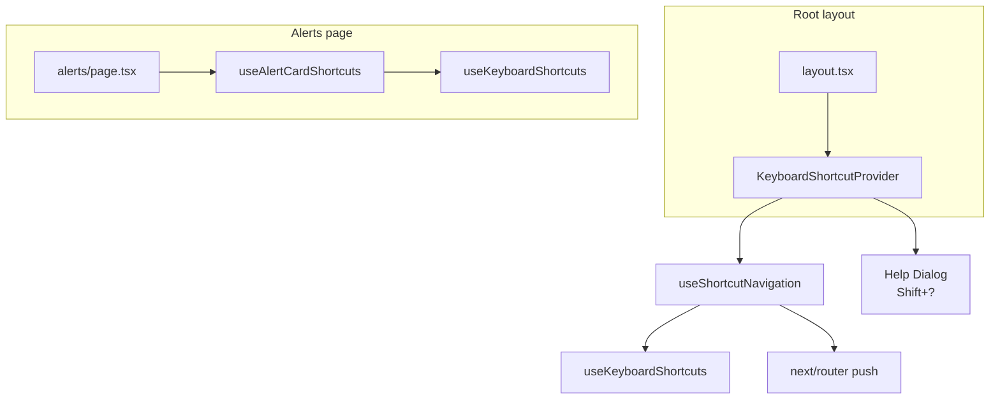

# ArchLucid operator shell — keyboard shortcuts

**Audience:** Operators using `archlucid-ui` and developers extending the shell.  
**Tests:** `src/integration/keyboard-shortcuts-*.test.tsx`

## Overview

The shell exposes **fast navigation** and **page actions** via the keyboard. Design choices:

| Principle | Rationale |
|-----------|-----------|
| **Alt + letter / number** | Avoids most browser chrome conflicts (Ctrl/Cmd+N/T/W, copy/paste, etc.). |
| **Input guard** | Shortcuts do not fire while focus is in `<input>`, `<textarea>`, `<select>`, or `contenteditable` (see [`useKeyboardShortcuts`](../src/hooks/useKeyboardShortcuts.ts)). |
| **Progressive discoverability** | Help overlay, nav `title` + `aria-keyshortcuts`, visible `<ShortcutHint>` chips on key pages, and footer hint text—operators learn without reading this doc first. |

Global shortcuts apply from the main content region wrapped by [`KeyboardShortcutProvider`](../src/components/KeyboardShortcutProvider.tsx) in [`layout.tsx`](../src/app/layout.tsx). The header/nav sit outside that wrapper, so **focus the page body** (e.g. Tab to main or click content) before Alt shortcuts if the nav stole focus.

## Global shortcuts (`SHORTCUTS`)

| Combo | Action | Navigates to |
|-------|--------|--------------|
| **Alt+N** | New run wizard | `/runs/new` |
| **Alt+R** | Runs list | `/runs?projectId=default` |
| **Alt+C** | Compare | `/compare` |
| **Alt+P** | Replay | `/replay` |
| **Alt+A** | Ask (Q&A) | `/ask` |
| **Alt+G** | Governance dashboard | `/governance/dashboard` |
| **Alt+Y** | Graph | `/graph` |
| **Alt+L** | Alerts | `/alerts` |
| **Alt+H** | Home | `/` |
| **Shift+?** | Open / close help (Escape closes) | *(dialog only)* |

Registry: [`src/lib/shortcut-registry.ts`](../src/lib/shortcut-registry.ts) (`SHORTCUTS`). Help dialog also lists **Alerts page** combos from `ALERTS_PAGE_SHORTCUTS`.

## Page-specific: Alerts (`/alerts`)

Focus an alert card (`role="article"`, `tabIndex={0}`, `data-alert-id`) or a control inside it. Implemented in [`useAlertCardShortcuts`](../src/hooks/useAlertCardShortcuts.ts) on [`alerts/page.tsx`](../src/app/alerts/page.tsx).

| Combo | Action |
|-------|--------|
| **Alt+1** | Acknowledge focused alert |
| **Alt+2** | Resolve focused alert |
| **Alt+3** | Suppress focused alert |
| **Alt+J** | Focus next card (wraps from last → first) |
| **Alt+K** | Focus previous card (stays on first) |

Optional comments still use `window.prompt` today; shortcuts call the same `applyAlertAction` path as the buttons.

## Discoverability

1. **Shift+?** — Full table in the Radix/shadcn dialog ([`KeyboardShortcutProvider`](../src/components/KeyboardShortcutProvider.tsx)).
2. **Shell nav** — [`ShellNav.tsx`](../src/components/ShellNav.tsx): extended `title` text includes `(Alt+…)`; `aria-keyshortcuts` matches [`registryKeyToAriaKeyShortcuts`](../src/lib/shortcut-registry.ts). No inline `<kbd>` in the nav (compact layout).
3. **`<ShortcutHint>`** — [`ShortcutHint.tsx`](../src/components/ShortcutHint.tsx): visible chips next to primary links on home, runs list, compare heading (uses global `kbd` CSS).
4. **Footer** — Shell hint: “Press Shift+? for keyboard shortcuts.” Alerts page: “Alt+J/K navigate · Alt+1 ack · Alt+2 resolve · Alt+3 suppress.”

## Technical architecture (developers)

**`useKeyboardShortcuts(map)`** ([`useKeyboardShortcuts.ts`](../src/hooks/useKeyboardShortcuts.ts)) — Registers one `window` `keydown` listener; map keys are combo strings (`alt+n`, `shift+?`). Each entry: `{ handler, description, allowInInput? }`. Parses combos with `parseKeyCombo`; skips handlers when `isEditableTarget(event.target)` unless `allowInInput`.

**Global wiring** — `useShortcutNavigation` builds a map from `SHORTCUTS` → `router.push(route)` plus optional `onHelpRequested` for Shift+?. Used inside `KeyboardShortcutProvider` only.

**Add a global shortcut**

1. Add an entry to `SHORTCUTS` in [`shortcut-registry.ts`](../src/lib/shortcut-registry.ts) (`key`, `label`, `description`, `route` or help-only).
2. If it navigates, `useShortcutNavigation` already binds any entry with `route`; no change unless you need custom behavior.
3. Update [`ShellNav.tsx`](../src/components/ShellNav.tsx) if the destination has a nav link (title + `aria-keyshortcuts`).
4. Extend [`KeyboardShortcutProvider`](../src/components/KeyboardShortcutProvider.tsx) / registry if the help dialog should show a new section.
5. Add or extend [`src/integration/keyboard-shortcuts-global.test.tsx`](../src/integration/keyboard-shortcuts-global.test.tsx).

**Add page-specific shortcuts**

1. Add `PAGE_SHORTCUTS` or extend `ALERTS_PAGE_SHORTCUTS`-style lists in [`shortcut-registry.ts`](../src/lib/shortcut-registry.ts) for documentation.
2. Create `useYourPageShortcuts({ ... })` calling `useKeyboardShortcuts` with a focused-element strategy (see [`useAlertCardShortcuts.ts`](../src/hooks/useAlertCardShortcuts.ts)).
3. Mount the hook from the page client component.
4. Add integration tests alongside [`keyboard-shortcuts-alerts.test.tsx`](../src/integration/keyboard-shortcuts-alerts.test.tsx).

**Skip link** — “Skip to main content” targets `#main-content` inside `KeyboardShortcutProvider`; shortcuts apply after focus lands in main.

## Accessibility

- **`aria-keyshortcuts`** on shell nav links matches registry combos (e.g. `Alt+N`). Exposes shortcuts to supporting AT; primary instructions remain titles and the help dialog.
- **Dialog** — Radix Dialog provides focus trap, `DialogTitle` / `DialogDescription`, visible close control, Escape to dismiss.
- **WCAG 2.1.4 Character Key Shortcuts** — No bare single-letter shortcuts: every shortcut requires **Alt**, **Shift** (for `?`), or **Alt+digit** / **Alt+J/K** on Alerts. Users are not forced to use single printable keys alone.

## Component wiring

## See also

- [OPERATOR_SHELL_TUTORIAL.md](./OPERATOR_SHELL_TUTORIAL.md) — Next.js / shell orientation.
- Repo onboarding: [ONBOARDING_HAPPY_PATH.md](../../docs/ONBOARDING_HAPPY_PATH.md) — getting oriented in the wider codebase.
