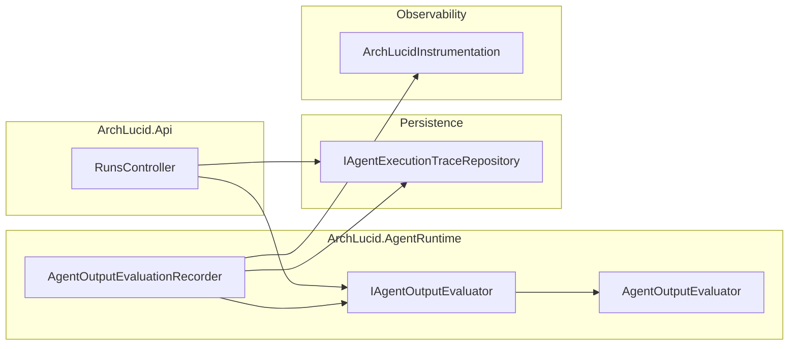

# Agent output structural evaluation

## 1. Objective

Provide a **cheap, deterministic** check that persisted agent **`AgentExecutionTrace.ParsedResultJson`** still looks like a serialized **`AgentResult`**: correct JSON root shape and expected **top-level property names** (camelCase, matching **`JsonSerializerDefaults.Web`**). Support **on-demand HTTP inspection** per run and **optional OTEL metrics** for batch or post-run jobs—without calling an LLM.

## 2. Assumptions

- **Traces** store **`ParsedResultJson`** only when **`ParseSucceeded`** is true (handlers serialize the validated **`AgentResult`**).
- **Schema validation** already ran at execution time; this layer catches **drift**, **manual SQL edits**, or **future serializer changes** that leave traces readable but structurally incomplete.
- **Metrics emission** is triggered explicitly via **`AgentOutputEvaluationRecorder`** (not yet wired into the authority pipeline executor by default).

## 3. Constraints

- **No new external services**; only **`System.Text.Json`** and existing repositories.
- **Privacy**: evaluation reads **already-persisted** trace JSON; the **GET** endpoint requires the same **read authority** policy as other run reads.
- **Cardinality**: metric labels use **`agent_type`** only (four values).

## 4. Architecture Overview



## 5. Component Breakdown

| Component | Responsibility |
|-----------|------------------|
| **`IAgentOutputEvaluator`** | Pure **`Evaluate(traceId, json, agentType)`** → **`AgentOutputEvaluationScore`**. |
| **`AgentOutputEvaluator`** | Expected key list for **`AgentResult`** JSON; parse; ratio = present / expected. |
| **`AgentOutputEvaluationRecorder`** | Load traces by **`runId`**; score; emit **`archlucid_agent_output_*`**; log low scores. |
| **`AgentOutputEvaluationScore` / `AgentOutputEvaluationSummary`** | Contracts for API and tests. |
| **`GET …/run/{runId}/agent-evaluation`** | Builds **`AgentOutputEvaluationSummary`** without recording metrics. |

## 6. Data Flow

1. **API**: **`GetByRunIdAsync`** → for each trace with **`ParseSucceeded`** and non-empty **`ParsedResultJson`**, **`Evaluate`** → aggregate average and skipped count.
2. **Metrics job** (future caller): **`EvaluateAndRecordMetricsAsync(runId)`** → same loop → **`Histogram.Record`** / **`Counter.Add`** with **`agent_type`** tag.
3. **Parse failure** (invalid JSON or non-object root): **`IsJsonParseFailure`** true; metrics path increments **`archlucid_agent_output_parse_failures_total`** (no histogram point).

## 7. Security Model

- **Authorization**: **`ReadAuthority`** on **`RunsController`** (same as **`GET …/traces`**).
- **Data exposure**: Response includes **missing key names** and **scores** only—no raw prompts. Traces already scoped by **run repository** / **RLS** as elsewhere.
- **Abuse**: Rate limiting inherits controller **`fixed`** window; evaluation is CPU-only over in-memory JSON strings.

## Semantic evaluation

Beyond structural completeness, **`AgentOutputSemanticEvaluator`** performs a deeper deterministic inspection of the agent JSON output without calling an LLM.

### What it checks

| Dimension | Scoring rule |
|-----------|-------------|
| **Claims quality** | Fraction of items in `claims[]` that have non-empty `evidenceRefs[]` or a non-empty `evidence` string. |
| **Findings quality** | Fraction of items in `findings[]` with non-empty `severity`, `description` (>10 chars), and `recommendation` (>5 chars). |
| **Overall score** | Weighted average: Claims × **0.4** + Findings × **0.6**. When only one dimension is present, that dimension's ratio is the overall score. Zero when both arrays are absent or empty. |

### OTel metric

**`archlucid_agent_output_semantic_score`** (histogram, 0.0–1.0; label `agent_type`) — recorded alongside the structural histogram by **`AgentOutputEvaluationRecorder`**.

### Warning threshold

The recorder logs a warning when `OverallSemanticScore < 0.5` — same threshold used for structural completeness.

### Interface

```csharp
IAgentOutputSemanticEvaluator.Evaluate(traceId, parsedResultJson, agentType) → AgentOutputSemanticScore
```

Registered as **singleton** (`IAgentOutputSemanticEvaluator → AgentOutputSemanticEvaluator`).

## Quality gate (optional)

**`IAgentOutputQualityGate`** classifies structural + semantic scores into **accepted / warned / rejected** using **`ArchLucid:AgentOutput:QualityGate`** (`AgentOutputQualityGateOptions`). **Disabled by default** (`Enabled: false`).

When enabled, **`AgentOutputEvaluationRecorder`** increments **`archlucid_agent_output_quality_gate_total`** (labels `agent_type`, `outcome`) and logs **warn** for **warned**/**rejected** outcomes. The gate does **not** change persisted traces or block merges by itself.

## Golden-set trace fixtures (regression)

**`ArchLucid.AgentRuntime.Tests`** includes **`GoldenAgentExecutionTraceTests`**, which load **`Fixtures/AgentExecutionTrace/*.json`** and assert:

- **`ModelDeploymentName`** / **`ModelVersion`** match expected values (including **`AgentExecutionTraceModelMetadata`** sentinels for simulator paths).
- **`ParseSucceeded`** and presence of **`ParsedResultJson`** where the fixture models a successful parse.

Add a new JSON file per scenario (minimal fields only); keep fixtures **small** and **non-sensitive** (no customer text, no secrets).

## 8. Operational Considerations

- **Default full blob prompts**: **`AgentExecution:TraceStorage:PersistFullPrompts`** defaults to **true**; see **`docs/AGENT_TRACE_FORENSICS.md`** for retention and privacy.
- **Dashboards**: **`archlucid_agent_output_structural_completeness_ratio`** (histogram), **`archlucid_agent_output_semantic_score`** (histogram), **`archlucid_agent_output_parse_failures_total`** (counter), and optional **`archlucid_agent_output_quality_gate_total`** (counter)—see **`docs/OBSERVABILITY.md`**.
- **Low score logs**: Recorder warns below **0.5** completeness for both structural and semantic scores (configurable in code if product asks).
- **Evolution**: Per-**`AgentType`** key lists live in **`GetExpectedKeys`** for future stricter Topology/Cost/Critic profiles.
