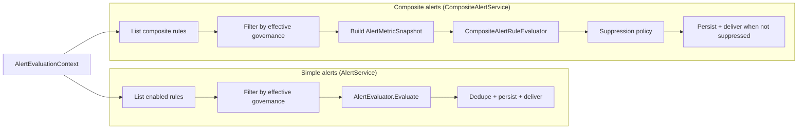

# Alerts, advisory scans, and related HTTP surface

This note ties together **operator-facing HTTP routes** and where behavior is implemented. For C# XML comment conventions and the incremental doc **piece tracker**, see [METHOD_DOCUMENTATION.md](METHOD_DOCUMENTATION.md). For policy-pack effects on alerts/compliance, see [API_CONTRACTS.md](API_CONTRACTS.md).

## Simple alert rules

| Area | Route prefix (typical) | Controller |
|------|------------------------|------------|
| Define/list metric rules | `v{version}/alert-rules` | `AlertRulesController` |
| List/act on fired alerts | `v{version}/alerts` | `AlertsController` |

Rules are stored per tenant/workspace/project. At evaluation time, enabled rules are **filtered by effective governance** (`PolicyPackGovernanceFilter.FilterAlertRules`) before `AlertEvaluator` runs.

## Composite alert rules

| Area | Route prefix | Controller |
|------|--------------|------------|
| Define/list composite rules | `v{version}/composite-alert-rules` | `CompositeAlertRulesController` |

Composite evaluation uses `AlertMetricSnapshotBuilder`, `CompositeAlertRuleEvaluator`, and `AlertSuppressionPolicy` (see piece 5–7 in `METHOD_DOCUMENTATION.md`).

## Routing & delivery

| Area | Route prefix | Controller |
|------|--------------|------------|
| Webhook/email subscriptions | `v{version}/alert-routing-subscriptions` | `AlertRoutingSubscriptionsController` |

`AlertDeliveryDispatcher` fans out to registered `IAlertDeliveryChannel` implementations (Email, Slack, Teams, on-call webhook).

### Outbound webhook HMAC (digest + alert channels)

When **`WebhookDelivery:HmacSha256SharedSecret`** is set (prefer **Key Vault** references in production — see **`appsettings.KeyVault.sample.json`**), the API signs the **exact UTF-8 JSON body** posted to Teams/Slack/on-call webhooks using **HMAC-SHA256** and sends:

- Header: **`X-ArchiForge-Webhook-Signature`**
- Value: **`sha256=`** + lowercase **hex** digest (see **`WebhookSignature`** / **`HttpWebhookPoster`**).

Integrators should compute HMAC-SHA256 over the **raw request body bytes** with the same shared secret and compare using a **constant-time** equality check. If the secret is unset, the header is omitted and receivers should not expect integrity protection from ArchiForge.

## Simulation & tuning

| Area | Route prefix | Controller |
|------|--------------|------------|
| What-if rule runs | `v{version}/alert-simulation` | `AlertSimulationController` |
| Threshold sweep / scoring | `v{version}/alert-tuning` | `AlertTuningController` |

Validators: `RuleSimulationRequestValidator`, `RuleCandidateComparisonRequestValidator`, `ThresholdRecommendationRequestValidator`.

## Advisory (plans, recommendations, schedules)

| Area | Route prefix | Controller |
|------|--------------|------------|
| Improvement plan & recommendation actions | `api/advisory` | `AdvisoryController` |
| CRON schedules, run-now, digests | `api/advisory-scheduling` | `AdvisorySchedulingController` |
| Digest delivery subscriptions & attempt history | `v{version}/digest-subscriptions` | `DigestSubscriptionsController` |
| Recommendation learning profile (latest / rebuild) | `api/recommendation-learning` | `RecommendationLearningController` |

Scheduled runs use `IAdvisoryScanRunner` / `AdvisoryScanRunner`: ambient scope, single load of effective governance, advisory defaults on the plan, then simple + composite alert evaluation, digest persistence, and **`IDigestDeliveryDispatcher`** fan-out (details in `API_CONTRACTS.md`).

## Scope debug

| Area | Route | Controller |
|------|-------|------------|
| Resolved tenant/workspace/project for the request | `GET api/scope` | `ScopeDebugController` |

## Simple vs composite evaluation (lifecycle sketch)

At a high level, **simple** rules are evaluated in **`AlertService`** (per-rule metrics vs **`AlertEvaluationContext`**), while **composite** rules run in **`CompositeAlertService`** (snapshot → **`ICompositeAlertRuleEvaluator`** → suppression → persist). Both paths share governance filtering and scope.

## Scope

All of the above rely on **`IScopeContextProvider`** (JWT claims / headers, or `AmbientScopeContext` for background jobs) so tenant, workspace, and project match stored rows and governance resolution.
