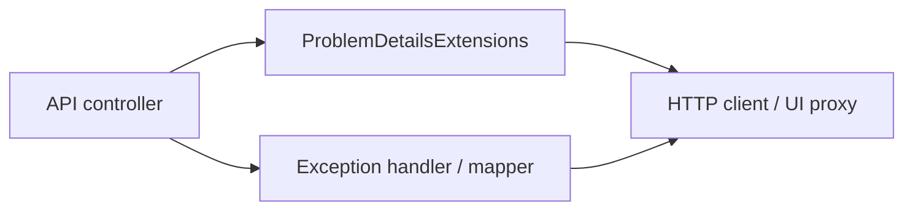

# API error contract (RFC 9457 Problem Details)

## Objective

Give API clients a **stable, machine-readable** error shape for failures: **`application/problem+json`** with **`type`**, **`title`**, **`detail`**, **`status`**, and **`correlationId`** where the global pipeline attaches it.

**Normative reference:** [RFC 9457](https://www.rfc-editor.org/rfc/rfc9457) (*Problem Details for HTTP APIs*), which **obsoletes** [RFC 7807](https://www.rfc-editor.org/rfc/rfc7807). The media type and JSON fields are unchanged; cite **9457** for new documentation and reviews.

## Assumptions

- Clients use **`GET /openapi/v1.json`** or the checked-in contract snapshot for response schemas.
- Operators may read **`correlationId`** from response bodies or **`X-Correlation-ID`** headers (see **[TROUBLESHOOTING.md](TROUBLESHOOTING.md)**).

## Constraints

- Prefer **`ProblemTypes.*`** URI constants (see **`ArchLucid.Host.Core.ProblemDetails`**) so **`type`** stays stable across releases.
- Do not use **empty** `NotFound()` / raw `Conflict(object)` for **client-visible** API errors when a typed problem exists — use **`ProblemDetailsExtensions`** on **`ArchLucid.Api`** (`NotFoundProblem`, `ConflictProblem`, `BadRequestProblem`, …).

## Architecture overview

## Component breakdown

| Layer | Responsibility |
|--------|----------------|
| Controllers | Return **`IActionResult`** built from **`this.*Problem`** helpers |
| **`ApplicationProblemMapper`** | Maps domain exceptions to problem **`type`** / **`detail`** |
| **`InvalidModelStateResponseFactory`** | Validation failures → **`ProblemTypes.ValidationFailed`** |
| UI proxy | Surfaces **`correlationId`** and problem **`title`** in **`OperatorApiProblem`** |

## Data flow

1. Request fails validation → **400** + **`ValidationFailed`**.
2. Missing scoped resource → **404** + resource-specific **`type`** (e.g. **`RunNotFound`**, **`ManifestNotFound`**).
3. State conflict → **409** + conflict **`type`** and **`detail`** explaining the gate.

## Security model

- Problem **`detail`** must **not** leak secrets, connection strings, or stack traces in production.
- Log injection: user-influenced strings in logs use **`LogSanitizer`** (see **[SECURITY.md](SECURITY.md)** § Log injection).

## Operational considerations

- **Reliability:** Contract tests (`OpenApiContractSnapshotTests`) catch accidental response-shape drift.
- **Cost:** N/A (JSON payload size negligible vs. business payloads).

## Related docs

- **[API_CONTRACTS.md](API_CONTRACTS.md)** — versioning, pagination, artifact semantics.
- **`docs/CURSOR_PROMPTS_WEIGHTED_IMPROVEMENTS_3_TO_6.md`** — prompt **`rfc9457-controller-sweep`** for remaining controller audits.
