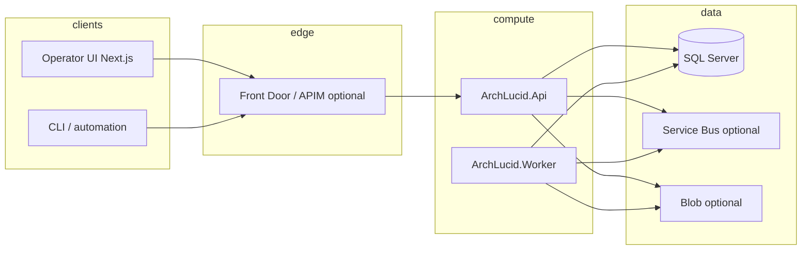

> **Scope:** Architecture on a page (ArchLucid) - full detail, tables, and links in the sections below.

# Architecture on a page (ArchLucid)

## 1. Objective

Give architects and operators a **single-page** view of **nodes, edges, and trust boundaries** so the system can be redrawn as a C4 or sequence diagram without re-reading the whole repo.

## 2. Assumptions

- Deployments use **Azure-first** patterns (Container Apps, SQL, private networking) unless a pilot explicitly diverges.
- **Incomplete requirements** and **imperfect rollout** are normal; the design favors **observable backlogs** (outboxes, health, metrics) over silent failure.

## 3. Constraints

- **No public SMB (445)**; blob/queue access via private endpoints and managed identity where possible.
- **Single DDL source per database** (`ArchLucid.sql` master script + forward-only migrations for new work).
- **Configuration rename in flight**: `ArchLucid*` keys remain valid with **`ArchLucid*` overrides** until Phase 7 (see [CONFIG_BRIDGE_SUNSET.md](CONFIG_BRIDGE_SUNSET.md)).

## 4. Architecture overview

**Orchestration layer:** HTTP API coordinates **authority runs**, **governance**, and **retrieval**; **Worker** drains queues/outboxes and long-running jobs. **Interfaces** (repositories, connectors) sit in Contracts/Application; **services** implement use cases; **data models** map to SQL and DTOs.

## 5. Component breakdown

| Node | Responsibility |
|------|------------------|
| **ArchLucid.Api** | REST surface, auth, OpenAPI, OTel + Prometheus scrape, admin diagnostics. |
| **ArchLucid.Worker** | Background processors (outbox publishers, advisory, indexing). |
| **ArchLucid.Host.Composition** | DI graphs (`AddArchLucidStorage`, agents, retrieval). |
| **ArchLucid.Persistence** | Dapper data access, outbox tables, integration dead-letter paths. |
| **archlucid-ui** | Operator shell; server **proxy** to API with scope + correlation headers. |

## 6. Data flow

1. **Run commit:** Client → API → SQL transactional write → post-commit **retrieval indexing outbox**.
2. **Integration events:** SQL **integration outbox** → Worker → Service Bus → downstream (with **dead-letter** and admin retry).
3. **Authority pipeline:** **AuthorityPipelineWorkOutbox** tracks async/staged work; metrics exported as **observable gauges** (see `ArchLucidInstrumentation`).

## 7. Security model

- **Default deny** on API controllers; anonymous only where explicitly marked (e.g. `/health/*`, `/version`).
- **Entra ID / JWT** or **API key** per environment; **development bypass** only in non-production with guardrails.
- **Secrets** in Key Vault / CI secrets; UI proxy uses **`ARCHLUCID_API_KEY`** with **`ARCHIFORGE_API_KEY`** fallback.

## 8. Operational considerations

- **Post-deploy validation:** CD runs **`scripts/ci/cd-post-deploy-verify.sh`**: **`/health/live`**, **`/health/ready`** (JSON **`.status` must be `Healthy`**), **`/openapi/v1.json`**, **`/version`**, plus **`SMOKE_SYNTHETIC_PATH`** when not **`/version`** (see **`docs/DEPLOYMENT_CD_PIPELINE.md`**).
- **Rollback:** Container Apps revision deactivation for **API and worker** when **`CD_ROLLBACK_ON_SMOKE_FAILURE`** is true and the worker app secret is set (see `.github/workflows/cd.yml`).
- **Metrics:** `infra/prometheus/archlucid-alerts.yml` targets **ArchLucid** meter outbox gauges fed by **`OutboxOperationalMetricsHostedService`**.
- **Cost / capacity:** see [CAPACITY_AND_COST_PLAYBOOK.md](CAPACITY_AND_COST_PLAYBOOK.md).

## 9. Deeper reading

- [CODE_MAP.md](CODE_MAP.md) — where to open the code.
- [ARCHITECTURE_INDEX.md](ARCHITECTURE_INDEX.md) — full doc map.
