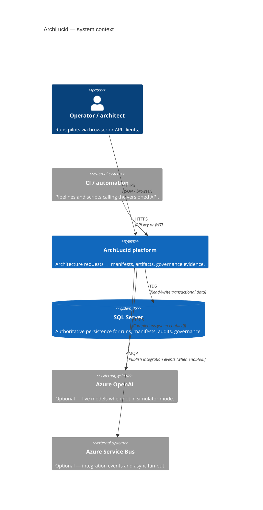
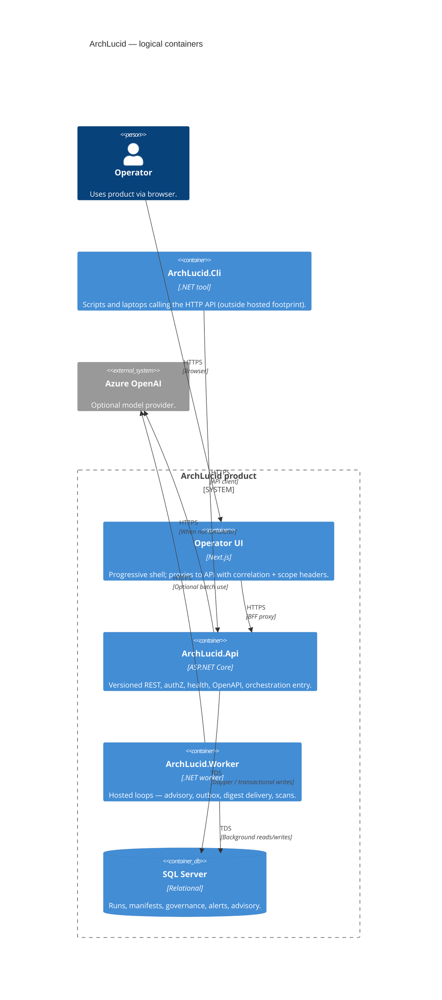

> **Scope:** Canonical architecture poster (C4 + ownership) — single entry before deep dives.

# Architecture on one page

**Purpose:** One screen to redraw **ArchLucid** as C4 and to know **who owns each box**, **where to read more**, and **which tests catch drift**. Deeper narrative: [ARCHITECTURE_CONTEXT.md](ARCHITECTURE_CONTEXT.md), [ARCHITECTURE_CONTAINERS.md](ARCHITECTURE_CONTAINERS.md), [ARCHITECTURE_COMPONENTS.md](ARCHITECTURE_COMPONENTS.md). Older flowchart-only view: [ARCHITECTURE_ON_A_PAGE.md](ARCHITECTURE_ON_A_PAGE.md).

---

## System context (C4)

### Context nodes → ownership

| Node | Owns runtime / code | Deep dive | Primary tests |
|------|---------------------|-----------|-----------------|
| Operator / architect | `archlucid-ui` (shell) | [operator-shell.md](operator-shell.md) | `archlucid-ui` Vitest + Playwright |
| Automation | External repos / runners | [API_CONTRACTS.md](API_CONTRACTS.md) | Consumer-owned |
| ArchLucid platform | `ArchLucid.Api`, `ArchLucid.Application`, `ArchLucid.Worker`, `ArchLucid.Host.Composition` | [ARCHITECTURE_CONTAINERS.md](ARCHITECTURE_CONTAINERS.md) | `ArchLucid.Api.Tests`, `ArchLucid.Application.Tests`, release smoke (`docs/RELEASE_SMOKE.md`) |
| SQL Server | `ArchLucid.Persistence` + `ArchLucid.Persistence.Data.*` + migrations | [DATA_MODEL.md](DATA_MODEL.md), [SQL_SCRIPTS.md](SQL_SCRIPTS.md) | SQL integration suites under `ArchLucid.*.Tests` |
| Azure OpenAI | `ArchLucid.Api` agent execution mode | [BUILD.md](BUILD.md) (config), agent docs in `docs/` | Simulator-first unit tests; live optional |
| Service Bus | `ArchLucid.Worker` publishers | [INTEGRATION_EVENTS_AND_WEBHOOKS.md](INTEGRATION_EVENTS_AND_WEBHOOKS.md) | Worker + contract tests |

---

## Containers (C4)

### Container nodes → ownership

| Container | Project / folder | Deep dive | Primary tests |
|-----------|------------------|-----------|-----------------|
| Operator UI | `archlucid-ui/` | [archlucid-ui/README.md](../archlucid-ui/README.md) | Vitest, Axe, Playwright operator journeys |
| ArchLucid.Api | `ArchLucid.Api/` | [ARCHITECTURE_COMPONENTS.md](ARCHITECTURE_COMPONENTS.md) § API | `ArchLucid.Api.Tests` |
| ArchLucid.Worker | `ArchLucid.Worker/` | [SYSTEM_MAP.md](SYSTEM_MAP.md) | Hosted-loop coverage via API / Decisioning tests + release smoke |
| ArchLucid.Cli | `ArchLucid.Cli/` | [CLI_USAGE.md](CLI_USAGE.md) | CLI integration / smoke scripts |
| SQL Server | `ArchLucid.Persistence*`, `Scripts/ArchLucid.sql` | [SQL_SCRIPTS.md](SQL_SCRIPTS.md) | Persistence + API integration |
| Azure OpenAI (ext) | Configuration + agent hosts | [CANONICAL_PIPELINE.md](CANONICAL_PIPELINE.md) | Decisioning + API tests (simulator default) |

---

## Happy path trace (Core Pilot + sponsor artifact)

Canonical sequence (operator mental model):

1. **Create run** — `POST /v1/architecture/request` (wizard or CLI `archlucid run`). See [ARCHITECTURE_FLOWS.md § Flow A](ARCHITECTURE_FLOWS.md#flow-a-run-lifecycle-request--tasks--results-commit--manifest) step *Create run* / *Generate tasks*.
2. **Execute** — pipeline fills tasks and authority stages (simulator in dev). Same Flow A sections *Submit results* / coordinator ↔ authority notes.
3. **Commit** — `POST /v1/architecture/run/{runId}/commit` (UI button or `archlucid commit`). Flow A *Commit*.
4. **Sponsor-facing PDF** — after artifacts exist: run detail exports or CLI `archlucid sponsor-one-pager <runId> [--save]`; Markdown / DOCX analysis exports follow [ARCHITECTURE_FLOWS.md § Flow B](ARCHITECTURE_FLOWS.md#flow-b-export-lifecycle-build--persist-record--replay).

**Where to go next:** [ARCHITECTURE_FLOWS.md](ARCHITECTURE_FLOWS.md) (full A/B/C narratives), [CORE_PILOT.md](CORE_PILOT.md) (first-pilot checklist), [OPERATOR_ATLAS.md](OPERATOR_ATLAS.md) (UI route × API × CLI map).
