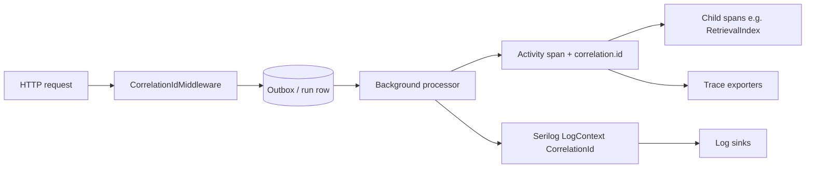

> **Scope:** Background job correlation (Activity + Serilog) - full detail, tables, and links in the sections below.

# Background job correlation (Activity + Serilog)

## 1. Objective

Keep **end-to-end traceability** when work leaves the HTTP pipeline: every background processor that drains an outbox or runs retention must expose the same **logical correlation id** in **OpenTelemetry spans** and in **structured logs** (Serilog `CorrelationId`), so operators can jump from a log line to a trace or vice versa.

## 2. Assumptions

- HTTP correlation is already correct (`CorrelationIdMiddleware` → `Activity` tag `correlation.id` → Serilog `LogContext`). This document covers **non-HTTP** entry points only.
- **Serilog does not read OTel tags automatically** (`Enrich.FromLogContext()` only sees pushed properties). Both channels must be set.
- **No new SQL columns** for correlation: synthetic ids are derived from existing keys (`OutboxId`, `RunId`, schedule id, or a per-invocation timestamp for archival).

## 3. Constraints

- Do **not** change `CorrelationIdMiddleware` or `ActivityCorrelation` contracts for this workstream.
- Tag names for domain identifiers use the **`archlucid.*`** prefix in telemetry (aligned with OpenTelemetry attribute naming for this product).
- Logical correlation uses `ActivityCorrelation.LogicalCorrelationIdTag` (`correlation.id`), aligned with HTTP and audit enrichment.

## 4. Architecture overview

| Channel | Mechanism | Consumer |
|--------|-----------|----------|
| Distributed traces | `ActivitySource.StartActivity` + `SetTag("correlation.id", …)` | Jaeger, Tempo, Application Insights, OTLP backends |
| Structured logs | `LogContext.PushProperty("CorrelationId", …)` | Seq, Loki, Application Insights, any Serilog sink |

Child components that already start activities (e.g. `RetrievalRunCompletionIndexer`) become **child spans** under the outbox span when `Activity.Current` is set by the parent processor.

## 5. Component breakdown

| Processor | `ActivitySource` name | Operation name | Synthetic `correlation.id` |
|-----------|------------------------|----------------|----------------------------|
| `RetrievalIndexingOutboxProcessor` | `ArchLucid.RetrievalIndexing.Outbox` | `RetrievalIndexingOutbox.ProcessEntry` | `retrieval-outbox:{OutboxId}` |
| `IntegrationEventOutboxProcessor` | `ArchLucid.IntegrationEvent.Outbox` | `IntegrationEventOutbox.ProcessEntry` | `run:{RunId}` if `RunId` set; else `integration-outbox:{OutboxId}` |
| `DataArchivalCoordinator` | `ArchLucid.DataArchival` | `DataArchival.RunOnce` | `data-archival:{yyyyMMddHHmmss}` (UTC) |

**Consistency (existing runners):** `AdvisoryScanRunner` and `AuthorityRunOrchestrator` also push Serilog `CorrelationId` alongside their existing `correlation.id` activity tags.

**Registration:** Hosts call `AddArchLucidOpenTelemetry` in `ObservabilityExtensions.cs`, which lists all `ActivitySource` names via `tracing.AddSource(...)`.

## 6. Data flow

## 7. Security model

Correlation ids are **diagnostic identifiers**, not secrets. They may appear in logs and traces; avoid embedding PII. Synthetic formats use **Guids** or **timestamps** already used in persistence.

## 8. Operational considerations

**Find in logs:** filter on property `CorrelationId` (Serilog) or message context enriched from `LogContext`.

**Find in traces:** filter on attribute **`correlation.id`** (OpenTelemetry semantic alignment used by `ActivityCorrelation.LogicalCorrelationIdTag`).

**Verify in tests:** `ArchLucid.Persistence.Tests` includes `*CorrelationTests` classes using `ActivityListener` (`ActivityStopped`) to assert source name, operation name, and tags. **Do not** reference `ArchLucidInstrumentation.*.Name` inside `ActivityListener.ShouldListenTo` callbacks registered before static initialization completes—use **string literals** for source names in listeners to avoid type-initializer cycles.

## 9. Checklist for a new background processor

1. Add or reuse an `ActivitySource` in `ArchLucidInstrumentation` (if new, append to `ObservabilityExtensions.AddSource` list).
2. At the **per-unit-of-work** boundary (per message, per row, or once per scheduled invocation), call `StartActivity` with a stable operation name.
3. Set `activity.SetTag(ActivityCorrelation.LogicalCorrelationIdTag, syntheticId)`.
4. Add domain tags (`archlucid.*`) for low-cardinality dimensions (ids, event type, etc.).
5. `using IDisposable _ = LogContext.PushProperty("CorrelationId", syntheticId);` for the same scope as the activity.
6. Add a **Core** unit test with `ActivityListener` and literal source name string in `ShouldListenTo`.

## 10. Authority pipeline stage spans (`ArchLucid.AuthorityRun`)

The synchronous authority path (`AuthorityRunOrchestrator` → `AuthorityPipelineStagesExecutor`) uses the same **`ActivitySource`** as the run span. Each major stage is a **child span** explicitly parented to **`AuthorityPipelineContext.RunActivity`** (the orchestrator’s run activity), not only to **`Activity.Current`**. That keeps the trace tree correct when intermediate code starts other activities.

| Span (operation name) | Tag `archlucid.stage.name` | Purpose |
|------------------------|----------------------------|---------|
| `authority.context_ingestion` | `context_ingestion` | Prior context + ingest + persist |
| `authority.graph` | `graph` | Graph resolution + persist |
| `authority.findings` | `findings` | Findings snapshot + persist |
| `authority.decisioning` | `decisioning` | Decision engine + manifest/trace + audit |
| `authority.artifacts` | `artifacts` | Synthesis + bundle + audit |

**Common tags:** `archlucid.run_id` on every stage; on failure, `error.type` and span status **Error** with the exception message.

**Metric (same `ArchLucid` meter):** `archlucid_authority_pipeline_stage_duration_ms` (unit **ms**), labels **`stage`** (values above) and **`outcome`** (`success` | `error`). See [OBSERVABILITY.md](OBSERVABILITY.md).

**Tests:** `ArchLucid.Persistence.Tests` — `AuthorityPipelineStagesExecutorTests` (`Suite=Core`).

## 11. References

- `ArchLucid.Core.Diagnostics.ArchLucidInstrumentation`
- `ArchLucid.Core.Diagnostics.ActivityCorrelation`
- `ArchLucid.Host.Core.Startup.ObservabilityExtensions`
- `docs/OBSERVABILITY.md` — meters, histograms, and activity sources
- `docs/TEST_EXECUTION_MODEL.md` (`Suite=Core`)
