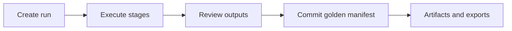

# Canonical run pipeline (operator view)

**Objective:** Give operators and sponsors a single mental model for how work flows from request to committed manifest and artifacts, without implementation seam vocabulary.

**Assumptions:** You use the operator UI or public APIs with a normal tenant scope. Storage is SQL-backed with row-level security.

**Constraints:** Detailed contributor maps and ADR receipts live under `docs/adr/` and `docs/archive/dual-pipeline-navigator-superseded.md` for engineering-only deep dives.

---

## Architecture overview

1. **Create run** — Guided wizard or API creates a scoped run with evidence and tasks.
2. **Execute stages** — The host runs ingestion, graph, findings, decisioning, and artifact synthesis where applicable; OpenTelemetry spans carry `archlucid.stage.name` for support correlation (see `docs/BACKGROUND_JOB_CORRELATION.md`).
3. **Review** — Inspect tasks, findings, and previews before commit.
4. **Commit** — Produce the golden manifest and durable traces for your scope.
5. **Artifacts** — Download bundles, exports, and sponsor-facing summaries from the run detail surface.

---

## Where to read next

- `docs/ARCHITECTURE_FLOWS.md` — narrative lifecycle and API touchpoints.
- `docs/ONBOARDING_HAPPY_PATH.md` — shortest path through one successful run.
- `docs/OPERATOR_ATLAS.md` — task → UI map.
- `docs/API_CONTRACTS.md` — stable HTTP contracts.

---

## Security model

All steps honor tenant, workspace, and project scope. Anonymous marketing surfaces (`/v1/demo/preview`, `/v1/public/demo/sample-run`) use read-only demo bundles only; they never bypass RLS for tenant data.

---

## Operational considerations

- **Stuck runs** — Check host logs for stage failures; confirm scope headers or JWT claims match the run’s tenant.
- **Support** — Capture correlation IDs from API responses and trace spans when opening incidents.
