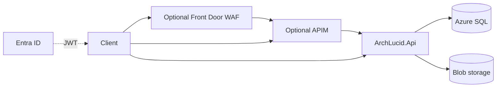

> **Scope:** Customer trust and access - full detail, tables, and links in the sections below.

# Customer trust and access

This document explains how ArchLucid balances **ease of use** (simple URLs, standard Microsoft sign-in, clear operator flows) with **data safety** (private connectivity, edge protection, identity-backed access). It ties together optional Terraform roots under **`infra/`** and API configuration.

---

## 1. Objective

- Give integrators and operators a **straightforward** path: one HTTPS entry point, familiar **Microsoft Entra** sign-in where possible, and documented configuration samples.
- Make **serious security posture** achievable in Azure: **WAF** at the edge, **private endpoints** for SQL and blob data plane, and **tokens** instead of only long-lived API keys.

---

## 2. Assumptions

- Production deployments target **Azure** with infrastructure represented in **Terraform** (see **`infra/README.md`**).
- Customers may still run locally with **DevelopmentBypass** or **ApiKey** auth; Entra and private endpoints are **incremental** upgrades.
- Organizational **landing zones** may supply VNets, DNS, and policies; the optional modules are composable, not a full landing-zone replacement.

---

## 3. Constraints

- **SMB (port 445)** must not be exposed publicly; blob access should use **HTTPS** and private DNS where applicable (see workspace security rule and **`infra/terraform-private/README.md`**).
- **Private endpoints** do not by themselves disable public SQL or storage APIs; operators must **harden** servers and accounts after DNS cutover (documented in the private stack README).
- **API Management Consumption** and **Front Door** have different limits and pricing; choose based on gateway features vs. global edge + WAF needs.

---

## 4. Architecture overview

**Nodes:** Browser or integrator → optional **Front Door + WAF** → optional **APIM** → **ArchLucid.Api** → **Azure SQL** / **Blob** (optionally via **private endpoints**). **Entra ID** issues tokens validated by the API.

**Edges:** TLS at the edge; JWT validation at the API; SQL and blob over private connectivity when the private stack is enabled.

---

## 5. Component breakdown

| Component | Location | Role |
|-----------|----------|------|
| Front Door + WAF | `infra/terraform-edge/` | OWASP-style rules, bot management, HTTPS redirect; origin = APIM or API hostname. |
| API Management | `infra/terraform/` | Optional Consumption gateway in front of the API. |
| Private endpoints | `infra/terraform-private/` | VNet, `privatelink.database.windows.net`, `privatelink.blob.core.windows.net`, endpoints for SQL and blob. |
| Entra app + roles | `infra/terraform-entra/` | App registration, **Admin / Operator / Reader** roles, identifier URI for **audience**. |
| JWT + API key auth | `ArchLucid.Api` | **`ArchLucidAuth`** section; **`appsettings.Entra.sample.json`** for Entra mode. |

---

## 6. Data flow

1. **Inbound request:** Client calls the public hostname (**Front Door** or **APIM** or direct API). **WAF** inspects the request when Front Door is enabled.
2. **Authentication:** With **JwtBearer**, the API validates the token (issuer, audience, **`roles`** claim). With **ApiKey**, keys are compared server-side (see **`Authentication:ApiKey`**).
3. **Data access:** The API uses **`ConnectionStrings:ArchLucid`** and storage configuration. With private endpoints and VNet-integrated compute, SQL and blob hostnames resolve to **private IPs** inside Azure.

---

## 7. Security model

- **Identity:** Prefer **Entra-issued tokens** with **app roles** for production; disable or scope **API keys** when no longer needed.
- **Network:** Prefer **private endpoints** for SQL and blob; **deny-by-default** public access once migration is complete.
- **Edge:** **WAF** reduces common web attacks before traffic reaches the API or gateway.
- **Secrets:** Use **Key Vault references** in App Service / Container Apps (see **`docs/CONFIGURATION_KEY_VAULT.md`** and **`appsettings.KeyVault.sample.json`**).

---

## 8. Operational considerations

- **Correlation:** Send **`X-Correlation-ID`** from clients; it flows through Front Door and the API for support and incident alignment.
- **Cutover:** Apply private endpoints, validate connectivity from integrated compute, then **disable public** SQL/storage access per runbook.
- **Entra:** After Terraform registers the API app, assign roles to users or service principals; update **`ArchLucidAuth`** and redeploy the API.
- **Backlog:** Optional **AI Search** private endpoints remain a future enhancement. OpenAPI **`securitySchemes`** for Entra is implemented when **`ArchLucidAuth:Mode`** is **`JwtBearer`** (see **`docs/API_CONTRACTS.md`**).

For variable-level checklists, see **`docs/terraform-azure-variables.md`**.
