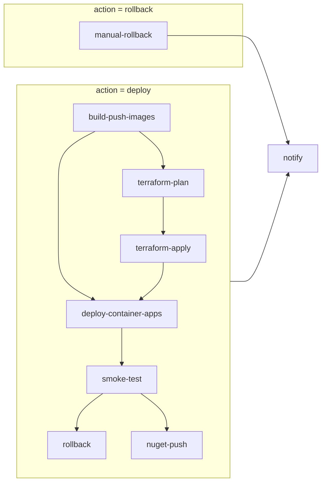

# CD pipeline (manual `workflow_dispatch`)

This document describes the multi-job **CD** workflow (`.github/workflows/cd.yml`). It complements [DEPLOYMENT.md](./DEPLOYMENT.md) and [DEPLOYMENT_TERRAFORM.md](./DEPLOYMENT_TERRAFORM.md).

## Objective

Provide a **repeatable V1-style** path: build and push container images to ACR, optionally plan/apply Terraform for the same environment, roll **API + worker + UI** Container App revisions to the new tag, smoke the public API surface, optionally roll back revisions on failed smoke, optionally publish the API client to NuGet, and notify—using **Azure OIDC** only (no long-lived service principal client secrets in GitHub).

## Assumptions

- GitHub **Environments** `staging` and `production` exist with **required reviewers** for manual gates where you need human approval before jobs that reference those environments run.
- Azure Federated Credentials map each environment (or the workflow) to Entra app registration(s) used by `azure/login@v2`.
- Operators copy `terraform.tfvars.example` → `terraform.tfvars` and `production.tfvars.example` → `production.tfvars` inside `infra/terraform-container-apps/` (or your `TF_WORKING_DIRECTORY`) when using Terraform; committed `.example` files are templates only.

## Architecture overview (nodes and flow)

- **Edges**: `needs` relationships in GitHub Actions; `deploy-container-apps` uses `always()`-style conditions so it still runs when `terraform-apply` is **skipped** (apply is optional).
- **Rollback path**: only `manual-rollback` and `notify` run when `action = rollback`.

## Job breakdown

| Job | Purpose |
|-----|---------|
| `build-push-images` | Checkout, OIDC login, Docker Buildx, push **API** (`ArchLucid.Api/Dockerfile`) and **UI** (`archlucid-ui/Dockerfile`) to ACR. The API image contains **both** `ArchLucid.Api.dll` and `ArchLucid.Worker.dll` (see Dockerfile comments). Tags: `${IMAGE_TAG}` (defaults to `github.sha`), plus `latest-staging` or `latest-production` on manual CD. BuildKit cache scopes: `api-docker-smoke`, `ui-docker-smoke` (aligned with CI). |
| `terraform-plan` | OIDC, `terraform init`, `terraform plan` (saved as `tfplan`), upload artifact `tfplan-<target>`, plan summary in step summary. **Skipped** when secret `TF_WORKING_DIRECTORY` is unset (job succeeds with no plan artifact). Production adds `-var-file=production.tfvars` when the file exists; staging adds `-var-file=terraform.tfvars` when present (otherwise default `terraform.tfvars` auto-load applies if present). |
| `terraform-apply` | Runs only when `run_terraform_apply` is true and a plan was produced. Downloads the plan artifact and runs `terraform apply tfplan`. Uses the same environment as the target (reviewer gate). |
| `deploy-container-apps` | OIDC, records API (and optional worker) revision **before** update, `az containerapp update --image` for API, **worker** (same image URI as API: `…/archlucid-api:<tag>`), and UI when configured, then records revisions **after**. Skips the whole update when `ACR_LOGIN_SERVER`, `AZURE_RESOURCE_GROUP`, or `CONTAINER_APP_API_NAME` is missing. Worker update runs only when secret **`CONTAINER_APP_WORKER_NAME`** is set (matches Terraform default `archlucid-worker`). |
| `smoke-test` (job id; UI label **Post-deploy validation**) | Optional when `SMOKE_TEST_BASE_URL` unset. Otherwise runs **`scripts/ci/cd-post-deploy-verify.sh`**: see [Post-deploy validation behavior](#post-deploy-validation-behavior) below. |
| `rollback` | On **smoke failure** only: if repo variable `CD_ROLLBACK_ON_SMOKE_FAILURE` is `true`, deactivates the new **API** revision and, when `CONTAINER_APP_WORKER_NAME` is configured, the new **worker** revision (keeps API and worker on the same rollback story). |
| `manual-rollback` | `workflow_dispatch` with `action = rollback`: deactivates the current latest API revision and verifies a different revision became active. |
| `nuget-push` | Production only, after successful smoke: packs and pushes `ArchLucid.Api.Client` when `NUGET_API_KEY` is set. |
| `notify` | `if: always()` webhook (optional) + consolidated step summary. |

## Post-deploy validation behavior

Implemented by **`scripts/ci/cd-post-deploy-verify.sh`** (called from **`smoke-test`** jobs in `.github/workflows/cd.yml` and `cd-staging-on-merge.yml`).

| Step | Request | Pass criteria | First-line diagnosis |
|------|---------|---------------|----------------------|
| 1 | `GET /health/live` | HTTP **200** | Logs HTTP code and up to **512** bytes of body on failure. |
| 2 | `GET /health/ready` | HTTP **200** and JSON **`.status` == `"Healthy"`** | Logs compact JSON; on non-Healthy prints **per-entry** `name` + `status` from `.entries[]`. Does **not** call `GET /health` (requires **ReadAuthority**). |
| 3 | `GET /openapi/v1.json` | HTTP **200** | Logs first **200** chars on success; body excerpt on failure. **Note:** `MapOpenApi` is registered only in **Development** in `PipelineExtensions.cs`; Staging/Production hosts may return **404** unless you change hosting—point `SMOKE_TEST_BASE_URL` at a host that exposes OpenAPI or adjust the app. |
| 4 | `GET /version` | HTTP **200** | Logs **compact JSON** (build / commit / environment). Anonymous per `VersionController`. |
| 5 | `GET {SMOKE_SYNTHETIC_PATH}` | HTTP **200** | Omitted when the path is **`/version`** (already checked). |

Failures print **`::error::`** lines on GitHub Actions for visible annotations and exit **non-zero** so the job fails and optional **rollback** can run.

**Retries:** Set repository variables **`CD_POST_DEPLOY_MAX_ATTEMPTS`** & **`CD_POST_DEPLOY_RETRY_WAIT_SECONDS`** to re-run the full check sequence after deploy (helps new revisions still starting).

**Local run:** `bash scripts/ci/cd-post-deploy-verify.sh https://your-api.example.com /version`

**Runner dependency:** **`jq`** must be on the path (preinstalled on `ubuntu-latest`).

## Security model

- **OIDC**: `permissions: id-token: write` and `azure/login@v2` with `AZURE_CLIENT_ID` / `AZURE_TENANT_ID` / `AZURE_SUBSCRIPTION_ID` from the environment. Do not store `AZURE_CREDENTIALS` JSON or client secrets for this flow.
- **Storage / SMB**: The pipeline does not expose SMB (port 445). Application storage patterns remain private-endpoint-oriented as described in deployment docs; nothing in this workflow publishes file shares publicly.

## Traceability

- Default image tag is the **git SHA** (`github.sha`), overridable via repository variable `IMAGE_TAG`.
- Terraform plan is stored as a run artifact named with the target environment for audit and optional `terraform apply` in a later job in the same run.

## GitHub Environment secrets and variables (checklist)

Configure per **environment** (`staging` / `production`) or organization policy as you prefer.

| Name | Required for | Notes |
|------|----------------|-------|
| `AZURE_CLIENT_ID`, `AZURE_TENANT_ID`, `AZURE_SUBSCRIPTION_ID` | All Azure steps | Federated credential workload identity. |
| `ACR_LOGIN_SERVER` | Image build/push and `az containerapp update` | e.g. `myregistry.azurecr.io`. When unset, build/push and app updates are skipped (job still succeeds). |
| `ACR_NAME` | `az acr login` | Optional; defaults to first label of `ACR_LOGIN_SERVER`. |
| `AZURE_RESOURCE_GROUP` | Container Apps CLI | Resource group that holds the apps. |
| `CONTAINER_APP_API_NAME` | Deploy / rollback | e.g. `archlucid-api`. |
| `CONTAINER_APP_WORKER_NAME` | Worker deploy / rollback | Optional; e.g. `archlucid-worker`. **Image** = same `archlucid-api:<tag>` as API; entrypoint/command stays `dotnet ArchLucid.Worker.dll` from Terraform. |
| `CONTAINER_APP_UI_NAME` | UI deploy | Optional. |
| `TF_WORKING_DIRECTORY` | Terraform jobs | e.g. `infra/terraform-container-apps`. Unset = plan/apply skipped. |
| `SMOKE_TEST_BASE_URL` | Post-deploy validation | Public base URL for the API (trailing slash optional). |
| `NUGET_API_KEY` | NuGet job | Production manual CD only. |
| `CD_NOTIFY_WEBHOOK_URL` | Notify | Optional Slack-style webhook. |

**Repository variables:** `IMAGE_TAG` (override default tag), `SMOKE_SYNTHETIC_PATH` (default `/version`; extra URL checked for HTTP 200 when not `/version`), `CD_ROLLBACK_ON_SMOKE_FAILURE` (`true` to auto-deactivate revisions on validation failure), `CD_POST_DEPLOY_MAX_ATTEMPTS` (default **1**; e.g. **6** with wait below for Container Apps cold start), `CD_POST_DEPLOY_RETRY_WAIT_SECONDS` (default **10**).

**Manual dispatch:** `run_terraform_apply` defaults to **false** so routine releases only refresh images and Container App revisions; set **true** when infra tfvars (e.g. image pins) must move with the same run.

## Operational considerations

- **Environment protection**: Use `required_reviewers` on `staging` and `production` so `terraform-apply` and image deploy jobs respect your change-management process.
- **Failure behavior**: If `terraform-plan` fails, downstream deploy jobs do not run. If **post-deploy validation** fails, set `CD_ROLLBACK_ON_SMOKE_FAILURE` to let the workflow deactivate bad **API and worker** revisions automatically; read the job log for HTTP codes, readiness JSON, and body excerpts.
- **Terraform vs CLI**: Routine CD updates **running** apps via `az containerapp update` without applying Terraform. Keep `api_container_image` / `ui_container_image` / `worker_container_image` in tfvars roughly aligned with what you deploy, or the next `terraform apply` may reset images to tfvars values—prefer updating tfvars when you use apply, or rely on CLI-only rollouts until the next planned apply.
- **Migrations**: Schema still travels with the **API** process (DbUp / bootstrap on startup). Deploy API before relying on worker-only features that need new schema, or run a one-off migration job per your runbook.

## Related workflows

- **CI** (`.github/workflows/ci.yml`): validation, tests, Docker smoke caches.
- **CD staging on merge** (`.github/workflows/cd-staging-on-merge.yml`): optional automatic staging deploy after green CI on `main`/`master` when `AUTO_DEPLOY_STAGING_MERGE=true`; same Container App + worker update pattern as manual CD.

**When something breaks after deploy:** [DEPLOYMENT_RUNBOOK.md](DEPLOYMENT_RUNBOOK.md) (health failures, deploy-only failures, version identification, manual rollback).
