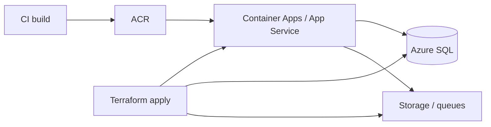

# ArchiForge deployment — Terraform map (Azure)

## Objective

Give operators a single map of **Terraform roots** under `infra/`, how they compose, and what they intentionally **do not** replace (pipelines, org policy). ArchiForge uses **Terraform only** for Azure IaC in this repository (no Bicep roots here).

## Assumptions

- Azure subscription and resource naming are owned by your landing zone.
- Container images are built in CI (see `.github/workflows/ci.yml`) and stored in **ACR** (or another registry your Terraform references).
- SQL schema is applied by the application host (`SqlSchemaBootstrapper` / DbUp), not by Terraform `azurerm_mssql_database` inline scripts.

## Constraints

- **SMB / port 445** must not be exposed publicly; file shares use private connectivity and network boundaries aligned with `terraform-private`.
- **Least privilege**: managed identities, Key Vault references, and private endpoints are preferred over connection strings in plain app settings where the platform supports it.
- **Consumption APIM** (`infra/terraform`) cannot replace Premium VNet-injected APIM for all private-only topologies — see that root’s README.

## Architecture overview

**Nodes:** operators, CI, ACR, Azure Container Apps (or App Service from legacy modules), Azure SQL, storage accounts, Front Door / edge, monitoring workspace, Entra ID app registrations.

**Edges:** Terraform plans apply dependency order; apps pull config from env + Key Vault; observability flows to Log Analytics / Prometheus / Grafana as configured in `terraform-monitoring`.

**Flows:**

1. **Build** → image artifact (digest-addressable).
2. **Provision** → Terraform creates/changes Azure resources.
3. **Release** → compute pulls image, runs migrations on startup, serves `/v1/...` behind edge or APIM.

## Component breakdown

| Root | Role |
|------|------|
| `infra/terraform-container-apps` | Primary **workload** pattern: Container Apps, identity, env wiring (parameters vary by fork/branch). |
| `infra/terraform-storage` | Storage accounts, blobs, queues used by artifacts and durable jobs. |
| `infra/terraform-private` | Networking baseline: VNet segments, private endpoints, alignment with SQL/storage. |
| `infra/terraform-edge` | Front Door (or edge) entry, TLS termination, routing to backends. |
| `infra/terraform-monitoring` | Log Analytics, diagnostics, Grafana/Prometheus hooks as defined in that root. |
| `infra/terraform-entra` | Entra app registrations / service principals **as code**, where used. |
| `infra/terraform` | Optional **API Management (Consumption)** in front of a public HTTPS backend — see `infra/terraform/README.md`. |

## Data flow

- **North/south:** Clients → edge/APIM → API → SQL/storage.
- **Observability:** API exposes Prometheus when `Observability:Prometheus:Enabled` is true; dashboards in `infra/grafana/` target metric and trace names produced by OpenTelemetry (verify exact series names on `/metrics` when wiring panels).

## Security model

- **Identity:** Prefer **managed identity** from compute to SQL, Key Vault, and storage APIs; fall back to Key Vault–backed secrets only where required.
- **Network:** Private endpoints for data planes; no public SQL; align with workspace SMB rule for any file share access.
- **RLS:** Production hosts with `ArchiForge:StorageProvider=Sql` must set `SqlServer:RowLevelSecurity:ApplySessionContext=true` (validated at startup — see `ArchiForgeConfigurationRules`).

## Operational considerations

- **Plan/apply:** Run `terraform init` / `plan` / `apply` per root; compose order is usually **network → data → compute → edge → monitoring**.
- **Drift:** Reconcile manual portal changes back into Terraform or expect the next apply to revert them.
- **Contracts:** HTTP surface is versioned under `/v1/...`; OpenAPI snapshot tests live in `ArchiForge.Api.Tests`; optional AsyncAPI for outbound webhooks is under `docs/contracts/`.
- **Image scanning:** CI runs **Trivy** on container images and Terraform directories — extend with registry gates and Defender for Containers per org policy.

## Related docs

- `docs/CONTAINERIZATION.md` — Docker images and local compose.
- `infra/terraform/README.md` — APIM-specific variables and OpenAPI import.
- `docs/API_CONTRACTS.md` — versioning, deprecation, and contract artifacts.
