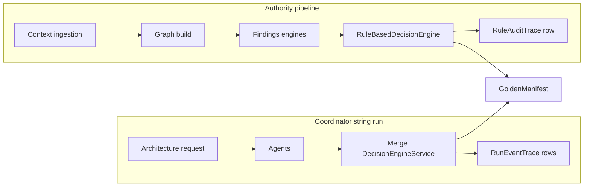

# Dual pipeline navigator (Coordinator vs Authority)

**Objective**: Give newcomers a single map of the two execution paths that both converge on a **golden manifest**, without reading every ADR first.

**Assumptions**: You are working in the .NET solution (`ArchiForge.*` assemblies, renaming incrementally to ArchLucid). Storage is SQL-backed with optional in-memory providers in tests.

**Constraints**: The two pipelines intentionally share contracts (manifest shape, findings model) but use **different persistence ports** for some artifacts (see ADR `0010-dual-manifest-trace-repository-contracts.md`).

---

## Architecture overview

| Concept | Coordinator (string run) | Authority (ingestion run) |
|--------|---------------------------|---------------------------|
| **Entry** | `POST /v1/architecture/request`, `ArchitectureRunService` | `AuthorityRunOrchestrator` / `AuthorityPipelineStagesExecutor` |
| **Primary actors** | `IAgentExecutor`, `DecisionEngineService` (merge) | Context ingestion → graph → findings → `IDecisionEngine` |
| **Event / audit log** | `RunEventTrace` (`ArchiForge.Contracts.Metadata`) — append-only steps | `RuleAuditTrace` (`ArchiForge.Decisioning.Models`) — rule IDs, finding accept/reject |
| **Manifest** | Versioned coordinator manifest | `GoldenManifest` with snapshot IDs |
| **Typical UI** | Runs / tasks / agent results | Authority run detail, graph, provenance |

---

## Component breakdown

- **Coordinator path**: `RunsController` → application services → `ICoordinatorGoldenManifestRepository` / `ICoordinatorDecisionTraceRepository` (names express “coordinator port”).
- **Authority path**: Ingestion connectors → `ContextSnapshot` → `GraphSnapshot` → `FindingsSnapshot` → `RuleBasedDecisionEngine` → `IDecisionTraceRepository` (rule audit rows) and `IGoldenManifestRepository`.
- **Overlap**: Both produce or consume `GoldenManifest`, `FindingsSnapshot`, and decision **nodes**; only the **trace types** differ (`RunEventTrace` vs `RuleAuditTrace`).

---

## Data flow (simplified)

---

## Security model

Both paths honor **scope** (`TenantId` / `WorkspaceId` / `ProjectId`) and **authorization policies** on controllers. Provenance export and `/v1/authority/runs/{id}/provenance` require the same read authority as run detail.

---

## Operational considerations

- **Incomplete authority runs** (no graph/findings/trace) return **422** from the provenance endpoint; coordinator-only runs are expected to hit that path.
- **Tracing**: Use correlation IDs from the API; coordinator merge emits `RunEventTrace` rows for operator forensics.
- **Rename**: Product/UI strings move to ArchLucid per `docs/ARCHLUCID_RENAME_CHECKLIST.md`; type names `RunEventTrace` / `RuleAuditTrace` are stable labels for code navigation.

---

## Related docs

- `docs/adr/0002-dual-persistence-architecture-runs-and-runs.md`
- `docs/adr/0010-dual-manifest-trace-repository-contracts.md`
- `docs/CONTEXT_INGESTION.md`
- `docs/ARCHITECTURE_INDEX.md`
