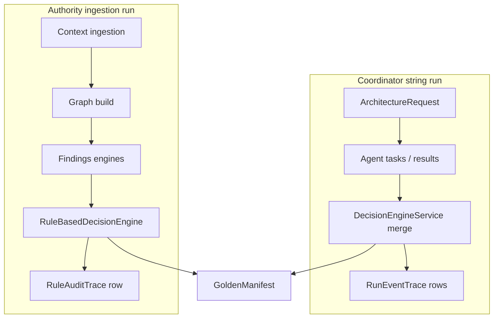

# Dual pipeline navigator (Coordinator vs Authority)

**Objective**: Cut ramp-up time for the two execution paths that both converge on a **golden manifest**, without reading every ADR first. This page is the map; ADRs remain the receipts.

**Assumptions**: You are working in the .NET solution (`ArchLucid.*` assemblies, renaming incrementally to ArchLucid). Storage is SQL-backed with optional in-memory providers in tests.

**Constraints**: The pipelines intentionally share contracts (manifest shape, findings model) but use **different persistence ports** for some artifacts (see ADR `0010-dual-manifest-trace-repository-contracts.md`).

---

## Architecture overview

| Concept | Coordinator (string `ArchitectureRuns.RunId`) | Authority (ingestion / `Guid` run) |
|--------|-----------------------------------------------|-------------------------------------|
| **Entry** | `POST /v1/architecture/request`, `ArchitectureRunService` | `AuthorityRunOrchestrator` / `AuthorityPipelineStagesExecutor` |
| **Primary actors** | `IAgentExecutor`, `DecisionEngineService` (merge) | Context ingestion → graph → findings → `RuleBasedDecisionEngine` |
| **Trace CLR type** | **`RunEventTrace`** (`RunEventTracePayload`) — merge/agent steps | **`RuleAuditTrace`** (`RuleAuditTracePayload`) — rule ids, finding accept/reject |
| **Trace JSON** | Same envelope for both: `DecisionTrace` base + `kind` + `runEvent` *or* `ruleAudit` (`DecisionTraceJsonConverter`) | (same wire shape when exposed as JSON) |
| **Manifest port** | `ICoordinatorGoldenManifestRepository` (versioned string manifest) | `IGoldenManifestRepository` (authority manifest + snapshot ids) |
| **Typical UI** | Runs / tasks / agent results / `GET .../runs/{id}/provenance` | Authority run detail, graph, `GET /v1/authority/runs/{id}/provenance` |

---

## Shared artifacts (overlap)

These concepts appear in **both** worlds or form the **bridge** between operator mental models:

| Artifact / concept | Coordinator use | Authority use |
|--------------------|-----------------|----------------|
| **`GoldenManifest` contract shape** | Output of merge on commit | Output of rule engine / builder after ingestion |
| **`FindingsSnapshot`** | May be referenced in merge/governance context | Primary input to rule-based decisioning |
| **Decision nodes** | `IDecisionEngineV2` / persisted `DecisionNode` rows at commit | Resolved decisions on authority manifest |
| **Traceability ids** | `ManifestMetadata.DecisionTraceIds` ↔ **`RunEventTrace`** `TraceId` | Provenance graph edges from **`RuleAuditTrace`** to rules/findings |
| **Scope** (`Tenant` / `Workspace` / `Project`) | All mutating routes | All authority rows and traces |

---

## Component breakdown

- **Coordinator path**: `RunsController` (`v1/architecture`) → `ArchitectureRunService` / `RunDetailQueryService` → `ICoordinatorGoldenManifestRepository` / `ICoordinatorDecisionTraceRepository`.
- **Authority path**: Ingestion connectors → `ContextSnapshot` → `GraphSnapshot` → `FindingsSnapshot` → `RuleBasedDecisionEngine` → `IDecisionTraceRepository` (rule audit) and `IGoldenManifestRepository`.
- **Naming**: Prefer **`RunEventTrace`** vs **`RuleAuditTrace`** in code and code review; the abstract **`DecisionTrace`** base is only the shared JSON/polymorphic carrier. Payload DTOs remain `RunEventTracePayload` / `RuleAuditTracePayload`.

---

## Data flow (side by side)

**Intersection (conceptual)**: Both subgraphs can emit or consume **`GoldenManifest`**, **`FindingsSnapshot`**, and **decision** graph nodes; only the **trace subtype** and **repository port** differ.

---

## Onboarding walkthrough — one coordinator run (HTTP → committed manifest)

Use this when debugging **string** architecture runs (Swagger, CLI, or UI against `/v1/architecture/...`).

1. **`POST /v1/architecture/request`** — `RunsController.CreateRun` → `ArchitectureRunService.CreateRunAsync` persists `ArchitectureRequest`, `ArchitectureRun`, evidence bundle, and starter `AgentTask` rows (`ICoordinatorService` plans work).
2. **`POST /v1/architecture/run/{runId}/execute`** (or environment-driven auto-execution) — `ArchitectureRunService.ExecuteRunAsync` drives `IAgentExecutor`; results land in `AgentResult` via **`POST /v1/architecture/run/{runId}/result`** in integrated flows.
3. **Ready gate** — Run moves to **`ReadyForCommit`** when required agent results exist (see `ArchitectureRunService` status transitions).
4. **`POST /v1/architecture/run/{runId}/commit`** — `CommitRunAsync` loads request/tasks/results/evaluations, calls `IDecisionEngineV2.ResolveAsync` for **`DecisionNode`**s, then `IDecisionEngineService.MergeResults` (`DecisionEngineService`) to build **`GoldenManifest`** and append coordinator **`RunEventTrace`** rows.
5. **Traceability check** — `CommittedManifestTraceabilityRules.GetLinkageGaps` ensures `Manifest.Metadata.DecisionTraceIds` matches every persisted **`RunEventTrace`** id (merge attaches ids).
6. **Persist** — `ICoordinatorGoldenManifestRepository.CreateAsync`, `ICoordinatorDecisionTraceRepository.CreateManyAsync`, `IDecisionNodeRepository.CreateManyAsync`, and run status **`Committed`** with `CurrentManifestVersion` (`PersistCommittedRunRowsAsync`).
7. **Read-back** — `GET /v1/architecture/run/{runId}` (detail), `GET /v1/architecture/runs/{runId}/provenance` (linkage graph), manifest fetches by version as documented in `docs/ARCHITECTURE_FLOWS.md`.

**Mental model**: Stop at step 4 in the debugger once (`DecisionEngineService`, `DecisionMergeResult`); you will see **`List<RunEventTrace>`** in memory before SQL insert.

---

## Security model

Both paths honor **scope** (`TenantId` / `WorkspaceId` / `ProjectId`) and **authorization policies** on controllers. Provenance export and `/v1/authority/runs/{id}/provenance` require the same read authority as run detail.

**HTTP distinction (OpenAPI):** `GET /v1/authority/runs/{runId}/provenance` returns the **computed** structural graph (`DecisionProvenanceGraph`). `GET /v1/authority/runs/{runId}/provenance-snapshot` returns the **persisted** snapshot row (`DecisionProvenanceSnapshot`, raw graph JSON + metadata). These must not share the same path template.

---

## Operational considerations

- **Incomplete authority runs** (no graph/findings/trace) return **422** from the provenance endpoint; coordinator-only runs are expected to hit that path.
- **Tracing**: Use correlation IDs from the API; coordinator merge emits **`RunEventTrace`** rows for operator forensics.
- **Storage**: Coordinator SQL stores **run-event** payload JSON in `DecisionTraces.EventJson`; authority stores **rule-audit** fields in relational **decisioning** trace tables (`SqlDecisionTraceRepository`). The names are easy to confuse — use this doc and the **`RunEventTrace`** / **`RuleAuditTrace`** types when coding.

---

## Related docs

- `docs/adr/0002-dual-persistence-architecture-runs-and-runs.md`
- `docs/adr/0010-dual-manifest-trace-repository-contracts.md`
- `docs/CONTEXT_INGESTION.md`
- `docs/ARCHITECTURE_FLOWS.md` — narrative run lifecycle
- `docs/ONBOARDING_HAPPY_PATH.md` — short HTTP spine (links here for the split)
- `docs/ARCHITECTURE_INDEX.md`
