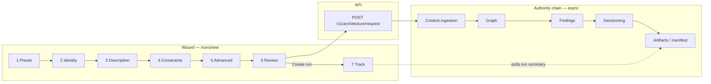

# First-run wizard (operator UI)

**Audience:** New operators, pilot users, and first-time evaluators using **ArchLucid** through the web shell (`archlucid-ui`).

**Route:** `/runs/new` — submits **`POST /v1/architecture/request`** with a full **`ArchitectureRequest`**-shaped body (camelCase JSON). The wizard replaces the older minimal “few fields only” flow.

**Operator checklist (no screenshots):** **[FIRST_RUN_WALKTHROUGH.md](FIRST_RUN_WALKTHROUGH.md)**

**Last reviewed:** 2026-04-17

---

## Implementation status

| Design element | Status |
|----------------|--------|
| Seven-step wizard (`/runs/new`) | **Shipped** — preset → identity → description → constraints → advanced → review → track (`WizardStep*` + `NewRunWizardClient`). |
| Starter presets (greenfield / modernize / blank) | **Shipped** — see `WizardStepPreset` and preset merge logic. |
| Live pipeline tracking (step 7) | **Shipped** — `RunProgressTracker` + polling against run detail APIs. |
| Playwright / Vitest coverage | **Partial** — Vitest: `archlucid-ui/src/app/runs/new/*.test.tsx`; E2E smoke: **`archlucid-ui/e2e/first-run-wizard.spec.ts`** (`/runs/new` heading + intro copy). **`/onboarding`** adds **`OnboardingWizardClient`** (auth / connection / storage checklist with localStorage progress). Extend when wizard steps change materially. |

---

## Purpose

The **seven-step guided wizard** walks you from a **starting template** (or scratch defaults) through **identity**, **requirements**, **constraints**, optional **advanced context**, **review**, and **live pipeline tracking**. It exists so you do not have to hand-craft JSON or guess which fields matter for agents and the authority chain.

Use it when you want a **repeatable first run** in a new tenant, workspace, or pilot environment, or when you are **demoing** ArchLucid to stakeholders who should not touch the API directly.

---

## End-to-end flow (wizard + pipeline)

Deep dives: **[ARCHITECTURE_FLOWS.md](ARCHITECTURE_FLOWS.md)** (run lifecycle narrative), **[DUAL_PIPELINE_NAVIGATOR.md](DUAL_PIPELINE_NAVIGATOR.md)** (coordinator vs authority, shared artifacts).

---

## Starter presets

| Preset | When to use it |
|--------|----------------|
| **Greenfield web app** | New public-facing web workload on Azure; pre-fills description, constraints, and capabilities typical of HTTPS + data tier + CI/CD. |
| **Modernize legacy system** | Strangler / incremental migration narrative; includes **topology hints**; leave **prior manifest** empty unless you have a baseline version string. |
| **Blank (advanced)** | Minimal defaults only — you fill every meaningful field yourself. Good when you already have a checklist or copy-paste from an RFC. |

**Start from scratch** resets the form to validated defaults (new `requestId`, placeholder description meeting length rules, empty lists, Azure + staging).

---

## Step-by-step (fields ↔ `ArchitectureRequest`)

Below, names match the **JSON body** sent to `POST /v1/architecture/request` (same surface as `ArchitectureRequest` / `CreateArchitectureRunRequestPayload` in the UI client).

### Step 1 — Choose a starting point

- **What:** Preset or scratch; no API fields change until you continue — the choice **merges** into the form (`reset` with parsed values).
- **Why:** Jump-start realistic examples or enforce a disciplined blank slate.

### Step 2 — System identity

| UI control | Request field | Notes |
|------------|---------------|--------|
| System name | `systemName` | Required; used as the **ingestion project identity** (short slug, e.g. `OrderService`). |
| Environment | `environment` | `staging`, `production`, `development`, or `sandbox`. |
| Cloud provider | `cloudProvider` | **Azure** only in this release; other clouds show as disabled “coming soon.” |
| Prior manifest version (optional) | `priorManifestVersion` | Omit or leave blank for greenfield; set a **version string** for incremental / baseline-aware runs. |

### Step 3 — Description & requirements

| UI control | Request field | Notes |
|------------|---------------|--------|
| Description | `description` | Required; **minimum 10 characters**. Primary signal for agents. |
| Inline requirements (list) | `inlineRequirements` | Optional strings; one row per extra requirement. |

**Tip:** A strong description is **2–4 sentences**: what the system does, who uses it, the **architectural question** you want answered (e.g. “single region vs multi-region,” “PCI scope,” “strangler cutover boundary”). Avoid paste-only buzzwords; agents need intent.

### Step 4 — Constraints, capabilities & assumptions

| UI area | Request field | Notes |
|---------|---------------|--------|
| Constraints (chips) | `constraints` | Hard limits: budget, regions, compliance, “must not” rules. |
| Required capabilities (chips) | `requiredCapabilities` | What the architecture **must** support (e.g. HTTPS ingress, managed DB). |
| Assumptions (chips) | `assumptions` | What agents may treat as true unless evidence contradicts (team skills, timelines). |

### Step 5 — Advanced (optional)

Omitted empty sections are not sent (or sent as empty arrays only where required by validation — the client strips noise for the POST body).

| UI area | Request field | Notes |
|---------|---------------|--------|
| Policy references (chips) | `policyReferences` | e.g. `policy-pack:enterprise-default`. |
| Topology hints (chips) | `topologyHints` | Patterns to prefer or avoid. |
| Security baseline hints (chips) | `securityBaselineHints` | Expected controls in plain language. |
| Documents (rows) | `documents[]` | `{ name, contentType, content }` — inlined UTF-8 text for agent context. |
| Infrastructure declarations (rows) | `infrastructureDeclarations[]` | `{ name, format, content }`; `format` typically `json` or `simple-terraform`. |

### Step 6 — Review & submit

- **What:** Read-only summary + inline validation messages from the form schema.
- **Why:** Catch mistakes before **`Create run`** calls the API.
- **Also shown:** `requestId` (client-generated idempotency-style key, 32-char hex without dashes).

### Step 7 — Track pipeline

- **What:** Polls **`GET /v1/authority/runs/{runId}/summary`** (via the UI proxy) for up to **~2 minutes**, every **~3 seconds**.
- **Why:** Surfaces **Context → Graph → Findings → Manifest** readiness without leaving the page.
- **Not the full OTel story:** The server’s authority orchestration spans **context → graph → findings → decisioning → artifacts** (see **ARCHITECTURE_FLOWS.md**). The wizard’s fourth milestone is **golden manifest available** (`hasGoldenManifest`), which is what operators care about for run detail and exports.

---

## Pipeline status indicators (Step 7)

| Badge | Meaning (run summary flags) | Rough expectation |
|-------|-----------------------------|-------------------|
| **Context — Ready** | `hasContextSnapshot` | Usually among the first to flip; depends on ingestion load and input size. |
| **Graph — Ready** | `hasGraphSnapshot` | Follows context once graph materialization completes. |
| **Findings — Ready** | `hasFindingsSnapshot` | Findings generation tied to graph/context readiness. |
| **Manifest — Ready** | `hasGoldenManifest` | End state for “can open run detail with manifest links”; may trail the others by minutes in busy environments. |

The **progress bar** is a simple **count of ready stages / 4**, not a time estimate. If nothing moves before the UI stops polling, treat it as **still running server-side** or **stuck** — see [Troubleshooting](#troubleshooting).

---

## After the wizard

1. **Open run detail** — `/runs/{runId}`: manifest summary, artifacts, authority context (when committed and indexed per environment).
2. **Commit if required** — Until commit, some views stay empty; follow **[OPERATOR_QUICKSTART.md](OPERATOR_QUICKSTART.md)** for API/CLI commit expectations and `409` handling.
3. **Export** — From run detail (with manifest): bundle / export ZIP links when your deployment exposes them.
4. **Compare** — `/compare?leftRunId={runId}` (wizard success panel links this for you).
5. **Provenance** — `/runs/{runId}/provenance` for graph/trace orientation.

Primary operator reference: **[OPERATOR_QUICKSTART.md](OPERATOR_QUICKSTART.md)**.

---

## Troubleshooting

| Symptom | What to check |
|---------|----------------|
| **Cannot create run / network error** | UI uses **`/api/proxy`** to reach the API. Verify API base URL, API key (server env), and JWT if enabled — see `archlucid-ui` docs and **`docs/TROUBLESHOOTING.md`**. |
| **Run id returned but Step 7 stays all Pending** | API may be down for authority workers, or scope headers point at the wrong project. Confirm **`GET .../runs/{id}/summary`** outside the UI. |
| **Stuck in “Created” / no snapshots** | Coordinator vs authority nuances: **DUAL_PIPELINE_NAVIGATOR.md**. Check host logs for `AuthorityPipelineStagesExecutor` / stage failures. |
| **Timeout (~2 min) with no golden manifest** | Pipeline may still be running; open **run detail** and refresh later. If permanently stuck, inspect SQL run row, worker health, and **OPERATIONS** runbooks. |
| **Empty manifest after “ready”** | “Ready” in the wizard means **summary flags**; **commit** and **artifact** availability are separate steps — **OPERATOR_QUICKSTART.md**. |

---

## Related documentation

| Doc | Use it for |
|-----|------------|
| [ONBOARDING_HAPPY_PATH.md](ONBOARDING_HAPPY_PATH.md) | Single HTTP journey spine (auth → request → authority → commit). |
| [OPERATOR_QUICKSTART.md](OPERATOR_QUICKSTART.md) | Day-1 commands, commit, manifests, exports. |
| [ARCHITECTURE_FLOWS.md](ARCHITECTURE_FLOWS.md) | Flow A run lifecycle + authority span names. |
| [DUAL_PIPELINE_NAVIGATOR.md](DUAL_PIPELINE_NAVIGATOR.md) | Two pipelines, traces, manifest ports. |
| [API_CONTRACTS.md](API_CONTRACTS.md) | `ArchitectureRequest`, idempotency, error shapes. |
