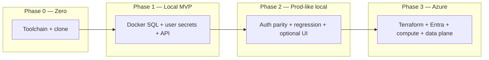

# Golden path — zero → prod-like dev → Azure

**Last reviewed:** 2026-04-04

One **environment and delivery** spine for ArchiForge. Use this page when you need **where to start** and **in what order** to turn things on.

- **Different question?** If you need how a **single API request** moves through the system (client → API → SQL → agents), see **[ONBOARDING_HAPPY_PATH.md](ONBOARDING_HAPPY_PATH.md)** (request lifecycle).

---

## Pick your lane (role-based entry)

| Role | Start here | Week-one ticket (3–5 checks) | You care most about |
|------|------------|------------------------------|---------------------|
| **Developer** | [Phase 0](#phase-0--zero-toolchain-and-clone) → [Phase 1](#phase-1--local-minimum-viable) | [onboarding/day-one-developer.md](onboarding/day-one-developer.md) | Build, tests, local SQL, API + optional UI |
| **SRE / Platform** | [Phase 2](#phase-2--prod-like-local) → [Phase 3](#phase-3--azure) → **[DEPLOYMENT.md](DEPLOYMENT.md)** | [onboarding/day-one-sre.md](onboarding/day-one-sre.md) | Terraform order, health, migrations, failover, observability |
| **Security / GRC** | **[CUSTOMER_TRUST_AND_ACCESS.md](CUSTOMER_TRUST_AND_ACCESS.md)** → [Phase 3](#phase-3--azure) (identity + network) | [onboarding/day-one-security.md](onboarding/day-one-security.md) | Entra, private endpoints, Key Vault, threat models under `docs/security/` |

**Exec / audit decks (PNG, not Mermaid):** [diagrams/c4/README.md](diagrams/c4/README.md) — context, container, and API component PNGs plus `.mmd` sources.

Deep references stay in linked docs; this file only **sequences** them.

---

## One diagram (maturity path)

**Nodes:** your machine, local dependencies, stricter local config, Azure landing zone.  
**Edges:** each phase **adds** realism (auth, tests, IaC); skipping a phase is allowed if you accept the risk (for example, jumping from Phase 1 to Azure without Phase 2 smoke tests).

---

## Phase 0 — Zero (toolchain and clone)

**Goal:** A clean checkout that builds.

| Step | Action | Detail |
|------|--------|--------|
| 1 | Install prerequisites | [.NET 10 SDK](https://dotnet.microsoft.com/download), Git; optional Docker, Node 22 for UI — see root **[README.md](../README.md#prerequisites)** |
| 2 | Clone and restore | `git clone …`, `dotnet restore`, `dotnet build` — **[CONTRIBUTOR_ONBOARDING.md](CONTRIBUTOR_ONBOARDING.md)** |
| 3 | (Optional) Dev Container | **[DEVCONTAINER.md](DEVCONTAINER.md)** |

**Done when:** `dotnet build` succeeds at repo root.

---

## Phase 1 — Local minimum viable

**Goal:** API running against real SQL on your laptop with **DevelopmentBypass** (or your team’s agreed dev auth).

| Step | Action | Detail |
|------|--------|--------|
| 1 | Start SQL + sidecars | `dotnet run --project ArchiForge.Cli -- dev up` **or** `docker compose up -d` — **[CONTAINERIZATION.md](CONTAINERIZATION.md)** |
| 2 | Configure connection string | User secrets `ConnectionStrings:ArchiForge` — root **[README.md](../README.md#secrets-development)** |
| 3 | Run API | `dotnet run --project ArchiForge.Api` |
| 4 | Verify | `GET /health/live`, `GET /health/ready` — **[BUILD.md](BUILD.md)** (startup vs migration failure) |
| 5 | Fix issues | **[TROUBLESHOOTING.md](TROUBLESHOOTING.md)** |

**Done when:** `/health/ready` succeeds and you can hit a simple **v1** route (see **[API_CONTRACTS.md](API_CONTRACTS.md)**).

---

## Phase 2 — Prod-like local

**Goal:** Same **behaviors** you expect in Azure: SQL persistence path, stricter auth modes, automated gates, optional operator UI.

| Step | Action | Detail |
|------|--------|--------|
| 1 | Confirm SQL storage | `ArchiForge:StorageProvider=Sql` for production-aligned paths — **[adr/0011-inmemory-vs-sql-storage-provider.md](adr/0011-inmemory-vs-sql-storage-provider.md)** |
| 2 | Exercise auth you will use in prod | **JwtBearer** or **ApiKey** — root **[README.md](../README.md#api-authentication-archiforgeauth)**, sample **[ArchiForge.Api/appsettings.Entra.sample.json](../ArchiForge.Api/appsettings.Entra.sample.json)** |
| 3 | Run integration / regression | Set `ARCHIFORGE_SQL_TEST` (or API test var); scripts — **[BUILD.md](BUILD.md)**, **[TEST_EXECUTION_MODEL.md](TEST_EXECUTION_MODEL.md)** |
| 4 | Optional release smoke | `release-smoke` with `ARCHIFORGE_SMOKE_SQL` — **[RELEASE_SMOKE.md](RELEASE_SMOKE.md)** |
| 5 | Optional operator UI | `archiforge-ui/` — **[operator-shell.md](operator-shell.md)**, **[archiforge-ui/README.md](../archiforge-ui/README.md)** |
| 6 | Pilot-style checklist | **[PILOT_GUIDE.md](PILOT_GUIDE.md)**, **[OPERATOR_QUICKSTART.md](OPERATOR_QUICKSTART.md)** |

**Done when:** Your team agrees “this laptop behaves like staging minus Azure networking.”

---

## Phase 3 — Azure

**Goal:** Workloads in a subscription with **identity, secrets, and data plane** aligned to org policy.

| Step | Action | Detail |
|------|--------|--------|
| 1 | Read umbrella deploy story | **[DEPLOYMENT.md](DEPLOYMENT.md)** (order: build → migrate → roll out → smoke) |
| 2 | Map Terraform roots | **[infra/README.md](../infra/README.md)**, **[DEPLOYMENT_TERRAFORM.md](DEPLOYMENT_TERRAFORM.md)** |
| 3 | Apply in **suggested dependency order** | Storage (if needed for artifacts) → Container Apps (or your compute) → optional **private** endpoints → optional **Entra** app → optional **edge** — see **infra/README** “Suggested order” |
| 4 | Wire app configuration | Key Vault / env — **[CONFIGURATION_KEY_VAULT.md](CONFIGURATION_KEY_VAULT.md)**, **[terraform-azure-variables.md](terraform-azure-variables.md)** |
| 5 | SQL HA / listener (if required) | Failover group + listener FQDN — **[runbooks/DATABASE_FAILOVER.md](runbooks/DATABASE_FAILOVER.md)**, **`infra/terraform-sql-failover/`** |
| 6 | RTO/RPO alignment | **[RTO_RPO_TARGETS.md](RTO_RPO_TARGETS.md)** |
| 7 | Observability | Metrics, Grafana templates — **[BUILD.md](BUILD.md)** (OpenTelemetry meter), **`infra/terraform-monitoring/`**, **[runbooks/SLO_PROMETHEUS_GRAFANA.md](runbooks/SLO_PROMETHEUS_GRAFANA.md)** |

**Done when:** Production (or staging) traffic path is documented, secrets are not in git, and rollback/failover pointers are known to on-call.

---

## Advanced and rarely used paths (appendix)

Use these when a **specific feature** demands them — not part of the golden path above.

| Topic | Where to go |
|--------|-------------|
| **Front Door / WAF** | `infra/terraform-edge/`, **[CUSTOMER_TRUST_AND_ACCESS.md](CUSTOMER_TRUST_AND_ACCESS.md)** |
| **Consumption APIM** | `infra/terraform/README.md` (not a substitute for all private APIM topologies) |
| **SQL failover group (IaC)** | `infra/terraform-sql-failover/` |
| **Contoso demo / trusted baseline** | **[demo-quickstart.md](demo-quickstart.md)**, **[TRUSTED_BASELINE.md](TRUSTED_BASELINE.md)** |
| **RLS / multi-tenant SQL** | **[security/MULTI_TENANT_RLS.md](security/MULTI_TENANT_RLS.md)**, ADRs under `docs/adr/` |
| **Managed identity SQL + blob** | **[security/MANAGED_IDENTITY_SQL_BLOB.md](security/MANAGED_IDENTITY_SQL_BLOB.md)** |
| **Ask + RAG threat model** | **[security/ASK_RAG_THREAT_MODEL.md](security/ASK_RAG_THREAT_MODEL.md)** |
| **Azure AI Search SKU** | **[AI_SEARCH_SKU_GUIDANCE.md](AI_SEARCH_SKU_GUIDANCE.md)** |
| **Knowledge graph deep dive** | **[KNOWLEDGE_GRAPH.md](KNOWLEDGE_GRAPH.md)** |
| **Context ingestion (full)** | **[CONTEXT_INGESTION.md](CONTEXT_INGESTION.md)** |
| **Comparison replay / custom types** | **[COMPARISON_REPLAY.md](COMPARISON_REPLAY.md)**, **[HOWTO_ADD_COMPARISON_TYPE.md](HOWTO_ADD_COMPARISON_TYPE.md)** |
| **Mutation testing (Stryker)** | **[MUTATION_TESTING_STRYKER.md](MUTATION_TESTING_STRYKER.md)** |
| **Finding-engine template** | **[BUILD.md](BUILD.md)** (`archiforge-finding-engine` template) |
| **Product / pilot learning dashboards** | **[PRODUCT_LEARNING.md](PRODUCT_LEARNING.md)**, release summary in **[CHANGELOG.md](CHANGELOG.md)**, full design-session logs in `docs/archive/` |
| **CLI API implementation plan** | **[CLI_API_IMPLEMENTATION_PLAN.md](CLI_API_IMPLEMENTATION_PLAN.md)** |
| **JSON / contract audits** | **[JSON_PUBLIC_CONTRACTS.md](JSON_PUBLIC_CONTRACTS.md)**, **[JSON_FALLBACK_AUDIT.md](JSON_FALLBACK_AUDIT.md)** |

---

## Related indexes

- **All architecture entry points:** **[ARCHITECTURE_INDEX.md](ARCHITECTURE_INDEX.md)**  
- **Runbooks (incident-shaped):** **[runbooks/README.md](runbooks/README.md)**  
- **ADRs (why we chose X):** **[adr/README.md](adr/README.md)**
