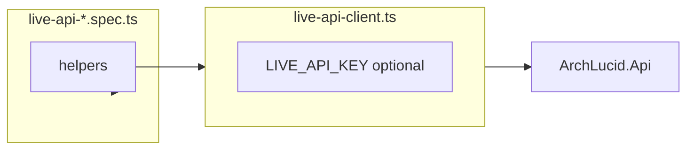

# Live E2E — auth assumptions (DevelopmentBypass vs ApiKey / JWT)

## 1. Objective

Document every **DevelopmentBypass-only** assumption in `archlucid-ui/e2e/live-api-*.spec.ts` and `e2e/helpers/live-api-client.ts` so contributors know what breaks when the API runs under **ApiKey** or **JwtBearer** auth. Use this when extending production-like live gates.

## 2. Assumptions

- **CI default (`ui-e2e-live`):** `ArchLucidAuth:Mode=DevelopmentBypass`, `Authentication:ApiKey:DevelopmentBypassAll=true` — HTTP calls need **no** `X-Api-Key` header.
- **Production-like:** `ArchLucidAuth:Mode=ApiKey`, `Authentication:ApiKey:Enabled=true`, `DevelopmentBypassAll=false` — callers must send a valid **`X-Api-Key`** for authorized endpoints.
- **Anonymous endpoints:** `GET /health/live` and `GET /health/ready` are **`AllowAnonymous`** — they succeed without auth in all modes (see `ArchLucid.Api/Startup/PipelineExtensions.cs`).

## 3. Constraints

- **Simulator + auth are orthogonal:** `AgentExecution:Mode=Simulator` does not remove auth requirements under ApiKey mode.
- **Governance `reviewedBy`** is a **JSON body field**, not the HTTP principal name — segregation compares `reviewedBy` to **`RequestedBy`** stored on the approval request (submitter identity from claims). Under ApiKey admin, submitter maps to **`ApiKeyAdmin`** (`ClaimTypes.Name` in `ApiKeyAuthenticationHandler`).
- **JWT live E2E** is not implemented in-repo; this document focuses on DevelopmentBypass vs ApiKey.

## 4. Architecture overview

**Nodes:** Playwright `APIRequestContext`, ArchLucid.Api, SQL Server, Next.js operator shell (for UI portions of specs).

**Edges:** Specs → `live-api-client` helpers → HTTP → API auth middleware → controllers.

**Flows:**

## 5. Inventory table

| File | Location / topic | Assumption | Why it fails under ApiKey without headers | Severity |
|------|------------------|------------|---------------------------------------------|----------|
| `live-api-client.ts` | All `request.*` helpers | No `X-Api-Key` when `LIVE_API_KEY` unset | Authorized routes return **401** | **Blocking** |
| `live-api-journey.spec.ts` | `developmentBypassActorName = "Developer"` | Self-approval soft check uses literal **Developer** | Under ApiKey, submitter is **ApiKeyAdmin** — same check must use `liveAuthActorName` | **Blocking** (assertion wrong) |
| `live-api-journey.spec.ts` | `peerReviewerActor` | Body string **e2e-peer-reviewer** | Still valid — differs from **ApiKeyAdmin** | Non-issue |
| `live-api-negative-paths.spec.ts` | `developmentBypassActorName` | Self-approval test title + `reviewedBy` | Must use `liveAuthActorName` under ApiKey | **Blocking** |
| `live-api-concurrency.spec.ts` | `e2e-concurrent-approver-a/b` | Distinct `reviewedBy` strings vs submitter | Valid under ApiKey if submitter is ApiKeyAdmin | Non-issue |
| `live-api-governance-rejection.spec.ts` | `e2e-rejector` | Rejector ≠ submitter | Valid under ApiKey | Non-issue |
| All live specs | `beforeAll` health message | Text says "DevelopmentBypass" | Misleading when testing ApiKey — message only | Soft |
| `live-api-archival.spec.ts` | Skip text | References DevelopmentBypass | Documentation only | Soft |
| `live-api-alert-rules.spec.ts` | Header comment | "DevelopmentBypass admin" | Operational note | Soft |
| UI-driven specs | `page` navigation | Next.js BFF may use cookies/JWT | Not covered by `live-api-client` key injection — scope stays **API direct** for helpers | Reliability |

## 6. Classification

| Class | Items |
|-------|--------|
| **Blocking (fix for ApiKey mode)** | Add optional `X-Api-Key` via `LIVE_API_KEY`; use `liveAuthActorName` instead of literal **Developer** for self-approval / submitter alignment. |
| **Soft** | `beforeAll` error strings mentioning DevelopmentBypass; comments in spec headers. |
| **Non-issue under ApiKey** | Distinct `reviewedBy` peer strings; 404/409 status assertions; graph/run id formatting. |

## 7. Data flow (auth)

1. **DevelopmentBypass:** Authentication handler synthesizes principal (`DevUserName` / **Developer**, Admin role). No API key header.
2. **ApiKey:** Handler validates `X-Api-Key` against configured admin/readonly segments; principal **ApiKeyAdmin** or **ApiKeyReadOnly** with permission claims.
3. **Helpers:** When `process.env.LIVE_API_KEY` is set, `live-api-client.ts` attaches `X-Api-Key` on every helper call. Explicit `liveJsonHeaders("")` omits the key for negative tests.

## 8. Security model

- **Secrets:** Never commit real keys; CI uses throwaway values in ephemeral jobs only.
- **ReadOnly key:** Exercises least-privilege (`commit:run` denied) without using admin material for mutating calls.

## 9. Operational considerations

- **PR job `ui-e2e-live-apikey`:** Subset of specs + dedicated `live-api-apikey-auth.spec.ts`; merge-blocking.
- **Nightly `live-e2e-nightly.yml`:** Optional full `live-api-*.spec.ts` matrix for both auth modes; long duration acceptable off critical path.
- **Docs:** Parity matrix in **`docs/LIVE_E2E_AUTH_PARITY.md`**; operator narrative in **`docs/LIVE_E2E_HAPPY_PATH.md`**.

## 10. Related links

- [LIVE_E2E_HAPPY_PATH.md](LIVE_E2E_HAPPY_PATH.md)
- [LIVE_E2E_AUTH_PARITY.md](LIVE_E2E_AUTH_PARITY.md)
- [TEST_STRUCTURE.md](TEST_STRUCTURE.md)
- [TEST_EXECUTION_MODEL.md](TEST_EXECUTION_MODEL.md)
- [runbooks/API_KEY_ROTATION.md](runbooks/API_KEY_ROTATION.md)
