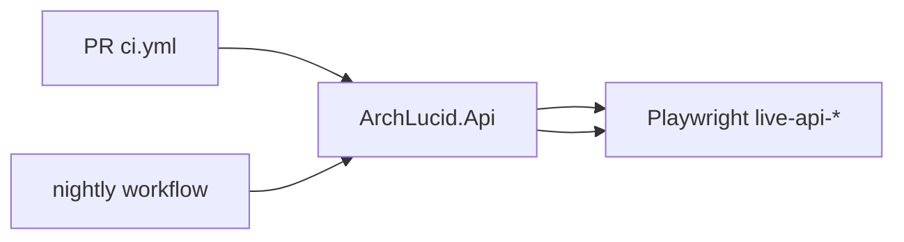

# Live E2E — auth parity (DevelopmentBypass vs ApiKey)

## 1. Objective

Record which **`live-api-*.spec.ts`** scenarios run under **PR CI** vs **nightly**, and how **DevelopmentBypass** differs from **ApiKey** auth, so operators know what integration proof exists for production-like behavior.

## 2. Assumptions

- **Simulator** is orthogonal to auth: `AgentExecution:Mode=Simulator` can pair with either auth mode.
- **JWT / Entra** live gates are **not** in-repo yet; this matrix covers DevelopmentBypass and ApiKey only.
- **Anonymous health:** `GET /health/ready` stays **`AllowAnonymous`** in all modes.

## 3. Constraints

- **ApiKey mode** uses fixed principals (**`ApiKeyAdmin`** / **`ApiKeyReadOnly`**) — true multi-user segregation is a **JWT** concern; body field **`reviewedBy`** still enforces governance segregation vs stored **`RequestedBy`**.
- **Nightly** workflows do not run on **forks** (`github.event.repository.fork == false`).

## 4. Architecture overview

**Nodes:** GitHub Actions runners, SQL Server service container, `ArchLucid.Api`, Playwright + Next.js `webServer`, `LIVE_API_*` env vars.

**Edges:** CI job → API env (`ArchLucidAuth:Mode`, `Authentication:ApiKey:*`) → Playwright → `live-api-client` (optional `X-Api-Key`).

**Flows:**

## 5. Component breakdown

| Artifact | Role |
|----------|------|
| **`ci.yml` → `ui-e2e-live`** | Full **`live-api-*.spec.ts`** under DevelopmentBypass + `DevelopmentBypassAll`; no `LIVE_API_KEY`. |
| **`ci.yml` → `ui-e2e-live-apikey`** | ApiKey API + subset: **`live-api-apikey-auth`**, **`live-api-journey`**, **`live-api-negative-paths`**. |
| **`live-e2e-nightly.yml`** | Scheduled + `workflow_dispatch`: **full** suite ×2 (DevelopmentBypass DB + ApiKey DB). |
| **`e2e/helpers/live-api-client.ts`** | Injects `X-Api-Key` when `LIVE_API_KEY` set; exports **`liveAuthActorName`**, **`livePeerReviewerActorName`**. |

## 6. Auth mode matrix (spec files)

| Spec | PR `ui-e2e-live` | PR `ui-e2e-live-apikey` | Nightly (each mode) |
|------|------------------|-------------------------|----------------------|
| `live-api-apikey-auth.spec.ts` | skipped (no key) | ✅ | ✅ (ApiKey job only meaningful; Bypass run skips tests) |
| `live-api-journey.spec.ts` | ✅ | ✅ | ✅ |
| `live-api-negative-paths.spec.ts` | ✅ | ✅ | ✅ |
| All other `live-api-*.spec.ts` | ✅ | — | ✅ |

## 7. Data flow (headers)

1. **DevelopmentBypass + no `LIVE_API_KEY`:** helpers send JSON/Accept only; API synthesizes **Developer** admin principal.
2. **ApiKey + `LIVE_API_KEY`:** helpers add **`X-Api-Key`**; submitter for governance is **`ApiKeyAdmin`**; **`liveAuthActorName`** matches for self-approval tests.

## 8. Security model

- CI keys are **throwaway** strings in workflow env (not secrets). Do not reuse outside ephemeral CI.
- **`LIVE_API_KEY_READONLY`** exercises least privilege (read list allowed; create run **403**).

## 9. Operational considerations

- **Cost:** Nightly doubles full live runs (two DBs, two API boots). Adjust cron if spend matters.
- **Flakes:** Full nightly is the pressure valve if PR subset is green but a rare spec regresses.
- **Artifacts:** Nightly uploads API logs **on failure** only (`live-e2e-nightly.yml`).

## 10. Related links

- [LIVE_E2E_AUTH_ASSUMPTIONS.md](LIVE_E2E_AUTH_ASSUMPTIONS.md)
- [LIVE_E2E_HAPPY_PATH.md](LIVE_E2E_HAPPY_PATH.md)
- [TEST_STRUCTURE.md](TEST_STRUCTURE.md)
- [TEST_EXECUTION_MODEL.md](TEST_EXECUTION_MODEL.md)
- [runbooks/API_KEY_ROTATION.md](runbooks/API_KEY_ROTATION.md)

## 11. Addendum — quality assessment (2026-04-14)

**Priority 1** (“Production-like live gates”) from **`docs/QUALITY_ASSESSMENT_2026_04_14.md`** is **partially addressed**: ApiKey subset on PR + full matrix nightly + documentation. **JWT/Entra** live coverage remains future work.
