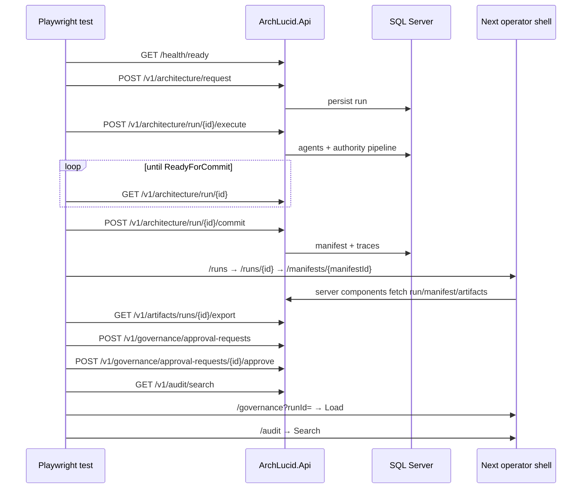

# Live E2E — operator happy path (Playwright + API + SQL)

**Purpose:** Describe the **single** CI Playwright journey that proves the operator shell against a **real** `ArchLucid.Api` and **SQL Server**, not the mock API server used by default `playwright.config.ts`.

**Specs (same Playwright live config):**

| File | `describe` | Purpose |
|------|------------|---------|
| `archlucid-ui/e2e/live-api-journey.spec.ts` | `live-api-journey` | Operator happy path (create → commit → manifest → export → governance approve → audit UI). |
| `archlucid-ui/e2e/live-api-conflict-journey.spec.ts` | `live-api-conflict-journey` | Second **commit** → **200** (idempotent, same `manifestVersion`); **ManifestGenerated** audit count unchanged; run detail UI still **Committed**. **404** `#run-not-found` on commit for a random missing `runId`. |
| `archlucid-ui/e2e/live-api-governance-rejection.spec.ts` | `live-api-governance-rejection` | Governance **submit → reject** (`e2e-rejector`); audit **`GovernanceApprovalRejected`**; **400** on approve-after-reject and duplicate reject; **`/governance`** UI shows **Rejected**. |
| `archlucid-ui/e2e/live-api-error-states.spec.ts` | `live-api-error-states` | UI resilience: fake run detail, **`/runs`** list, **`/audit`** no-results search, **`/governance/dashboard`** load (no mock API). |

**Config:** `archlucid-ui/playwright.live.config.ts`  
**HTTP helpers:** `archlucid-ui/e2e/helpers/live-api-client.ts`  
**CI job:** `.github/workflows/ci.yml` → **`ui-e2e-live`** (**merge-blocking**; failures fail the workflow).

---

## Prerequisites

| Requirement | Notes |
|-------------|--------|
| **ArchLucid.Api** | Listening on **`LIVE_API_URL`** (default `http://127.0.0.1:5128`). |
| **SQL** | Connection string points at a database the API can migrate (CI creates **`ArchLucidLiveE2e`** via `sqlcmd`). |
| **Auth** | **`ArchLucidAuth:Mode=DevelopmentBypass`** (CI sets this). |
| **Agents** | **`AgentExecution:Mode=Simulator`** — no real LLM; deterministic synthetic agent results + authority pipeline still run. |
| **Next.js** | Built with **`output: "standalone"`** before live E2E in CI; **`LIVE_E2E_SKIP_NEXT_BUILD=1`** avoids a second `npm run build` beside the API. |

---

## Step-by-step journey

1. **`GET /health/ready`** — fail fast if the API is not up (`beforeAll`).
2. **`POST /v1/architecture/request`** — create a run; capture **`runId`**.
3. **`POST /v1/architecture/run/{runId}/execute`** — simulator execution.
4. **Poll `GET /v1/architecture/run/{runId}`** until **`run.status`** is **`ReadyForCommit`** (numeric **`4`**) or already committed. Each poll retries a few times on **HTTP 5xx** (short backoff) to ride out transient SQL/API blips.
5. **`POST /v1/architecture/run/{runId}/commit`** — persist golden manifest; read **`manifest.metadata.manifestVersion`**.
6. **`GET /v1/architecture/run/{runId}`** — read **`run.goldenManifestId`** for UI navigation.
7. **UI:** **`/runs`** → **`/runs/{runId}`** — assert **Golden Manifest** link → **`/manifests/{goldenManifestId}`** — **Manifest** heading, **Artifacts**, table, **Download bundle (ZIP)**.
8. **`GET /v1/artifacts/runs/{runId}/export`** — non-empty ZIP; emits **`RunExported`** audit.
9. **`POST /v1/governance/approval-requests`** — **`dev` → `test`**, manifest version from commit.
10. **Negative (soft):** **`POST …/approve`** with **`reviewedBy: Developer`** (same as default **`ArchLucidAuth:DevUserName`** under DevelopmentBypass) → **400** self-approval block (**`expect.soft`** — does not fail the happy path).
11. **`POST /v1/governance/approval-requests/{id}/approve`** — **`reviewedBy: e2e-peer-reviewer`** (differs from submitter) → **Approved**.
12. **Negative (soft):** second **`POST …/approve`** on the same id → **400** (invalid transition from **Approved**).
13. **`GET /v1/audit/search?runId=…`** — assert durable types: **`RunStarted`**, **`ManifestGenerated`**, **`GovernanceApprovalSubmitted`**, **`GovernanceApprovalApproved`**, **`RunExported`**. **`expect.soft`** on each row: non-empty **`correlationId`** (aligns with **`AuditService`** enrichment). Then **`GET /v1/audit/search?correlationId=…`** using the first non-empty id — assert at least one row (**`correlationId`** filter path end-to-end).
14. **`GET /v1/architecture/runs`** — list includes this **`runId`** with status **Committed** (**`expect.soft`** on status text).
15. **UI:** **`/governance?runId=…`** — **Load** — expect approval card + **Approved** status.
16. **UI:** **`/audit`** — filter by run ID, **Search**, no error alerts.

**Forensics:** The spec sets Playwright **`test.info().annotations`** (`e2e-run-id`, `e2e-approval-request-id`, `e2e-audit-correlation-id`) and logs **`runId` / `approvalRequestId` / `auditCorrelationId`** in **`afterAll`** for CI log triage.

---

## Sequence diagram

---

## Error-path E2E (conflict journey)

The **`live-api-conflict-journey`** spec complements the happy path:

- After a successful commit, a second **`POST …/commit`** returns **200** with the same manifest version (**idempotent**); **`ManifestGenerated`** audit count must not increase.
- **`GET /v1/audit/search?runId=…`** must not gain an extra **`ManifestGenerated`** row after the idempotent second commit.
- **`GET /v1/architecture/run/{runId}`** must still show **Committed** status.
- Committing a **non-existent** `runId` returns **404** with **`#run-not-found`**.

Shared helpers: **`commitRunRaw`**, **`waitForReadyForCommit`** (exported from **`live-api-client.ts`**).

---

## Known limitations

- **No real LLM** in CI — semantic quality of outputs is not under test.
- **DevelopmentBypass** — not a production auth configuration; do not equate this gate with Entra/API-key hardening.
- **Compare, replay, DOCX consulting export** and other surfaces remain primarily **mock-backed** in **`ui-e2e-smoke`** (live E2E now covers happy path + conflict + governance rejection + basic error-state UI).

---

## Local run

1. Start SQL and **`ArchLucid.Api`** with Sql + DevelopmentBypass + Simulator (mirror **`ui-e2e-live`** env in `ci.yml`).
2. From **`archlucid-ui`:** `npm ci` && `npm run build` (first time or after dependency changes).
3. `npx playwright install chromium` (if needed).
4. `npx playwright test -c playwright.live.config.ts`

See also [TEST_STRUCTURE.md](TEST_STRUCTURE.md) and [TEST_EXECUTION_MODEL.md](TEST_EXECUTION_MODEL.md).
