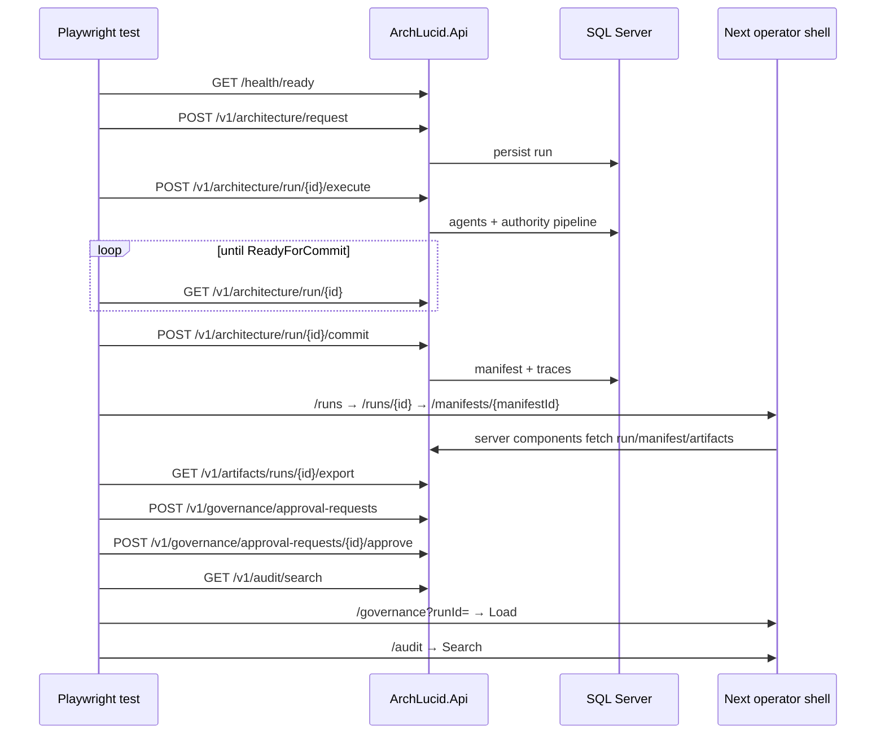

> **Scope:** Live E2E — operator shell vs real API + SQL (Playwright) - full detail, tables, and links in the sections below.

# Live E2E — operator shell vs real API + SQL (Playwright)

**Purpose:** Document every **`live-api-*.spec.ts`** file run in CI against a **real** `ArchLucid.Api` and **SQL Server**. Mock journeys use **`playwright.mock.config.ts`** (`npm run test:e2e`).

**Discovery:** default **`archlucid-ui/playwright.config.ts`** uses **`testMatch: ["live-api-*.spec.ts"]`** (and re-exported as **`playwright.live.config.ts`** for back-compat) so new live specs are picked up when the filename matches the convention.

**Specs (same Playwright live config):**

| File | `describe` | Purpose |
|------|------------|---------|
| `archlucid-ui/e2e/live-api-apikey-auth.spec.ts` | `live-api-apikey-auth` | **ApiKey-only** (skipped without `LIVE_API_KEY`): anonymous `/health/ready`, 401 without key / bad key, admin list 200, optional readonly **403** on create. See **`docs/LIVE_E2E_AUTH_ASSUMPTIONS.md`**. |
| `archlucid-ui/e2e/live-api-jwt-auth.spec.ts` | `live-api-jwt-auth` | **JWT-only** (skipped without `LIVE_JWT_TOKEN`): Bearer list/create parity vs ApiKey lane. See **`docs/LIVE_E2E_JWT_SETUP.md`**. |
| `archlucid-ui/e2e/live-api-journey.spec.ts` | `live-api-journey` | Operator happy path (create → commit → manifest → export → governance approve → audit UI). |
| `archlucid-ui/e2e/live-api-conflict-journey.spec.ts` | `live-api-conflict-journey` | Second **commit** → **200** (idempotent, same `manifestVersion`); **ManifestGenerated** audit count unchanged; run detail UI still **Committed**. **404** `#run-not-found` on commit for a random missing `runId`. |
| `archlucid-ui/e2e/live-api-governance-rejection.spec.ts` | `live-api-governance-rejection` | Governance **submit → reject** (`e2e-rejector`); audit **`GovernanceApprovalRejected`**; **400** on approve-after-reject and duplicate reject; **`/governance`** UI shows **Rejected**. |
| `archlucid-ui/e2e/live-api-error-states.spec.ts` | `live-api-error-states` | UI resilience: fake run detail, **`/runs`** list, **`/audit`** no-results search, **`/governance/dashboard`** load (no mock API). |
| `archlucid-ui/e2e/live-api-negative-paths.spec.ts` | `live-api-negative-paths` | API-only negatives: **`GovernanceSelfApprovalBlocked`** + **`#governance-self-approval`** (approve as same **`Developer`** actor as submitter); **`GET /v1/architecture/run/{id}`** **404** `#run-not-found`; **`POST /v1/architecture/request`** with **`{}`** → **400** or **422**. |
| `archlucid-ui/e2e/live-api-advisory-flow.spec.ts` | `live-api-advisory-flow` | Advisory scan scheduling: create → commit run, **`POST /v1/advisory/scans`** (skip if 404), audit trail asserts **`AdvisoryScanScheduled`** or **`AdvisoryScanExecuted`**. |
| `archlucid-ui/e2e/live-api-replay-export.spec.ts` | `live-api-replay-export` | Replay and re-export: create → commit run, **`POST /v1/replay/run/{id}`** (skip if 404), **`GET /v1/artifacts/runs/{id}/export`** ZIP, audit trail asserts **`ReplayExecuted`** + **`RunExported`**. |
| `archlucid-ui/e2e/live-api-analysis-report.spec.ts` | `live-api-analysis-report` | Analysis report generation: create → commit run, **`POST /v1/reports/analysis`** (skip if 404), audit trail asserts **`ArchitectureAnalysisReportGenerated`**; optional DOCX export via **`GET /v1/exports/docx/runs/{id}/architecture-package`**. |
| `archlucid-ui/e2e/live-api-policy-pack-lifecycle.spec.ts` | `live-api-policy-pack-lifecycle` | **`POST /v1/policy-packs`** → assign **`1.0.0`** → **`GET /v1/policy-packs/effective`**; UI **`/policy-packs`**; recent audit includes **`PolicyPackCreated`**. |
| `archlucid-ui/e2e/live-api-compare-runs.spec.ts` | `live-api-compare-runs` | Two runs create → execute → commit; **`GET /v1/authority/compare/runs`**; UI **`/compare?leftRunId=…&rightRunId=…`**; **404** when second run id is missing. |
| `archlucid-ui/e2e/live-api-alert-rules.spec.ts` | `live-api-alert-rules` | **`POST /v1/alert-rules`** + list; UI **`/alerts`** with axe (critical/serious = 0). |
| `archlucid-ui/e2e/live-api-search-ask-graph.spec.ts` | `live-api-search-ask-graph` | Runs list by **`systemName`**; **`GET /v1/graph/runs/{guid}`**; optional **`POST /v1/ask`**; UI **`/search`** and **`/ask`** axe. |
| `archlucid-ui/e2e/live-api-digest-webhook.spec.ts` | `live-api-digest-webhook` | **`POST/GET /v1/digest-subscriptions`**, toggle, audit **`DigestSubscriptionCreated`** / **`DigestSubscriptionToggled`**; skipped placeholder for webhook dry-run (no HTTP surface). |
| `archlucid-ui/e2e/live-api-concurrency.spec.ts` | `live-api-concurrency` | Parallel **`commitRunRaw`** (no **5xx**; run ends **Committed**); parallel governance approve (**exactly one** **2xx**, partner **4xx**; single new **`GovernanceApprovalApproved`** audit). |
| `archlucid-ui/e2e/live-api-archival.spec.ts` | `live-api-archival` | Skipped note: archival is **worker**-driven (no API trigger); smoke test that **two** committed runs stay visible on **`GET /v1/architecture/runs`**. |
| `archlucid-ui/e2e/live-api-accessibility.spec.ts` | `accessibility baseline` | **Axe** sweep across primary operator routes (critical/serious = **0**). |
| `archlucid-ui/e2e/live-api-accessibility-focus.spec.ts` | `route focus and announcements` | Skip link, route-change focus, announcer text, **axe** in dark mode. |

**Config:** `archlucid-ui/playwright.config.ts` (default live); **`playwright.live.config.ts`** re-exports the same object.  
**HTTP helpers:** `archlucid-ui/e2e/helpers/live-api-client.ts`  
**CI jobs:** `.github/workflows/ci.yml` → **`ui-e2e-live`** (full suite, DevelopmentBypass) and **`ui-e2e-live-apikey`** (ApiKey API + subset: apikey-auth + journey + negative-paths) — both **merge-blocking**; **`ui-e2e-live-jwt`** (JwtBearer + local PEM + subset: jwt-auth + journey + negative-paths) — **`continue-on-error: true`** (signal-only until stable). **Nightly:** `.github/workflows/live-e2e-nightly.yml` runs the **full** `live-api-*.spec.ts` suite under DevelopmentBypass, ApiKey, and JwtBearer (separate DBs). Parity matrix: **`docs/LIVE_E2E_AUTH_PARITY.md`**; JWT env: **`docs/LIVE_E2E_JWT_SETUP.md`**.

---

## Prerequisites

| Requirement | Notes |
|-------------|--------|
| **ArchLucid.Api** | Listening on **`LIVE_API_URL`** (default `http://127.0.0.1:5128`). |
| **SQL** | Connection string points at a database the API can migrate (CI creates **`ArchLucidLiveE2e`** via `sqlcmd`). |
| **Auth** | **`ArchLucidAuth:Mode=DevelopmentBypass`** (default PR job **`ui-e2e-live`**). For **ApiKey** subset CI, set **`LIVE_API_KEY`** / **`LIVE_API_KEY_READONLY`** to match **`Authentication:ApiKey:*`** on the API (see **`ui-e2e-live-apikey`** in `ci.yml`). For **JWT** lane, set **`LIVE_JWT_TOKEN`** (+ **`ARCHLUCID_PROXY_BEARER_TOKEN`** for Next proxy); API uses **`JwtSigningPublicKeyPemPath`** + **`JwtLocalIssuer`** / **`JwtLocalAudience`** (see **`docs/LIVE_E2E_JWT_SETUP.md`**). |
| **Agents** | **`AgentExecution:Mode=Simulator`** — no real LLM; deterministic synthetic agent results + authority pipeline still run. |
| **Next.js** | Built with **`output: "standalone"`** before live E2E in CI; **`LIVE_E2E_SKIP_NEXT_BUILD=1`** avoids a second `npm run build` beside the API. |

---

## Step-by-step journey

1. **`GET /health/ready`** — fail fast if the API is not up (`beforeAll`).
2. **`POST /v1/architecture/request`** — create a run; capture **`runId`**.
3. **`POST /v1/architecture/run/{runId}/execute`** — simulator execution.
4. **Poll `GET /v1/architecture/run/{runId}`** until **`run.status`** is **`ReadyForCommit`** (numeric **`4`**) or already committed. Each poll retries a few times on **HTTP 5xx** (short backoff) to ride out transient SQL/API blips.
5. **`POST /v1/architecture/run/{runId}/commit`** — persist golden manifest; read **`manifest.metadata.manifestVersion`**.
6. **`GET /v1/architecture/run/{runId}`** — read **`run.goldenManifestId`** for UI navigation.
7. **UI:** **`/runs`** → **`/runs/{runId}`** — assert **Golden Manifest** link → **`/manifests/{goldenManifestId}`** — **Manifest** heading, **Artifacts**, table, **Download bundle (ZIP)**.
8. **`GET /v1/artifacts/runs/{runId}/export`** — non-empty ZIP; emits **`RunExported`** audit.
9. **`POST /v1/governance/approval-requests`** — **`dev` → `test`**, manifest version from commit.
10. **Negative (soft):** **`POST …/approve`** with **`reviewedBy: Developer`** (same as default **`ArchLucidAuth:DevUserName`** under DevelopmentBypass) → **400** self-approval block (**`expect.soft`** — does not fail the happy path).
11. **`POST /v1/governance/approval-requests/{id}/approve`** — **`reviewedBy: e2e-peer-reviewer`** (differs from submitter) → **Approved**.
12. **Negative (soft):** second **`POST …/approve`** on the same id → **400** (invalid transition from **Approved**).
13. **`GET /v1/audit/search?runId=…`** — assert durable types: **`RunStarted`**, **`ManifestGenerated`**, **`GovernanceApprovalSubmitted`**, **`GovernanceApprovalApproved`**, **`RunExported`**. **`expect.soft`** on each row: non-empty **`correlationId`** (aligns with **`AuditService`** enrichment). Then **`GET /v1/audit/search?correlationId=…`** using the first non-empty id — assert at least one row (**`correlationId`** filter path end-to-end).
14. **`GET /v1/architecture/runs`** — list includes this **`runId`** with status **Committed** (**`expect.soft`** on status text).
15. **UI:** **`/governance?runId=…`** — **Load** — expect approval card + **Approved** status.
16. **UI:** **`/audit`** — filter by run ID, **Search**, no error alerts.

**Forensics:** The spec sets Playwright **`test.info().annotations`** (`e2e-run-id`, `e2e-approval-request-id`, `e2e-audit-correlation-id`) and logs **`runId` / `approvalRequestId` / `auditCorrelationId`** in **`afterAll`** for CI log triage.

---

## Sequence diagram

---

## Error-path E2E (conflict journey)

The **`live-api-conflict-journey`** spec complements the happy path:

- After a successful commit, a second **`POST …/commit`** returns **200** with the same manifest version (**idempotent**); **`ManifestGenerated`** audit count must not increase.
- **`GET /v1/audit/search?runId=…`** must not gain an extra **`ManifestGenerated`** row after the idempotent second commit.
- **`GET /v1/architecture/run/{runId}`** must still show **Committed** status.
- Committing a **non-existent** `runId` returns **404** with **`#run-not-found`**.

Shared helpers: **`commitRunRaw`**, **`waitForReadyForCommit`** (exported from **`live-api-client.ts`**).

---

## Known limitations

- **No real LLM** in CI — semantic quality of outputs is not under test; **`POST /v1/ask`** may be non-**2xx** without failing the graph/search spec.
- **DevelopmentBypass** — not a production auth configuration; do not equate this gate with Entra/API-key hardening.
- **`ui-axe-components`** runs **Vitest + jest-axe** on **`src/accessibility/**`** (fast component gate). **`ui-e2e-live`** is the **only** merge-blocking **browser** operator journey gate (**default `playwright.config.ts`**, live API + SQL). **Mock** Playwright: **`playwright.mock.config.ts`** / **`npm run test:e2e`**.
- **Run archival** is not invocable over **`ArchLucid.Api`** HTTP in DevelopmentBypass; see **`live-api-archival.spec.ts`** skip rationale and **`docs/runbooks/DATA_ARCHIVAL_HEALTH.md`**.

---

## Local run

1. Start SQL and **`ArchLucid.Api`** with Sql + DevelopmentBypass + Simulator (mirror **`ui-e2e-live`** env in `ci.yml`).
2. From **`archlucid-ui`:** `npm ci` && `npm run build` (first time or after dependency changes).
3. `npx playwright install chromium` (if needed).
4. `npx playwright test`

See also [TEST_STRUCTURE.md](TEST_STRUCTURE.md) and [TEST_EXECUTION_MODEL.md](TEST_EXECUTION_MODEL.md).
