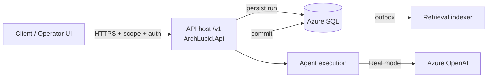

# Happy path — from request to answer

→ New here? Start at [docs/START_HERE.md](START_HERE.md) instead.

**Last reviewed:** 2026-04-06

One narrative for **new engineers and integrators** working on **ArchLucid** (this codebase). Deep dives are linked; this page is the **spine**.

> **Two pipelines (coordinator string run vs authority ingestion)?** Read **[DUAL_PIPELINE_NAVIGATOR.md](DUAL_PIPELINE_NAVIGATOR.md)** first — side-by-side flows, shared artifacts, and a step-by-step coordinator commit walkthrough.

> **Environments and delivery (clone → local → Azure)?** Use **[GOLDEN_PATH.md](GOLDEN_PATH.md)** — role-based entry (developer / SRE / security), one maturity diagram, ordered phases, and an **advanced appendix** for rarely used paths. *This* page focuses on **one HTTP request’s journey** through the API and data plane.

## Flow (nodes and edges)

## Steps

1. **Authenticate** — API key (`X-Api-Key`) or JWT (Entra), per environment. Scope: `x-tenant-id`, `x-workspace-id`, `x-project-id` (or claims).
2. **Create run** — `POST /v1/architecture/request` with `ArchitectureRequest`. Optional `Idempotency-Key` (see `docs/API_CONTRACTS.md`).
3. **Execute authority** — Pipeline stages ingest context, graph, findings, decisioning, artifacts (see traces: `ArchLucid.AuthorityRun` in logs/telemetry).
4. **Agents** — `AgentExecution:Mode` `Simulator` (deterministic) or `Real` (Azure OpenAI). Token usage and optional per-tenant metrics: `docs/OPERATIONS_LLM_QUOTA.md`.
5. **Commit** — `POST /v1/architecture/run/{runId}/commit` when the run is ready; handle `409` for invalid state.
6. **Retrieval** — After commit, indexing work is processed asynchronously; query `GET /v1/retrieval/search` when enabled.
7. **Ask (optional)** — Threaded Q&A uses the same scope and LLM stack; see Ask controller routes under `/v1/ask`.

## Health and operations

- **Liveness:** `GET /health/live`
- **Readiness:** `GET /health/ready` (SQL, schema, packs)
- **Admin (privileged):** `GET /v1/admin/diagnostics/outboxes`, `.../leases`, feature flags — see `docs/OPERATIONS_ADMIN.md`
- **Runbooks:** `docs/TROUBLESHOOTING.md`, `docs/OPERATIONS_LLM_QUOTA.md`
- **RTO / RPO (tier defaults):** `docs/RTO_RPO_TARGETS.md` — production targets include relational RPO under five minutes via SQL geo-replication; `docs/runbooks/DATABASE_FAILOVER.md` for failover steps.

## Local development

- **SQL + dependencies:** `docker compose up -d` (see `docker-compose.yml`).
- **Full .NET regression with SQL:** `scripts/run-full-regression-docker-sql.ps1` or `.sh` (sets `ARCHLUCID_SQL_TEST`).
- **Test tiers:** `docs/TEST_EXECUTION_MODEL.md`

## Architecture decisions

See `docs/adr/README.md` for ADRs that explain non-obvious choices (hosting roles, RLS, LLM pipeline, etc.).
