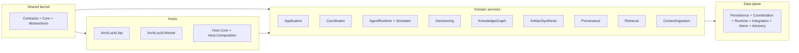

> **Scope:** Solution project map (bounded contexts) - full detail, tables, and links in the sections below.

# Solution project map (bounded contexts)

## Objective

Map **`ArchLucid.sln`** projects to **bounded contexts** and seams so engineers can jump from “which `.csproj`?” to “which domain boundary?” without opening every folder.

## Assumptions

- You are working in the main **ArchLucid** .NET solution (`ArchLucid.sln`).
- **Domain** boundaries are summarized in **[bounded-context-map.md](bounded-context-map.md)**; this doc adds **project-level** granularity.

## Constraints

- **Test projects** mirror product seams; they are not separate bounded contexts.
- **`ArchLucid.Contracts.Abstractions`** is a thin shared surface; treat it with **Contracts** as shared kernel.
- **`archlucid-ui`** is not in the solution file above; see **[CONTAINERIZATION.md](CONTAINERIZATION.md)** and **[archlucid-ui/README.md](../archlucid-ui/README.md)**.

## Architecture overview

## Component breakdown

| Bounded context / seam | Product projects | Primary responsibility |
|--------------------------|------------------|-------------------------|
| **Shared kernel** | `ArchLucid.Contracts`, `ArchLucid.Contracts.Abstractions`, `ArchLucid.Core` | DTOs, policies, instrumentation, cross-cutting types |
| **HTTP + composition host** | `ArchLucid.Api`, `ArchLucid.Worker`, `ArchLucid.Host.Core`, `ArchLucid.Host.Composition` | ASP.NET surfaces, DI roots, background services, startup guards |
| **Authority pipeline (application)** | `ArchLucid.Application` | Run lifecycle orchestration, use cases, coordination entry points |
| **Coordinator & manifests** | `ArchLucid.Coordinator` | Golden manifests, merge/commit paths, coordinator-specific workflows |
| **Agent runtime** | `ArchLucid.AgentRuntime`, `ArchLucid.AgentSimulator` | LLM calls, handlers, traces, evaluation, simulator |
| **Decisioning & findings** | `ArchLucid.Decisioning` | Finding engines, explainability, governance/decision merge inputs |
| **Knowledge graph** | `ArchLucid.KnowledgeGraph` | Graph model, validation, snapshots |
| **Artifact synthesis** | `ArchLucid.ArtifactSynthesis` | DOCX/Mermaid/export build pipelines |
| **Provenance** | `ArchLucid.Provenance` | Provenance graph/query helpers |
| **Retrieval** | `ArchLucid.Retrieval` | Embeddings, indexing, search integration seams |
| **Context ingestion** | `ArchLucid.ContextIngestion` | Ingestion pipeline into authority context |
| **Persistence** | `ArchLucid.Persistence`, `ArchLucid.Persistence.Coordination`, `ArchLucid.Persistence.Runtime`, `ArchLucid.Persistence.Integration`, `ArchLucid.Persistence.Alerts`, `ArchLucid.Persistence.Advisory` | Dapper repositories, outboxes, UoW, domain-specific persistence slices |
| **Client & tooling** | `ArchLucid.Api.Client`, `ArchLucid.Cli`, `ArchLucid.Backfill.Cli` | Generated HTTP client, operator CLI, maintenance CLI |
| **Quality / perf harness** | `ArchLucid.TestSupport`, `ArchLucid.Benchmarks`, `ArchLucid.Architecture.Tests` | Test doubles, benchmarks, **NetArchTest** dependency rules |

### Test projects (mirror of above)

| Pattern | Examples |
|---------|----------|
| Per product assembly | `ArchLucid.*.Tests` matching each `ArchLucid.*` project (Api, Persistence, AgentRuntime, …) |
| Cross-cutting architecture | `ArchLucid.Architecture.Tests` |
| Host composition | `ArchLucid.Host.Composition.Tests` |

Tier and filter guidance: **[TEST_STRUCTURE.md](TEST_STRUCTURE.md)**.

## Data flow

- **Inbound HTTP** → `ArchLucid.Api` → `ArchLucid.Application` / feature areas → `ArchLucid.Persistence*` → SQL.
- **Agents** → `ArchLucid.AgentRuntime` → optional **`ArchLucid.Coordinator`** / **`ArchLucid.Decisioning`** → persisted traces and manifests.
- **Worker** → `ArchLucid.Worker` + same composition as API for outbox processors, scans, and scheduled jobs.

## Security model

- **Secrets and identity** materialize in **host** projects and **API** configuration, not in **Contracts**.
- **Persistence** enforces tenant scope and RLS session patterns at the SQL boundary (see **[MULTI_TENANT_RLS.md](security/MULTI_TENANT_RLS.md)**).

## Operational considerations

- **Ownership:** When adding a new `ArchLucid.*` project, update this table and **[ARCHITECTURE_CONTAINERS.md](ARCHITECTURE_CONTAINERS.md)** if container responsibilities shift.
- **CI:** Solution-wide tests assume project references stay acyclic; see **`ArchLucid.Architecture.Tests`**.

## Related

- **[bounded-context-map.md](bounded-context-map.md)** — domain language and integration styles  
- **[CONTROLLER_AREA_MAP.md](CONTROLLER_AREA_MAP.md)** — API areas ↔ controller types  
- **[ARCHITECTURE_INDEX.md](ARCHITECTURE_INDEX.md)** — full doc map  
