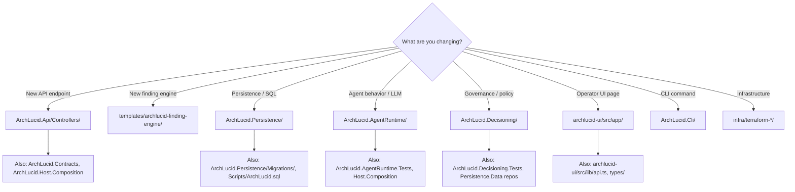

# Start here — ArchLucid for new contributors

**Shipped product name:** **ArchLucid** (repository folders and some .NET assemblies may still say **ArchLucid** during rename — see [ARCHLUCID_RENAME_CHECKLIST.md](ARCHLUCID_RENAME_CHECKLIST.md)).

Use **this page** as the single front door. It orients you in a few minutes, then points to role-specific checklists and deeper architecture docs.

**Local vs committed output:** See **[REPO_HYGIENE.md](REPO_HYGIENE.md)** for `artifacts/`, the checked-in API client `Generated/` file, and paths that should stay out of git.

## First five documents (read these first)

1. **[START_HERE.md](START_HERE.md)** (this page) — mental model, layers, where to go next.
2. **[V1_SCOPE.md](V1_SCOPE.md)** — what is in/out of V1 for pilots and supportability.
3. **[ARCHITECTURE_FLOWS.md](ARCHITECTURE_FLOWS.md)** — run lifecycle and major HTTP/SQL flows.
4. **[SECURITY.md](SECURITY.md)** — auth modes, RBAC, DevelopmentBypass production guard, scanning.
5. **[TEST_EXECUTION_MODEL.md](TEST_EXECUTION_MODEL.md)** — CI tiers, traits, and how to run tests locally.

**After the first five — by role**

| Role | Next reads |
|------|------------|
| **Developer** | [BUILD.md](BUILD.md), [CONTRIBUTOR_ONBOARDING.md](CONTRIBUTOR_ONBOARDING.md), [CODE_MAP.md](CODE_MAP.md) |
| **SRE / Operator** | [DEPLOYMENT.md](DEPLOYMENT.md), [runbooks/](runbooks/), [OBSERVABILITY.md](OBSERVABILITY.md) |
| **Security** | [SECURITY.md](SECURITY.md), [docs/security/](security/), [AUDIT_COVERAGE_MATRIX.md](AUDIT_COVERAGE_MATRIX.md) |
| **Pilot / evaluator** | [PILOT_GUIDE.md](PILOT_GUIDE.md), [FIRST_RUN_WIZARD.md](FIRST_RUN_WIZARD.md), [OPERATOR_QUICKSTART.md](OPERATOR_QUICKSTART.md) |

**Finding engine plugins:** optional DLLs implementing `IFindingEngine` with a **parameterless constructor**, loaded from **`ArchLucid:FindingEngines:PluginDirectory`** — see template **`templates/archlucid-finding-engine/`** and **`FindingEnginePluginDiscovery`**.

---

## Five-minute architecture overview

ArchLucid is a **.NET API** (and optional **Worker**) that runs an **authority pipeline**: ingest context, build a knowledge graph, run findings and decisioning, synthesize artifacts, and persist results to **SQL Server**. Clients call versioned HTTP routes under `/v1/...` with tenant/workspace/project scope and auth.

### Layered components (text diagram)

Request and domain logic flow **inward** through contracts, then **out** through hosts:

```
                    ┌─────────────────────────────────────────────────────────┐
                    │  Clients (CLI, operator UI, integrators)                │
                    └───────────────────────────┬─────────────────────────────┘
                                                │ HTTPS + auth + scope headers
                                                ▼
┌──────────────┐    ┌──────────────────┐    ┌────────────────────────────────┐
│ ArchLucid.   │───▶│ ArchLucid.Host.  │───▶│ ArchLucid.Api  /  ArchLucid.     │
│ Composition  │    │ Core             │    │ Worker                         │
│ (DI wiring,  │    │ (middleware,     │    │ (background jobs, same           │
│  storage     │    │  health, OTel,   │    │  building blocks)               │
│  registration)│    │  shared hosting) │    │                                │
└──────┬───────┘    └────────┬─────────┘    └────────────────┬───────────────┘
       │                     │                               │
       │                     │ uses                          │
       ▼                     ▼                               ▼
┌──────────────────────────────────────────────────────────────────────────────┐
│ ArchLucid.Application — use cases, run/commit/replay, governance calls       │
└──────────────────────────────────┬───────────────────────────────────────────┘
                                   │
       ┌───────────────────────────┼───────────────────────────┐
       ▼                           ▼                           ▼
┌─────────────┐           ┌─────────────────┐         ┌───────────────────┐
│ ArchLucid.  │           │ ArchLucid.      │         │ ArchLucid.        │
│ Persistence │◀─────────▶│ Contracts       │         │ Decisioning,      │
│ (Dapper,    │  ports    │ (DTOs, domain   │         │ AgentRuntime,     │
│  SQL,       │  defined  │  shapes shared  │         │ ContextIngestion, │
│  orchestr-  │  in       │  across layers) │         │ …                 │
│  ation)     │  Contracts│                 │         │                   │
└──────┬──────┘           └─────────────────┘         └───────────────────┘
       │
       ▼
┌─────────────┐
│ SQL Server  │  — runs, snapshots, manifests, traces, governance, alerts, …
└─────────────┘
```

**How to read the arrows**

- **Contracts** define stable shapes and ports; **Application** orchestrates workflows; **Persistence** implements repositories and **`AuthorityRunOrchestrator`** stages against SQL.
- **Host.Core** is shared HTTP/worker infrastructure (security headers, health, telemetry, validation).
- **Host.Composition** is the composition root: it registers Application + Persistence + storage for **Api** and **Worker** entrypoints.

**Deeper structural docs:** [ARCHITECTURE_CONTAINERS.md](ARCHITECTURE_CONTAINERS.md), [ARCHITECTURE_COMPONENTS.md](ARCHITECTURE_COMPONENTS.md), [DI_REGISTRATION_MAP.md](DI_REGISTRATION_MAP.md).

---

## Pick your role

| Role | Week-one checklist (3–5 outcomes) |
|------|-----------------------------------|
| **Developer** | [onboarding/day-one-developer.md](onboarding/day-one-developer.md) — build, tests, local SQL, API, optional UI |
| **SRE / Platform** | [onboarding/day-one-sre.md](onboarding/day-one-sre.md) — Terraform order, health, migrations, observability |
| **Security / GRC** | [onboarding/day-one-security.md](onboarding/day-one-security.md) — Entra, private endpoints, Key Vault, threat models |

**Environment path (clone → local → prod-like → Azure):** after the day-one ticket, follow [GOLDEN_PATH.md](GOLDEN_PATH.md).

**When LLM or agent backends are down:** [DEGRADED_MODE.md](DEGRADED_MODE.md) — what still works and what fails closed.

**One request’s journey (HTTP → SQL → agents):** [ONBOARDING_HAPPY_PATH.md](ONBOARDING_HAPPY_PATH.md).

**Build / test commands only:** [CONTRIBUTOR_ONBOARDING.md](CONTRIBUTOR_ONBOARDING.md).

---

## Key concepts (one sentence each)

| Concept | What it is | Go deeper |
|--------|------------|-----------|
| **Authority pipeline** | Ordered stages that ingest context, graph, findings, decisioning, and artifacts for a scoped run, then persist or roll back as a unit. | [DUAL_PIPELINE_NAVIGATOR.md](DUAL_PIPELINE_NAVIGATOR.md), [ARCHITECTURE_FLOWS.md](ARCHITECTURE_FLOWS.md) |
| **Agent runtime** | Executes agent handlers (simulator vs real LLM) invoked from the pipeline; configurable per environment. | [ARCHITECTURE_COMPONENTS.md](ARCHITECTURE_COMPONENTS.md) (AgentRuntime), [.cursor/rules/Navigation.mdc](../.cursor/rules/Navigation.mdc) |
| **Governance merge** | Resolution of effective policy packs and rules for a tenant/workspace/project scope used by runs and previews. | [API_CONTRACTS.md](API_CONTRACTS.md) (governance / policy packs), [GLOSSARY.md](GLOSSARY.md) |
| **Provenance graph** | Typed nodes and edges derived from context and snapshots, validated and stored for manifests and traceability. | [KNOWLEDGE_GRAPH.md](KNOWLEDGE_GRAPH.md), [DATA_MODEL.md](DATA_MODEL.md) |

**Glossary:** [GLOSSARY.md](GLOSSARY.md) — authority run, golden manifest, finding engine, policy pack, scope, …

---

## Quick commands

| Goal | Command / pointer |
|------|-------------------|
| **Restore + build** | `dotnet restore` then `dotnet build` at repo root — [BUILD.md](BUILD.md), [CONTRIBUTOR_ONBOARDING.md](CONTRIBUTOR_ONBOARDING.md) |
| **Tests (fast core, CI-like)** | `dotnet test --filter "Suite=Core&Category!=Slow&Category!=Integration"` — [TEST_STRUCTURE.md](TEST_STRUCTURE.md) |
| **Run API locally** | Configure user secrets / `ConnectionStrings:ArchLucid`, then `dotnet run --project ArchLucid.Api` — root [README.md](../README.md#secrets-development) |
| **SQL + sidecars in Docker** | `dotnet run --project ArchLucid.Cli -- dev up` or `docker compose up -d` — [CONTAINERIZATION.md](CONTAINERIZATION.md) |
| **Full .NET regression + SQL** | `scripts/run-full-regression-docker-sql.ps1` or `.sh` — [BUILD.md](BUILD.md) |
| **API + Worker in containers** | `docker compose --profile full-stack up -d --build` — [CONTAINERIZATION.md](CONTAINERIZATION.md) |

**Full doc index:** [ARCHITECTURE_INDEX.md](ARCHITECTURE_INDEX.md).

---

## What to open first (contributor decision tree)

Use this when you know **what** you are changing but not **which folder** to open first. For deeper extension maps (finding engines, connectors, agents), see [.cursor/rules/Navigation.mdc](../.cursor/rules/Navigation.mdc).



| Change type | Start here | Also touch | Test project | Key doc |
|-------------|------------|------------|--------------|---------|
| New API endpoint | `ArchLucid.Api/Controllers/` | `ArchLucid.Contracts` (DTOs), `ArchLucid.Host.Composition` (DI), OpenAPI snapshot | `ArchLucid.Api.Tests` | [API_CONTRACTS.md](API_CONTRACTS.md) |
| New finding engine | `templates/archlucid-finding-engine/` | `ArchLucid.Decisioning/Findings/`, `Host.Composition` | `ArchLucid.Decisioning.Tests` | [DECISIONING_TYPED_FINDINGS.md](DECISIONING_TYPED_FINDINGS.md) |
| SQL schema change | `ArchLucid.Persistence/Migrations/` | `Scripts/ArchLucid.sql`, Dapper + in-memory repos | `ArchLucid.Persistence.Tests` | [SQL_SCRIPTS.md](SQL_SCRIPTS.md), [SQL_DDL_DISCIPLINE.md](SQL_DDL_DISCIPLINE.md) |
| Agent / LLM behavior | `ArchLucid.AgentRuntime/` | `Host.Composition`, `ArchLucid.Contracts` (trace models) | `ArchLucid.AgentRuntime.Tests` | [AGENT_TRACE_FORENSICS.md](AGENT_TRACE_FORENSICS.md) |
| Governance / policy | `ArchLucid.Decisioning/` | `ArchLucid.Application`, `ArchLucid.Persistence.Data` | `ArchLucid.Decisioning.Tests`, `ArchLucid.Application.Tests` | [PRE_COMMIT_GOVERNANCE_GATE.md](PRE_COMMIT_GOVERNANCE_GATE.md) |
| Operator UI page | `archlucid-ui/src/app/{route}/` | `archlucid-ui/src/lib/api.ts`, `components/` | Vitest (co-located `.test.tsx`) | [operator-shell.md](operator-shell.md) |
| CLI command | `ArchLucid.Cli/` | `ArchLucid.Api.Client` when adding HTTP calls | `ArchLucid.Cli.Tests` | [CLI_USAGE.md](CLI_USAGE.md) |
| Terraform | `infra/terraform-{area}/` | `terraform.tfvars.example`, CI validate matrix | CI `terraform validate` | [DEPLOYMENT_TERRAFORM.md](DEPLOYMENT_TERRAFORM.md) |

---

## Recommended reading order

After the role-specific day-one checklist above:

1. [GLOSSARY.md](GLOSSARY.md) — terminology and abbreviations used across all docs  
2. [ONBOARDING_HAPPY_PATH.md](ONBOARDING_HAPPY_PATH.md) — trace one HTTP request end-to-end  
3. [CONTRIBUTOR_ONBOARDING.md](CONTRIBUTOR_ONBOARDING.md) — build, test, lint commands  
4. [GOLDEN_PATH.md](GOLDEN_PATH.md) — from local dev to production  
5. [ARCHITECTURE_INDEX.md](ARCHITECTURE_INDEX.md) — full doc catalog (for reference, not linear reading)  

## Documentation tiers

| Tier | Audience | Examples |
|------|----------|----------|
| **Start** | Everyone | This file, GLOSSARY, CONTRIBUTOR_ONBOARDING |
| **Operate** | SRE, operators | GOLDEN_PATH, DEPLOYMENT, OPERATIONS_ADMIN, runbooks |
| **Architecture** | Developers, architects | ADRs, ARCHITECTURE_*, DATA_MODEL, API_CONTRACTS |
| **Reference** | Lookup | DI_REGISTRATION_MAP, CODE_MAP, SYSTEM_MAP |
| **Archive** | Historical | `docs/archive/` — change-set summaries, superseded docs |
