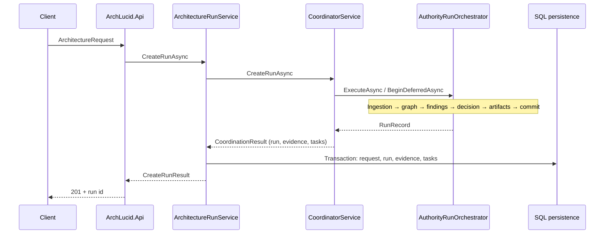
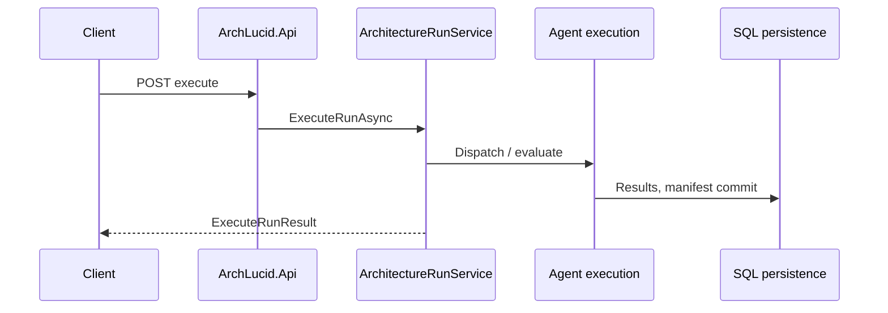
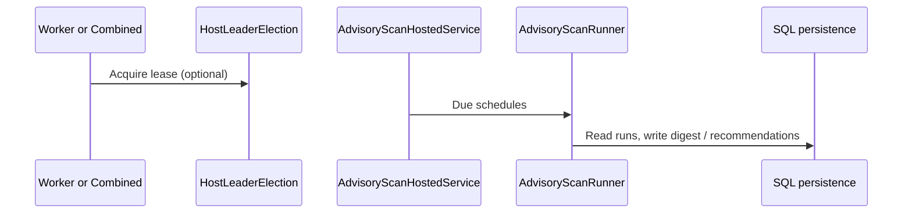

# ArchLucid system map

High-level flows for navigation and onboarding. For component detail see [ARCHITECTURE_COMPONENTS.md](./ARCHITECTURE_COMPONENTS.md) and [ARCHITECTURE_FLOWS.md](./ARCHITECTURE_FLOWS.md).

---

## Primary HTTP flows

### Create architecture run (`POST /v1/architecture/runs` and related)

### Execute run (agent tasks → commit)

### Advisory scan (worker / combined host)

---

## Composition root entry points

| Host | File | Responsibility |
|------|------|----------------|
| API | `ArchLucid.Api/Program.cs` | HTTP pipeline, config validation, `AddArchLucidApplicationServices` |
| Worker | `ArchLucid.Worker/Program.cs` | Background loops, health, shared DI |
| DI assembly | `ArchLucid.Host.Composition/Startup/ServiceCollectionExtensions*.cs` (+ `Configuration/ArchLucidStorageServiceCollectionExtensions.cs`) | Partial classes: storage, agents, scheduling, alerts, pipeline, coordinator |

---

## Feature flags (Microsoft.FeatureManagement)

Section `FeatureManagement:FeatureFlags` in configuration. Used for gradual rollout of authority pipeline behavior. See `AuthorityPipeline:QueueContextAndGraph` and related options under `ArchLucid:AuthorityPipeline`.

---

## Observability artifacts

- **Traces**: `ArchLucidInstrumentation` activity sources (including `ArchLucid.AuthorityRun` and per-stage child activities).
- **Metrics**: OpenTelemetry meter **`ArchLucid`** (`ArchLucidInstrumentation.MeterName`); Prometheus scrape path under `Observability:Prometheus`. (Exported **metric series names** for queue depth and LLM usage use an `archlucid_*` prefix — see `infra/prometheus/`.)
- **Dashboards / alerts**: `infra/grafana/` and `infra/prometheus/` (reference JSON and rule files for operators).
