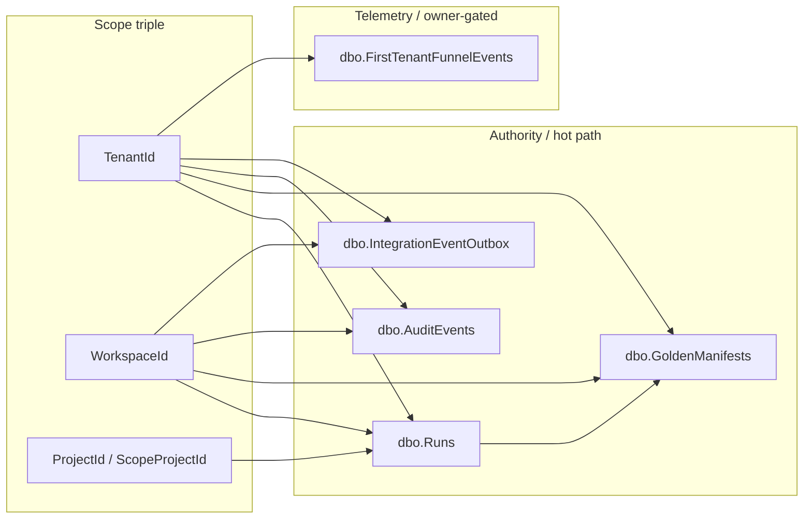

> **Scope:** Tenant-scoped tables inventory — full detail, tables, and links in the sections below. **Backward-compat path:** some CI and deep links still resolve `docs/TENANT_SCOPED_TABLES_INVENTORY.md`. When the **Component breakdown** table changes, update [docs/library/TENANT_SCOPED_TABLES_INVENTORY.md](library/TENANT_SCOPED_TABLES_INVENTORY.md) first, then mirror the table (and overview) here.

> **Spine doc:** [Five-document onboarding spine](FIRST_5_DOCS.md). Read this file only if you have a specific reason beyond those five entry documents.

# Tenant-scoped tables inventory

## Objective

Give operators and engineers a single map from **logical scope** (`TenantId`, `WorkspaceId`, project scope) to **physical tables** in `ArchLucid.Persistence/Scripts/ArchLucid.sql`, so RLS policies, archival jobs, and cross-tenant probes stay aligned with the DDL.

## Assumptions

- The **master DDL** (`ArchLucid.sql`) is the integration source of truth for greenfield installs; numbered migrations remain historical.
- Some tables are **run-scoped** (foreign key to `dbo.Runs`) without denormalized tenant columns; isolation still flows from the parent run.

## Constraints

- SQL object names committed under legacy prefixes (for example `rls.ArchiforgeTenantScope`) are **not** renamed in this document; see `docs/MULTI_TENANT_RLS.md` and the rename checklist Phase 7.5–7.8.
- Inventory rows are **curated**, not an automated dump of every column named `TenantId`.

## Architecture overview

## Component breakdown

| Table | `TenantId` | `WorkspaceId` | Project scope column | Notes |
|-------|------------|---------------|----------------------|--------|
| `dbo.Runs` | NOT NULL | NOT NULL | `ProjectId` (NVARCHAR LOB key) + `ScopeProjectId` (UNIQUEIDENTIFIER surrogate) | Primary authority row; other artifacts hang off `RunId`. |
| `dbo.GoldenManifests` | NOT NULL | NOT NULL | `ProjectId` (UNIQUEIDENTIFIER) | Denormalized scope for manifest queries. |
| `dbo.AuditEvents` | NOT NULL | NOT NULL | `ProjectId` (UNIQUEIDENTIFIER) | Immutable audit trail. |
| `dbo.IntegrationEventOutbox` | NOT NULL | NOT NULL | `ProjectId` (UNIQUEIDENTIFIER) | Durable integration fan-out. |
| `dbo.BillingSubscriptions` | NOT NULL | NOT NULL | `ProjectId` (UNIQUEIDENTIFIER) | Commercial subscription state for trial conversion; RLS + stored-procedure-only DML for `ArchLucidApp`. |
| `dbo.ContextSnapshots` | nullable (brownfield) | nullable | `ScopeProjectId` nullable | Backfilled scope columns; see brownfield blocks in `ArchLucid.sql`. |
| `dbo.FirstTenantFunnelEvents` | NOT NULL | — | — | Optional per-tenant onboarding funnel rows when `Telemetry:FirstTenantFunnel:PerTenantEmission` is `true`; tenant grain only (no `WorkspaceId` / `ProjectId`); see `docs/security/PRIVACY_NOTE.md` and pending question 40 in `docs/PENDING_QUESTIONS.md`. |

**Run-scoped without tenant triple on row** (examples): `dbo.GraphSnapshots` — scope is implied via `RunId` → `dbo.Runs`.

## Data flow

Writes on authority tables should set the **same** tenant/workspace/project tuple as the parent `dbo.Runs` row (or the registration-derived scope) so session context and BLOCK predicates cannot be bypassed by orphan inserts.

## Security model

- **RLS** predicates filter on the denormalized scope where present; see [MULTI_TENANT_RLS.md](security/MULTI_TENANT_RLS.md).
- **Operational probes** (`DataConsistencyOrphanProbeHostedService`, admin remediation) should use this inventory when classifying “missing scope” vs “expected run-only” tables.

## Operational considerations

- When adding a new table that stores customer data, decide explicitly: **denormalized triple** vs **strict `RunId` FK only**; document the choice here.
- `ArchLucid.Architecture.Tests` `TenantScopedTableDdlTests` guards a subset of critical tables; expand `TheoryData` when new authority tables ship.
- CI **`scripts/ci/assert_tenant_inventory_tables_in_archlucid_sql.py`** asserts every **`dbo.*`** row in the table above has a matching **`CREATE TABLE`** in **`ArchLucid.Persistence/Scripts/ArchLucid.sql`**.

## Reliability / cost / scalability

- **Reliability:** mis-scoped DDL breaks RLS and multi-tenant isolation — tests fail CI early.
- **Cost:** none beyond maintaining this short list.
- **Scalability:** not a hot path; documentation + compile-time DDL string checks only.
