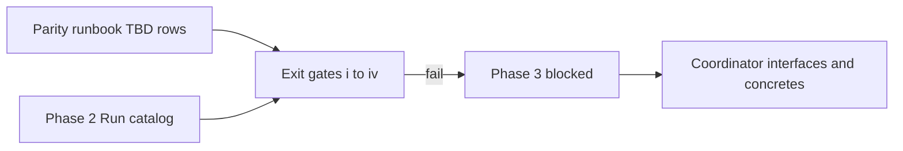

> **Scope:** ADR 0022 — Phase 3 coordinator retirement blocked pending exit gates (ADR 0021).

# ADR 0022: Coordinator interface family retirement — **blocked** (exit gates not met)

- **Status:** Proposed — **do not merge deletion PRs until gates pass**
- **Date:** 2026-04-21
- **Supersedes:** *(none — this ADR does not retire ADR 0010 / 0021 until Phase 3 actually ships)*
- **Superseded by:** *(none)*

## Objective

Record **why** [ADR 0021 Phase 3](0021-coordinator-pipeline-strangler-plan.md) **did not** delete the coordinator interface family in this change set, list **which non-negotiable gates failed**, and preserve governance: **no forced deletion** when ADR 0021 § Consequences require explicit no-rollback sign-off and measurable evidence.

## Assumptions

- Platform/SRE will fill `docs/runbooks/COORDINATOR_TO_AUTHORITY_PARITY.md` with **14 contiguous daily rows** showing **zero Coordinator-pipeline writes** before merge-block is lifted on gate **(iv)**.
- Phase 2 **audit catalog** work ([ADR 0021](0021-coordinator-pipeline-strangler-plan.md) § Phase 2) may still be incomplete until `AuditEventTypes.Run` (or equivalent unified catalog) exists and is the active read path in dashboards and exports.

## Constraints

- **Non-reversible Phase 3** deletions require **all** of ADR 0021 § Phase 3 exit gates **(i)–(iv)** and the **30-day** / **Sunset 2026-07-20** sequencing described in the strangler plan — not a single forced PR.
- **No** edits to historical SQL migrations **001–028**; behaviour changes continue via new migrations + `ArchLucid.Persistence/Scripts/ArchLucid.sql` when schema work resumes.
- **Integration event** documentation still names coordinator-prefixed audit semantics in at least one row — silent removal would violate [`docs/INTEGRATION_EVENTS_AND_WEBHOOKS.md`](../INTEGRATION_EVENTS_AND_WEBHOOKS.md) consumer expectations without a deprecation cycle.

## Architecture overview



## Component breakdown

| Component | State (2026-04-21) |
|-----------|-------------------|
| `ICoordinatorGoldenManifestRepository` / `ICoordinatorDecisionTraceRepository` | **Retained** — no deletion |
| Coordinator concretes (`InMemoryCoordinator*`, split implementations on `GoldenManifestRepository` / `DecisionTraceRepository` if any) | **Retained** |
| `AuditEventTypes.CoordinatorRun*` constants | **Retained** (Sunset **2026-07-20** per API deprecation policy); dual-written with **`AuditEventTypes.Run.*`** (Phase 2 catalog shipped **2026-04-21**) |
| `IRunCommitOrchestrator` façade | **Introduced** (**2026-04-21**) — `RunCommitOrchestratorFacade` delegates to `ArchitectureRunCommitOrchestrator`; Phase 3 deletion PRs still **blocked** until exit gates **(i)–(iv)** |

## Data flow

No migration of write paths occurred in this change set; coordinator and authority pipelines remain as documented in [ADR 0010](0010-dual-manifest-trace-repository-contracts.md) and [ADR 0021](0021-coordinator-pipeline-strangler-plan.md).

## Security model

Unchanged. Premature deletion would increase operational risk (partial pipeline, broken DI) without parity evidence — **fail-closed** per strangler governance.

## Operational considerations

- **Gate-evidence table** (mechanical verification 2026-04-21):

| Gate | Verdict | Notes |
|------|---------|-------|
| **(i)** | Not satisfied for “delete interfaces today” | No `git log -D` history for deleted concretes yet; forward-looking **30-day** window applies **after** concrete-deletion PR merges |
| **(ii)** | Not recorded here | Run `dotnet test --filter "Suite=Core\|Suite=Integration"` and attach log under `artifacts/phase3/` when unblocking |
| **(iii)** | Not verified here | Confirm latest `main` CI green for `live-api-*.spec.ts` within 7 days |
| **(iv)** | **FAIL** | `COORDINATOR_TO_AUTHORITY_PARITY.md` template rows are still `*(TBD)*` — **no 14-day zero-write window** |
| **Phase 2 catalog** | **Partial (2026-04-21)** | `AuditEventTypes.Run` nested class + dual-write landed; dashboards/exports migration + Sunset log-warning cadence still per ADR 0021 § Phase 2 exit gate |

- **Artifacts:** [`artifacts/phase3/gate-verification.md`](../../artifacts/phase3/gate-verification.md)

- **Parity excerpt (inline — not 14 days):**

```
| Window start (UTC) | Window end (UTC) | Tenant sample | Coordinator p95 ms | Authority p95 ms | Audit rows/hr | Replay parity OK? | Notes |
|--------------------|------------------|-----------------|----------------------|------------------|-----------------|---------------------|-------|
| *(TBD)* | *(TBD)* | *(TBD)* | | | | | |
```

## Related

- **Tracking issue:** https://github.com/joefrancisGA/ArchLucid/issues/81
- [ADR 0010 — Dual manifest and decision-trace repository contracts](0010-dual-manifest-trace-repository-contracts.md)
- [ADR 0012 — Runs / authority convergence write-freeze](0012-runs-authority-convergence-write-freeze.md)
- [ADR 0021 — Coordinator pipeline strangler plan](0021-coordinator-pipeline-strangler-plan.md)
- [COORDINATOR_TO_AUTHORITY_PARITY.md](../runbooks/COORDINATOR_TO_AUTHORITY_PARITY.md)
- [DUAL_PIPELINE_NAVIGATOR.md](../DUAL_PIPELINE_NAVIGATOR.md)

## Follow-up (unblock Phase 3)

1. Fill parity runbook with **14 contiguous** daily windows and **Coordinator writes = 0** (gate **iv**).
2. Complete Phase 2 **Run.*` audit catalog** (or document explicit waiver in ADR with platform sign-off).
3. Re-verify gates **(ii)** and **(iii)** on `main`.
4. Execute **PR A** / **PR B** sequencing per ADR 0021 (concretes first, **30 days**, then interfaces; audit constants after **2026-07-20** Sunset).
