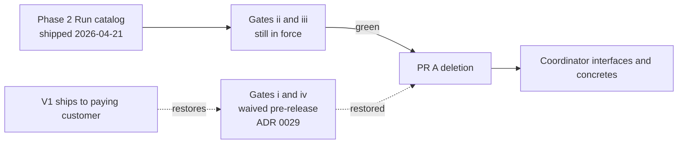

> **Scope:** ADR 0022 — Phase 3 coordinator retirement blocked pending exit gates (ADR 0021).

> **Spine doc:** [Five-document onboarding spine](../FIRST_5_DOCS.md). Read this file only if you have a specific reason beyond those five entry documents.


# ADR 0022: Coordinator interface family retirement — **blocked** (exit gates not met)

- **Status:** Proposed — **do not merge deletion PRs until gates pass**
- **Date:** 2026-04-21
- **Supersedes:** *(none — this ADR does not retire ADR 0010 / 0021 until Phase 3 actually ships)*
- **Superseded by:** *(none yet — flips to `Superseded by [ADR 0030](0030-coordinator-authority-pipeline-unification.md) inside PR A3` per ADR 0030 § Lifecycle, not by the original "single PR A merges" event)*
- **Amended by:** [ADR 0030 — Coordinator → Authority pipeline unification (sequenced multi-PR plan)](0030-coordinator-authority-pipeline-unification.md) — the gate-evidence framing in this ADR's § Operational considerations now applies **per-sub-PR** (PR A0 → PR A4), not to a single PR A. The "PR A may merge once gates (ii) and (iii) clear" wording in the `IRunCommitOrchestrator` row of § Component breakdown carries over to each sub-PR independently.

## Objective

Record **why** [ADR 0021 Phase 3](0021-coordinator-pipeline-strangler-plan.md) **did not** delete the coordinator interface family in this change set, list **which non-negotiable gates failed**, and preserve governance: **no forced deletion** when ADR 0021 § Consequences require explicit no-rollback sign-off and measurable evidence.

## Assumptions

- ~~Platform/SRE will fill `docs/runbooks/COORDINATOR_TO_AUTHORITY_PARITY.md` with **14 contiguous daily rows** showing **zero Coordinator-pipeline writes** before merge-block is lifted on gate **(iv)**.~~ **Superseded 2026-04-21** — gate (iv) was waived for the pre-release window per [ADR 0029](0029-coordinator-strangler-acceleration-2026-05-15.md) § Operational considerations (no customer traffic exists pre-release, so the rows the gate measures cannot accumulate). The runbook stays live; gate (iv) is restored automatically the moment ArchLucid ships V1 to a paying customer.
- Phase 2 **audit catalog** work ([ADR 0021](0021-coordinator-pipeline-strangler-plan.md) § Phase 2) may still be incomplete until `AuditEventTypes.Run` (or equivalent unified catalog) exists and is the active read path in dashboards and exports.

## Constraints

- **Non-reversible Phase 3** deletions require ADR 0021 § Phase 3 exit gates **(ii)** and **(iii)** to be green — gates **(i)** and **(iv)** are **waived for the pre-release window** per [ADR 0029](0029-coordinator-strangler-acceleration-2026-05-15.md) (rationale: no published clients to protect with a 30-day soak; no customer traffic to measure with the parity probe). The Sunset header date (`2026-05-15`) is the **latest-by** deadline, not a wait-for-evidence one. (The earlier Draft [ADR 0028 — completion scaffold](0028-coordinator-strangler-completion.md) is now Superseded by 0029.)
- **No** edits to historical SQL migrations **001–028**; behaviour changes continue via new migrations + `ArchLucid.Persistence/Scripts/ArchLucid.sql` when schema work resumes.
- **Integration event** documentation still names coordinator-prefixed audit semantics in at least one row — silent removal would violate [`docs/INTEGRATION_EVENTS_AND_WEBHOOKS.md`](../INTEGRATION_EVENTS_AND_WEBHOOKS.md) consumer expectations without a deprecation cycle.

## Architecture overview



## Component breakdown

| Component | State (2026-04-21) |
|-----------|-------------------|
| `ICoordinatorGoldenManifestRepository` / `ICoordinatorDecisionTraceRepository` | **Retained** — no deletion |
| Coordinator concretes (`InMemoryCoordinator*`, split implementations on `GoldenManifestRepository` / `DecisionTraceRepository` if any) | **Retained** |
| `AuditEventTypes.CoordinatorRun*` constants | **Retained** (Sunset **2026-05-15** per [ADR 0029](0029-coordinator-strangler-acceleration-2026-05-15.md) — accelerated from the originally published `2026-07-20`); dual-written with **`AuditEventTypes.Run.*`** (Phase 2 catalog shipped **2026-04-21**) |
| `IRunCommitOrchestrator` façade | **Introduced** (**2026-04-21**) as a 12-line thin pass-through to `ArchitectureRunCommitOrchestrator` (no Coordinator-vs-Authority bridging today — the two pipelines have incompatible domain models and SQL tables). Per [ADR 0030 amendment](0030-coordinator-authority-pipeline-unification.md), the original "PR A unblocked" framing is replaced by sub-PRs **A0 → A4**; the façade is the *target* of PR A2's swap, not a today-existing bridge. Each sub-PR carries its own gates (ii) + (iii) clearance; gates (i) and (iv) stay waived for the pre-release window per [ADR 0029](0029-coordinator-strangler-acceleration-2026-05-15.md). |

## Data flow

No migration of write paths occurred in this change set; coordinator and authority pipelines remain as documented in [ADR 0010](0010-dual-manifest-trace-repository-contracts.md) and [ADR 0021](0021-coordinator-pipeline-strangler-plan.md).

## Security model

Unchanged. Premature deletion would increase operational risk (partial pipeline, broken DI) without parity evidence — **fail-closed** per strangler governance.

## Operational considerations

- **Gate-evidence table** (mechanical verification 2026-04-21):

| Gate | Verdict | Notes |
|------|---------|-------|
| **(i)** | **Waived for pre-release** per [ADR 0029](0029-coordinator-strangler-acceleration-2026-05-15.md) | Original gate required **30-day** window after concrete-deletion PR; ADR 0029 documents why this gate does not apply pre-release (no published clients to protect). Gates **(ii)–(iv)** remain in force. |
| **(ii)** | Not recorded here | Run `dotnet test --filter "Suite=Core\|Suite=Integration"` and attach log under `docs/evidence/phase3/` when unblocking |
| **(iii)** | Not verified here | Confirm latest `main` CI green for `live-api-*.spec.ts` within 7 days |
| **(iv)** | **Waived for pre-release** per [ADR 0029](0029-coordinator-strangler-acceleration-2026-05-15.md) (2026-04-21 owner Q&A follow-up) | Original gate required `COORDINATOR_TO_AUTHORITY_PARITY.md` to show 14 contiguous green daily rows of **Coordinator-pipeline writes = 0**. Pre-release there is no customer traffic, the daily probe needs a SQL secret that only meaningfully exists post-V1, and holding the gate would create a chicken-and-egg block. ADR 0029 § Operational considerations explains the rationale. Restored automatically if V1 ships to a paying customer before PR A merges. |
| **Phase 2 catalog** | **Partial (2026-04-21)** | `AuditEventTypes.Run` nested class + dual-write landed; dashboards/exports migration + Sunset log-warning cadence still per ADR 0021 § Phase 2 exit gate |

- **Artifacts:** [`evidence/phase3/gate-verification.md`](../evidence/phase3/gate-verification.md)

- **Parity excerpt (inline — not 14 days):**

```
| Window start (UTC) | Window end (UTC) | Tenant sample | Coordinator p95 ms | Authority p95 ms | Audit rows/hr | Replay parity OK? | Notes |
|--------------------|------------------|-----------------|----------------------|------------------|-----------------|---------------------|-------|
| *(TBD)* | *(TBD)* | *(TBD)* | | | | | |
```

## Related

- **Tracking issue:** https://github.com/joefrancisGA/ArchLucid/issues/81
- [ADR 0010 — Dual manifest and decision-trace repository contracts](0010-dual-manifest-trace-repository-contracts.md)
- [ADR 0012 — Runs / authority convergence write-freeze](0012-runs-authority-convergence-write-freeze.md)
- [ADR 0021 — Coordinator pipeline strangler plan](0021-coordinator-pipeline-strangler-plan.md)
- [COORDINATOR_TO_AUTHORITY_PARITY.md](../runbooks/COORDINATOR_TO_AUTHORITY_PARITY.md)
- [dual-pipeline-navigator-superseded.md](../archive/dual-pipeline-navigator-superseded.md)

## Follow-up (unblock Phase 3)

1. ~~Fill parity runbook with **14 contiguous** daily windows and **Coordinator writes = 0** (gate **iv**).~~ **Waived for pre-release** per [ADR 0029](0029-coordinator-strangler-acceleration-2026-05-15.md). Restored automatically the moment ArchLucid ships V1 to a paying customer.
2. Phase 2 **`Run.*` audit catalog** shipped 2026-04-21 — dual-write live; Sunset log-warning cadence per ADR 0021 § Phase 2 still tracked there.
3. Verify gates **(ii)** and **(iii)** are green on **each sub-PR branch (A0 → A4)** per [ADR 0030 § Lifecycle](0030-coordinator-authority-pipeline-unification.md) (not on `main` — they are produced inside each sub-PR's own CI run). The original "single PR A" framing in this list is replaced; see ADR 0030 § Component breakdown for the per-sub-PR scope.
4. Execute **PR A0 → PR A4** sequencing per [ADR 0030](0030-coordinator-authority-pipeline-unification.md). The 2026-05-15 Sunset deadline from [ADR 0029](0029-coordinator-strangler-acceleration-2026-05-15.md) now applies to **PR B (audit constants)** rather than PR A, because PR A is no longer single-session — see ADR 0030 § Operational considerations.
