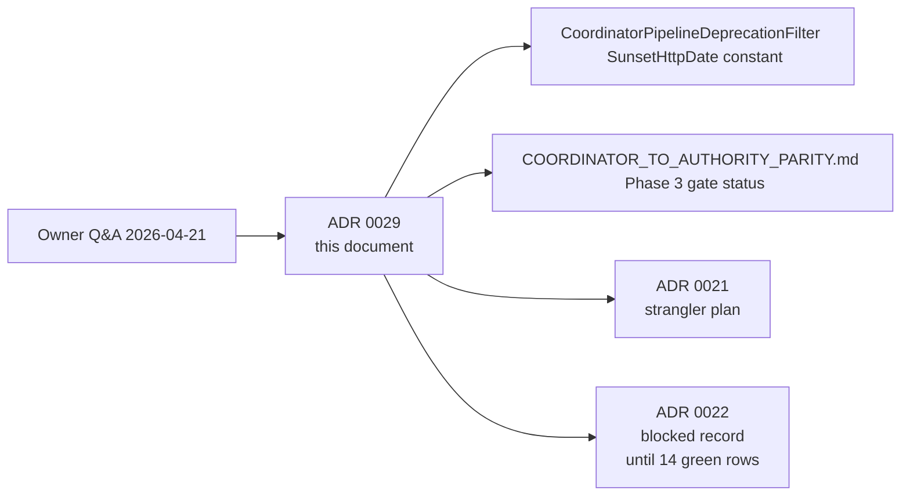

> **Scope:** ADR 0029 — Coordinator strangler acceleration to 2026-05-15 (Phase 3 cut-over) - full detail, tables, and links in the sections below.

> **Spine doc:** [Five-document onboarding spine](../FIRST_5_DOCS.md). Read this file only if you have a specific reason beyond those five entry documents.

# ADR 0029: Coordinator strangler acceleration — Phase 3 cut-over to **2026-05-15**

- **Status:** Accepted
- **Date:** 2026-04-21 (§ Lifecycle amended 2026-04-22 — **PR B — audit-constant retirement checklist** + tracker mirror per `PENDING_QUESTIONS.md` item **35e**)
- **Supersedes:** [ADR 0028 (Draft) — Coordinator strangler completion (scaffold)](0028-coordinator-strangler-completion.md) (the calendar-date and exit-gate `_TODO (owner)_` placeholders in 0028 are answered by this ADR)
- **Superseded by:** *(none yet — see § Lifecycle below)*
- **Amends:** [ADR 0021 — Coordinator pipeline strangler plan](0021-coordinator-pipeline-strangler-plan.md) (cut-over date and Phase 3 30-day exit-gate waiver)
- **Amended by:** [ADR 0030 — Coordinator → Authority pipeline unification (sequenced multi-PR plan)](0030-coordinator-authority-pipeline-unification.md) — the **2026-05-15** Sunset deadline this ADR set for "PR A" now applies to **PR B (audit-constant retirement)** only. The original "PR A: deletion" milestone is replaced by ADR 0030's sequenced **PR A0 → PR A4** plan, because the two pipelines were found to persist incompatible domain models to incompatible SQL tables — single-PR deletion is mechanically impossible. The `SunsetHttpDate` constant on `CoordinatorPipelineDeprecationFilter` stays at `Fri, 15 May 2026 00:00:00 GMT` because that header advertises the **route family** sunset, and the route family (`POST /v1/architecture/*`) does not shrink in PR A0 → PR A4 — only the implementation under it swaps. See ADR 0030 § Operational considerations for the deadline reassignment rationale.

## Objective

Record the **owner-approved decision (2026-04-21)** to accelerate the Coordinator → Authority strangler cut-over from the originally published **2026-07-20** Sunset to **2026-05-15**, document **why** the originally published 30-day post-deletion soak gate is **waived** for this pre-release context, and pin the **mechanical surface area** that must be updated atomically with this date change so deprecation headers, parity-probe documentation, and client SDK release notes do not drift.

## Assumptions

- **Pre-release.** ArchLucid V1 is **not yet shipped to production customers**. The Phase 3 Sunset clock under [ADR 0021](0021-coordinator-pipeline-strangler-plan.md) was originally calibrated to a customer-migration window — that window does not apply when there are no customer integrations holding the legacy `CoordinatorRun*` interface stable.
- **Owner Q&A 2026-04-21** (`docs/PENDING_QUESTIONS.md` items **24** and **16**, sub-bullet "Legacy `CoordinatorRun*` sunset"): owner explicitly chose **2026-05-15** when offered the option — *"product not released, so we can do it any time."*
- Parity evidence (`docs/runbooks/COORDINATOR_TO_AUTHORITY_PARITY.md`) reaches the **14 contiguous green daily rows** target before the Phase 3 deletion PR (PR A under [ADR 0021](0021-coordinator-pipeline-strangler-plan.md) § Phase 3) merges. The accelerated date does **not** waive gate **(iv)** — it only waives the *post-PR-A* 30-day soak gate **(i)** in the original ADR for this pre-release context.

## Constraints

- Historical SQL migrations (001–028) **must not** be re-edited; any schema move associated with this acceleration ships as a new migration plus the master DDL update — same constraint that has applied since the rename.
- Deprecation headers MUST advertise the **same** Sunset date everywhere they appear. The mechanical surface area is enumerated under § Component breakdown so a reviewer can verify atomic update.
- ADR 0021 stays `Accepted`. This ADR is the **single owner-cited record** that the *date* moved and the *30-day soak gate* was waived for pre-release. Any future re-acceleration or deceleration must amend or supersede this ADR — not the original ADR 0021.

## Architecture overview

## Component breakdown — atomic surface area

The new date **2026-05-15** must appear consistently in **every** location below. CI does not (yet) enforce this — reviewers must.

| Component | What changes |
|-----------|--------------|
| `ArchLucid.Api/Filters/CoordinatorPipelineDeprecationFilter.cs` | `SunsetHttpDate` constant: `Mon, 20 Jul 2026 00:00:00 GMT` → `Fri, 15 May 2026 00:00:00 GMT`. XML doc-comment rationale updated to cite this ADR. Tests on the constant continue to pass by construction (they read `CoordinatorPipelineDeprecationFilter.SunsetHttpDate`, not a string literal). |
| `docs/adr/0021-coordinator-pipeline-strangler-plan.md` | The 2026-04-21 update note (§ Status note → "Phase 2 deprecation signal kicked off") changes the inline `Sunset:` value from `Mon, 20 Jul 2026 00:00:00 GMT` to `Fri, 15 May 2026 00:00:00 GMT` and adds a one-line back-reference to **ADR 0029**. |
| `docs/adr/0022-coordinator-phase3-deferred.md` | Three references to `2026-07-20` move to `2026-05-15`; the "PR B audit constants after Sunset" line cites this ADR as the source of the new date. |
| `docs/runbooks/COORDINATOR_TO_AUTHORITY_PARITY.md` | "Phase 3 gate status" sub-section gains a one-line note: *"Cut-over date accelerated to 2026-05-15 per **ADR 0029**; gate **(iv)** still requires 14 contiguous green daily rows before deletion PR merges."* |
| Any unreleased client SDK release notes | Replace 2026-07-20 with 2026-05-15. (No public SDK has shipped yet — this is a forward guard.) |

Historical CHANGELOG entries dated **before 2026-04-21** continue to mention 2026-07-20; that is correct historical record and is not edited.

## Data flow

No runtime data-flow change. The acceleration only moves a future date forward; the Coordinator and Authority pipelines continue to dual-write per [ADR 0021](0021-coordinator-pipeline-strangler-plan.md) § Phase 2 until Phase 3 PR A merges.

## Security model

Unchanged. The acceleration removes a calendar-time buffer but does not change authentication, authorization, RLS, or audit semantics. The deprecation triplet (RFC 9745 / 8594 / 8288) continues to ship on every coordinator-pipeline response — only the `Sunset` value changes.

## Operational considerations

- **Why the 30-day soak gate is waived (gate (i) in ADR 0021 § Phase 3).** That gate was calibrated to give published clients calendar time to roll back if Phase 3 broke them. Pre-release, there are no published clients; the protection that gate (i) was buying does not exist to lose. **This waiver applies only while ArchLucid is pre-release.** If the project ships V1 to a customer before Phase 3 PR A merges, this ADR must be amended to restore the 30-day gate.
- **Why gate (iv) is also waived (added 2026-04-21 owner Q&A follow-up).** Gate (iv) requires 14 contiguous green daily rows in [`docs/runbooks/COORDINATOR_TO_AUTHORITY_PARITY.md`](../runbooks/COORDINATOR_TO_AUTHORITY_PARITY.md) showing **Coordinator-pipeline writes = 0**. The gate exists to detect *customer-traffic* regressions on the legacy write path before the deletion PR removes the rollback option. Pre-release, there is **no customer traffic** on either pipeline — every write is a developer-, CI-, or seed-script-driven run. The former `coordinator-parity-daily.yml` workflow (retired **2026-05-05** with PR B) could not produce real rows without the `ARCHLUCID_COORDINATOR_PARITY_ODBC` secret pointing at a populated `dbo.AuditEvents` table — which only meaningfully exists after V1 ships. Holding gate (iv) in force pre-release would create a chicken-and-egg block (no customers → no traffic → no rows → cannot delete the legacy pipeline that is itself blocking V1 ship). **This waiver also applies only while ArchLucid is pre-release.** The same V1-ship trigger that restores gate (i) restores gate (iv) — the daily probe must then accumulate 14 green rows before any *future* coordinator-style refactor proceeds.
- **What is *not* waived.** Gate **(ii)** (`dotnet test --filter "Suite=Core|Suite=Integration"` green) and gate **(iii)** (live-API E2E suite green within 7 days on `main`) **remain in force**. They are mechanical, do not depend on customer traffic, and the assistant can produce evidence for both inside the deletion PR itself.
- **Net effect on the cut-over.** With gates (i) and (iv) waived for pre-release, PR A is unblocked the moment gates (ii) and (iii) clear on the deletion branch — both of which are inside the assistant's control and complete in a single CI run. The 2026-05-15 calendar date is now a *latest-by* deadline, not a *waiting-for-evidence* deadline.
- **ADR 0022 lifecycle (per Q&A item 16).** ADR 0022 flips to **Superseded** by a Phase 3 *deletion* ADR when PR A merges (no longer waiting for 14 contiguous green daily rows, which would never accumulate pre-release). ADR 0022's `Superseded by` field is filled inside PR A itself.

### Lifecycle

#### PR B — audit-constant retirement checklist

This checklist is **the** authoritative record for Phase 3 **PR B** (audit-constant retirement closure). The former working-surface file `docs/architecture/PHASE_3_PR_B_TODO.md` and `scripts/ci/assert_pr_b_tracker_in_sync.py` were **removed** when PR B merged **2026-05-05** (see [ADR 0030](0030-coordinator-authority-pipeline-unification.md)).

- [x] PR A3 has merged on `main` (Coordinator concretes deleted).
- [x] All `AuditEventTypes.CoordinatorRun*` string constants are gone from **`AuditEventTypes`** (verified by **`Legacy_CoordinatorRun_audit_constants_are_removed_from_AuditEventTypes`** in **`ArchLucid.Architecture.Tests/DependencyConstraintTests.cs`** — remaining **`CoordinatorRun`** substrings elsewhere in **`*.cs`** are assertion text only).
- [x] No SQL migration is required — literals were removed in **C#** only (**`ArchLucid.sql`** unchanged for this cleanup).
- [x] Calendar date 2026-05-15 reached or owner has explicitly approved earlier merge. **Owner explicit early approval 2026-05-05** (pre-release; alternative allowed by this checklist).
- [x] PR B opened, CI green, owner approves, merged. **Merged 2026-05-05.**

| Event | Action |
|-------|--------|
| ~~Phase 3 PR A (concrete + interface deletion) merges on or before **2026-05-15**~~ **Re-scoped by [ADR 0030](0030-coordinator-authority-pipeline-unification.md).** PR A is no longer a single deletion; it is now PR A0 → PR A4 per ADR 0030 § Component breakdown. ADR 0022 flips to `Superseded by ADR 0030` inside **PR A3**, not "inside PR A". | n/a — see ADR 0030 § Lifecycle. |
| ~~Phase 3 PR B (audit-constant retirement) merges **on or after 2026-05-15**~~ **DONE 2026-05-05** (owner-approved early merge). | `AuditEventTypes.CoordinatorRun*` constants were already removed in code before closure; ADR 0010 / ADR 0021 superseded by [ADR 0030](0030-coordinator-authority-pipeline-unification.md); `PHASE_3_PR_B_TODO.md` + PR B tracker CI script retired. |
| ArchLucid ships V1 to a paying customer **before any of PR A0 → PR A4 merge** | This ADR is **amended** (alongside ADR 0030) to restore both gate (i) (30-day soak between PR A2 and PR A3) and gate (iv) (14 contiguous parity rows). |
| ArchLucid ships V1 to a paying customer **after PR A4 merges** | Both waivers expire automatically; any *future* coordinator-style refactor (not currently planned) must satisfy gates (i)–(iv) in full. |
| Owner reverses the acceleration | This ADR is **superseded** by a new ADR with a fresh date and rationale. |

## Related

- [ADR 0021 — Coordinator pipeline strangler plan](0021-coordinator-pipeline-strangler-plan.md)
- [ADR 0022 — Coordinator interface family retirement blocked](0022-coordinator-phase3-deferred.md)
- [`docs/runbooks/COORDINATOR_TO_AUTHORITY_PARITY.md`](../runbooks/COORDINATOR_TO_AUTHORITY_PARITY.md)
- [`docs/PENDING_QUESTIONS.md`](../PENDING_QUESTIONS.md) items **24** and **16** (sub-bullets "Legacy `CoordinatorRun*` sunset" and "ADR 0022 lifecycle")
- [`docs/CHANGELOG.md`](../CHANGELOG.md) 2026-04-21 entry (interactive owner Q&A — 19 decisions)
