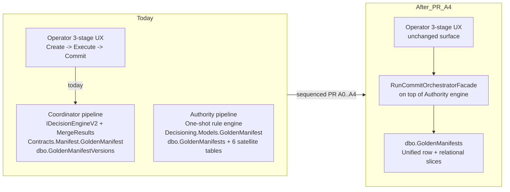

> **Scope:** ADR 0030 — Coordinator → Authority pipeline unification, sequenced over multiple PRs. Replaces the optimistic single-PR-A framing in [ADR 0021](0021-coordinator-pipeline-strangler-plan.md) § Phase 3 mechanism (a) once the dual-data-model and dual-SQL-table reality is acknowledged.

> **Spine doc:** [Five-document onboarding spine](../FIRST_5_DOCS.md). Read this file only if you have a specific reason beyond those five entry documents.

# ADR 0030: Coordinator → Authority pipeline unification — sequenced multi-PR plan

- **Status:** Accepted
- **Date:** 2026-04-21 (amended 2026-04-22 — owner Q&A on `PENDING_QUESTIONS.md` items **35a** + **35b** + **35d**; see § Owner sub-decisions, **PR A0.5** in § Component breakdown, and **PR A4** hard-drop update per item **35d**) (amended 2026-04-24 — **PR A3 shipped**: coordinator interfaces + concretes deleted, legacy commit orchestrator deleted, `TopologySection.Relationships` added so the Authority FK chain round-trips contract relationships, `Demo:SeedDepth = quickstart | vertical` integration test landed, OpenAPI snapshot regenerated; ADR 0022 superseded by this ADR) (amended 2026-04-29 — **PR A4 shipped**: migration **`111_DropGoldenManifestVersions_Legacy.sql`** removes **`dbo.GoldenManifestVersions`**; master DDL **`ArchLucid.sql`** documents removal with rollback **`Rollback/R111_DropGoldenManifestVersions_Legacy.sql`**; no-rollback sign-off per owner decision **35d**) (amended 2026-04-29 — **PR A final cleanup shipped**: `CoordinatorPipelineDeprecationFilter`, `CoordinatorPipelineDeprecatedAttribute`, `CoordinatorPipelineDeprecationFilterTests`, and `CoordinatorRoutesDeprecationHeaderTests` deleted; `[CoordinatorPipelineDeprecated]` removed from `RunsController`; coordinator strangler initiative fully retired — no coordinator pipeline artifacts remain in production code) (amended 2026-05-05 — **PR B merged**: [ADR 0029](0029-coordinator-strangler-acceleration-2026-05-15.md) § Lifecycle § PR B checklist closed; `docs/architecture/PHASE_3_PR_B_TODO.md` + `scripts/ci/assert_pr_b_tracker_in_sync.py` retired; [ADR 0010](0010-dual-manifest-trace-repository-contracts.md) superseded by this ADR; [ADR 0021](0021-coordinator-pipeline-strangler-plan.md) superseded by this ADR; `.github/workflows/coordinator-parity-daily.yml` retired)
- **Supersedes:** [ADR 0022 — Coordinator interface family retirement blocked](0022-coordinator-phase3-deferred.md) *(2026-04-24, on PR A3 merge — see § Lifecycle)* · [ADR 0010 — Dual manifest and decision-trace repository contracts](0010-dual-manifest-trace-repository-contracts.md) *(2026-05-05, on PR B merge — single Authority manifest/trace family; dual coordinator repository contracts retired)*
- **Superseded by:** *(none yet)*
- **Amends:** [ADR 0021 — Coordinator pipeline strangler plan](0021-coordinator-pipeline-strangler-plan.md) (Phase 3 mechanism (a) is re-scoped from "single PR A deletion" into the sequenced PR list below); [ADR 0022 — Coordinator interface family retirement blocked](0022-coordinator-phase3-deferred.md) (the gate-evidence framing now applies per-sub-PR, not to a single PR A); [ADR 0029 — Coordinator strangler acceleration to 2026-05-15](0029-coordinator-strangler-acceleration-2026-05-15.md) (the 2026-05-15 Sunset deadline now applies to **PR B — audit-constant retirement** only; the original "PR A: deletion" milestone is replaced by the **PR A0 → A4** sequence below); [ADR 0010 — Dual manifest and decision-trace repository contracts](0010-dual-manifest-trace-repository-contracts.md) (**PR B 2026-05-05**: dual coordinator repository family retired; supersession recorded)
- **Self-amended 2026-04-22:** (1) every internal cross-reference to "pending question item **34**" / "**34a–d**" is corrected to **35** / **35a–e** to match the actual `docs/PENDING_QUESTIONS.md` numbering (the original ADR draft mis-numbered them — there is no item 34a–d in `PENDING_QUESTIONS.md`; item 34 is "Production Simmy / fault-injection game day"); (2) § Component breakdown gains a **PR A0.5 — Authority typed services + datastores** row between PR A0 and PR A1 (consequence of owner Q35a.2 = `empty-with-guard`); (3) § Operational considerations gains a new **Known-empty allow-list mechanism** subsection (consequence of owner Q35a.4 = `yes`); (4) § Lifecycle gains a PR A0.5 row; (5) § Owner sub-decisions section captures the canonical 35a / 35b answer block; (6) a new pending sub-question **35f** (PR A0.5 typed-services source) is opened; (7) owner Q&A item **35d** — **PR A4** is a **hard drop** (no backfill / archival); § Owner sub-decisions gains row **35d**; item **35e** (PR B tracker) shipped as [ADR 0029](0029-coordinator-strangler-acceleration-2026-05-15.md) § Lifecycle § PR B plus **`PHASE_3_PR_B_TODO.md`** (**removed 2026-05-05** with PR B merge).

## Objective

Record **why** [ADR 0021](0021-coordinator-pipeline-strangler-plan.md) § Phase 3 mechanism (a) cannot be executed as a single deletion PR, **what** sequenced PRs are required to actually unify the Coordinator and Authority pipelines, and **which** owner decisions are now blocking each sub-PR. The intent is to keep the strangler initiative honest with the code state instead of letting an optimistic ADR shape the next session's scope when the underlying pipelines diverge in domain model, SQL storage, and decision-engine implementation.

## Assumptions

- **Pre-release.** Same as [ADR 0029](0029-coordinator-strangler-acceleration-2026-05-15.md) § Assumptions — ArchLucid V1 is not yet shipped to a paying customer; soak-time gates (i) and parity-row gates (iv) from [ADR 0021](0021-coordinator-pipeline-strangler-plan.md) § Phase 3 stay waived per ADR 0029 across every sub-PR below until V1 ships.
- **Owner Q&A 2026-04-21** (`docs/PENDING_QUESTIONS.md` item **16** sub-bullet "Phase 3 PR A authorship"): the owner authorized "no-rollback sign-off" for the original single PR A scope; that authorization carries over to the sub-PRs **A0 → A4** below, but the **per-sub-PR gates (ii) + (iii)** still must clear inside each sub-PR's own CI run.
- **The 2026-04-21 grounding read** (this ADR) is the authoritative finding that the two pipelines persist incompatible domain models to incompatible SQL tables. See § Component breakdown for the evidence.

## Constraints

- **Two `GoldenManifest` types exist today.** `ArchLucid.Contracts.Manifest.GoldenManifest` (Coordinator pipeline; string `RunId`; services + datastores + relationships + governance + metadata) and `ArchLucid.Decisioning.Models.GoldenManifest` (Authority pipeline; Guid `ManifestId` + Guid `RunId` + Guid scope triple; section objects: Topology / Security / Compliance / Cost / Constraints / UnresolvedIssues / Decisions / Provenance / Policy). They are **not** the same type and one cannot be substituted for the other without a wider refactor.
- **Legacy coordinator manifest storage is retired.** **`dbo.GoldenManifestVersions`** was dropped in **PR A4** (migration **111**); fresh **`ArchLucid.sql`** documents removal instead of creating the table. Coordinator-shaped manifests persist only via **`dbo.GoldenManifests`** + six phase-1 relational satellite tables (`GoldenManifestAssumptions`, `GoldenManifestWarnings`, `GoldenManifestProvenanceSourceFindings`, `GoldenManifestProvenanceSourceGraphNodes`, `GoldenManifestProvenanceAppliedRules`, `GoldenManifestDecisions` + `…DecisionEvidenceLinks` + `…DecisionNodeLinks`) — Authority side — keyed by Guid `ManifestId` + scope triple.
- **Two decision engines exist today.** Coordinator pipeline uses `IDecisionEngineService.MergeResults` + `IDecisionEngineV2.ResolveAsync`; Authority pipeline uses its own one-shot rule-engine path. The Authority engine does **not** today produce a `Contracts.Manifest.GoldenManifest` shape.
- **`RunCommitOrchestratorFacade` is a 12-line thin pass-through today** to `ArchitectureRunCommitOrchestrator`. It does not bridge the two pipelines; the introduction notes in [ADR 0022](0022-coordinator-phase3-deferred.md) § Component breakdown overstate its role.
- **Historical SQL migrations 001–028 must not be re-edited.** Any schema move ships as a new migration plus the master DDL update.
- **No edits to the Authority engine's Decisioning.Models contract surface without an ADR amendment.** That surface is consumed by the operator UI's run / manifest views and by the AsyncAPI emitter; widening the manifest-row producer is an in-scope change but breaking the consumer surface is out of scope for this initiative without a separate ADR.

## Architecture overview

## Component breakdown — the four sub-PRs

Each sub-PR ships independently and can be verified against gates **(ii)** + **(iii)** on its own CI run before the next one starts. Each sub-PR is reversible by `git revert` until the PR after it merges. The **only** PR that is irreversible without restoring deleted code from history is **PR A4** (the legacy `dbo.GoldenManifestVersions` table drop), and that one is gated on owner sign-off again at the time of merge.

| Sub-PR | What ships | What is blocked on (owner / evidence) |
|--------|------------|---------------------------------------|
| **PR A0 — Authority engine output reshaping (additive).** | Authority engine grows the ability to emit a `Contracts.Manifest.GoldenManifest`-shape projection from the same one-shot run. New code path: `IAuthorityCommitProjectionBuilder.BuildContractsManifestAsync(...)`. No deletion. No SQL change. New unit tests under `ArchLucid.Decisioning.Tests` covering shape parity (every Coordinator-shape field reachable from Authority-shape source data). **Per owner 35a (2026-04-22):** projection lives in a **new mapper class** (`AuthorityCommitProjectionBuilder`) consumed by `RunCommitOrchestratorFacade`, not inside the Authority engine itself — keeps Authority pure (sub-question (ii) of original 35a). `RunId` / `SystemName` / `Governance` / `Metadata` are populated; `Services` / `Datastores` / `Relationships` ship as empty `[]` under the **known-empty allow-list** described in § Operational considerations, with rationale rows pointing at PR A0.5 (Services + Datastores) and a future Relationships-graph PR. `SystemName` is read from the sibling `Run` / `ArchitectureRequest` row via the existing `IRunRepository` (no Authority schema change). | **Resolved 2026-04-22 (owner Q&A on item 35a — recommended-set accepted in full):** projection-location = `(ii) new mapper class` (implicit from the `IAuthorityCommitProjectionBuilder` design); Q35a.1 = `sibling-row`; Q35a.2 = `empty-with-guard`; Q35a.3 = `empty-with-guard`; Q35a.4 = `yes` (allow-list + CI guard). Drafting authorized; CI gates **(ii)** + **(iii)** still required on the PR A0 branch. |
| **PR A0.5 — Authority typed services + datastores (additive schema growth).** | Authority engine and `Decisioning.Models.GoldenManifest` grow first-class typed `ManifestService` and `ManifestDatastore` collections (mirroring the Coordinator-shape contracts, but populated from the rule-engine resource graph rather than parsed from resource strings). `AuthorityCommitProjectionBuilder` from PR A0 starts populating `Services` and `Datastores` from the new typed source. The two field rows are **removed from the known-empty allow-list** in the same PR. **Requires this ADR to be amended further** before merge (per § Constraints — *"No edits to the Authority engine's `Decisioning.Models` contract surface without an ADR amendment"*); the amendment row in § Component breakdown can be the same PR. The AsyncAPI emitter and operator UI run / manifest views must be regression-tested because they consume `Decisioning.Models.GoldenManifest`. | New owner sub-decision: confirm the typed source for `ManifestService.ServiceType` / `RuntimePlatform` mapping (rule-engine output may need new metadata to disambiguate). Captured as new pending question **item 35f** (carved out from 35a on 2026-04-22). PR A0.5 is **not** on the critical path for PR A1 / A2 — those can proceed against the empty-with-guard `Services` / `Datastores` if needed; PR A0.5 just makes the projection complete before PR A3 deletes the Coordinator typed source. |
| **PR A1 — Authority repository accepts Contracts manifests (additive write port).** | `ArchLucid.Decisioning.Interfaces.IGoldenManifestRepository` grows a second `SaveAsync(Contracts.Manifest.GoldenManifest, ...)` overload (per the 2026-04-21 owner Q&A `q_pra_authority_writes` decision: extend Authority interface, do not split into separate writer port). `SqlGoldenManifestRepository` learns to map a Contracts-shape input into the existing `dbo.GoldenManifests` schema using PR A0's projection builder in reverse where needed. Coordinator interface untouched. **Per owner 35b (2026-04-22):** the write overload returns the produced `Decisioning.Models.GoldenManifest` so the caller keeps idempotency-key reasoning (same `ManifestId` it would have written) — one extra in-memory allocation, much clearer caller code than re-reading after the write. (Note: the original 35b sub-question framed the choice as `Task` vs `Task<Guid>`. Owner answer expanded the third option `Task<Decisioning.Models.GoldenManifest>` and chose it; this is recorded in the new § Owner sub-decisions table below.) | **Resolved 2026-04-22 (owner Q&A on item 35b):** the overload signature is `Task<Decisioning.Models.GoldenManifest> SaveAsync(Contracts.Manifest.GoldenManifest manifest, ...)`. No further owner sign-off required to draft PR A1; CI gates **(ii)** + **(iii)** still required on the PR A1 branch. |
| **PR A2 — RunCommitOrchestratorFacade swaps target.** | `RunCommitOrchestratorFacade` stops delegating to `ArchitectureRunCommitOrchestrator` and instead drives the Authority engine + the new Authority write port from PR A1. The legacy `ArchitectureRunCommitOrchestrator` stays in place behind a `legacy:true` feature flag for rollback. The 9 mocking test files start being migrated to mock the Authority interfaces; the 4 Coordinator contract tests stay green because the Coordinator concrete is still wired. **Critical:** OpenAPI snapshot must be unchanged (route shape stable). | Gate **(ii)** + gate **(iii)** green on PR A2 branch. Owner sign-off on the **legacy feature flag default** (off vs on by environment) **and** on the flag scope (per-tenant vs global config). Pending question item **35c**. |
| **PR A3 — Coordinator concretes + interfaces deletion. — DONE 2026-04-24.** | Shipped: deleted `ICoordinatorGoldenManifestRepository` + `ICoordinatorDecisionTraceRepository` + every in-memory and SQL concrete; deleted the 6 coordinator-shape contract test files; deleted `ArchLucid.Architecture.Tests/DualPipelineInternalReadPathTests.cs` and `ArchLucid.Application.Tests/Orchestration/CoordinatorAuditDurableTests.cs`; deleted the legacy `ArchitectureRunCommitOrchestrator` concrete + `RunCommitPathSelector` + `LegacyRunCommitPathOptions` (the legacy feature flag itself); rewired `IArchitectureRunCommitOrchestrator` directly to `AuthorityDrivenArchitectureRunCommitOrchestrator`; rewrote `DualPipelineRegistrationDisciplineTests` to assert the opposite invariant; rewrote `DemoSeedService` + `ReplayRunService` to write only the Authority FK chain; collapsed `RunDetailQueryService` + `UnifiedGoldenManifestReader` to authority-only reads; grew `Decisioning.Manifest.Sections.TopologySection.Relationships` so the Authority FK chain round-trips contract `ManifestRelationship` rows (per owner Decision A 2026-04-23, the Relationships row leaves the known-empty allow-list inside this PR); added `Demo:SeedDepth = quickstart \| vertical` (owner Decision B 2026-04-23) with new integration test `DemoSeedDepthIntegrationTests` proving both modes commit a manifest with non-empty Services + Datastores + Relationships; regenerated the OpenAPI snapshot. ADR 0022 flips to `Superseded by ADR 0030` in this PR. | Resolved 2026-04-24 — gate (ii) + (iii) green on the PR A3 branch. |
| **PR A4 — `dbo.GoldenManifestVersions` table drop. — DONE 2026-04-29.** | Shipped: migration **`111_DropGoldenManifestVersions_Legacy.sql`** drops **`dbo.GoldenManifestVersions`** (idempotent `IF OBJECT_ID`); **`ArchLucid.sql`** documents removal (ADR 0030 PR A4); rollback **`Rollback/R111_DropGoldenManifestVersions_Legacy.sql`** recreates an empty legacy shell only (no row restore). **Irreversible row history.** **Hard drop** per owner decision **35d** (`docs/PENDING_QUESTIONS.md`). No historical Coordinator-shape rows preserved. | Resolved 2026-04-29 — merge-time no-rollback acknowledgement recorded in CHANGELOG **2026-04-29**. Item **35d** remains resolved 2026-04-22 — no backfill destination. |

(Phase 3 **PR B — audit-constant retirement** (**DONE 2026-05-05**): [ADR 0029](0029-coordinator-strangler-acceleration-2026-05-15.md) § Lifecycle § PR B checklist is closed. `AuditEventTypes.CoordinatorRun*` literals were removed from code before closure; PR B carried ADR supersession + tracker/CI retirement.)

## Data flow

No runtime data-flow change in PR A0 (additive code only). PR A1 introduces a new write target without enabling it. PR A2 flips the runtime write path behind a feature flag; the operator-visible 3-stage Create / Execute / Commit semantics are preserved by `RunCommitOrchestratorFacade` and the unchanged HTTP route shape on `RunsController`. PR A3 collapses the dual-write to single-write Authority-side. PR A4 drops the now-empty legacy storage.

The OpenAPI / AsyncAPI **public** surface does not change in any of A0 → A4 — every public route on `RunsController` keeps its request/response shape. The internal `CommitRunResult.Manifest` continues to be `Contracts.Manifest.GoldenManifest`, populated by either pipeline depending on the feature flag in PR A2 and the deletion in PR A3.

## Security model

RLS policies on `dbo.GoldenManifests` enforce scope boundaries. **PR A4** (**migration 111**, **2026-04-29**): legacy **`dbo.GoldenManifestVersions`** is dropped — coordinator-facing reads/writes were removed in PR A3; a merge-time security review confirmed no production code paths queried that table before removal (ADR lifecycle § PR A4).

## Operational considerations

- **2026-05-15 deadline (PR B).** [ADR 0029](0029-coordinator-strangler-acceleration-2026-05-15.md) originally tied the accelerated date to PR B; **PR B merged 2026-05-05** with owner-approved early merge. The former `CoordinatorPipelineDeprecationFilter` was deleted in **PR A final cleanup** — operator routes use **[`ApiDeprecationHeadersMiddleware`](../../ArchLucid.Api/Middleware/ApiDeprecationHeadersMiddleware.cs)** + **`ApiDeprecation:*`** when deprecation signalling is needed. **Route-family** narrowing/removal of `POST /v1/architecture/*` remains a **future ADR** ([`COORDINATOR_STRANGLER_INVENTORY.md`](../architecture/COORDINATOR_STRANGLER_INVENTORY.md)); this ADR does not retire those routes.
- **PR A2 risk.** Swapping the façade behind a feature flag is the highest-risk single sub-PR because it is the moment runtime behaviour changes. Run the `tests/golden-cohort/cohort.json` deterministic simulator end-to-end against both flags before merging A2; capture the SHA-equality evidence in `docs/evidence/phase3/pr-a2-cohort-parity.md` so reviewers can verify the swap produced bit-identical committed manifests.
- **PR A4 backfill — N/A.** Owner chose hard drop on 2026-04-22; no backfill destination needed.
- **What stays from ADR 0029 and ADR 0022.** ADR 0022 is `Superseded by ADR 0030` (**PR A3**, 2026-04-24). ADR 0029 stays `Accepted`; **PR B** closed its § Lifecycle checklist **2026-05-05**.

### Known-empty allow-list mechanism (added 2026-04-22 per owner Q35a.4)

PR A0 deliberately leaves three Coordinator-shape fields empty (`Services`, `Datastores`, `Relationships`) because the Authority engine does not today produce typed services / datastores / relationships graphs. Without an explicit guard, future contributors will silently grow that empty set and the projection builder will quietly emit less and less data. The allow-list is the mechanism that prevents that drift.

- **Source of truth.** New committed file `docs/architecture/AUTHORITY_PROJECTION_KNOWN_EMPTY.json` lists exactly the field names that `AuthorityCommitProjectionBuilder.BuildContractsManifestAsync(...)` is allowed to leave empty. Each row carries: `field`, `rationale`, `tracked-by` (PR / ADR amendment that will populate it), `added-utc`.
- **Initial contents (PR A0).** Three rows: `Services` → tracked by PR A0.5; `Datastores` → tracked by PR A0.5; `Relationships` → tracked by a future Relationships-graph PR (not yet scoped — will be flagged when scoping PR A2).
- **CI guard.** New script `scripts/ci/assert_authority_projection_known_empty.py` (with mirrored `scripts/ci/tests/test_assert_authority_projection_known_empty.py`) wired into `.github/workflows/ci.yml`. Two assertions:
  1. **Builder vs allow-list (no silent emptiness).** Run a representative Authority commit through `AuthorityCommitProjectionBuilder` against a fixture, assert that the empty-collection set on the produced `Contracts.Manifest.GoldenManifest` is **exactly** the allow-list set — neither superset nor subset. A field that is supposed to be empty must be empty; a field that is supposed to be populated must be populated. The script lives in CI rather than as a `.NET` test so the JSON file is the single source of truth across both the C# builder and the CI guard.
  2. **Allow-list vs ADR (no silent additions).** Assert that every row in the JSON allow-list has a `tracked-by` value that resolves to either an open PR identifier in this ADR's § Component breakdown or a referenced future ADR. Rows whose `tracked-by` PR has been merged must be removed from the allow-list in the same PR (this is enforced by the same script).
- **Lifecycle of the allow-list.** When PR A0.5 merges, `Services` and `Datastores` rows must be removed from the allow-list **inside that PR** (the script enforces this). When the future Relationships-graph PR merges, the third row must be removed inside that PR. The allow-list is therefore self-eroding — the moment Authority gains the data, the guard removes the field's right to be empty.
- **Why this lives in JSON, not as a C# attribute.** Two readers (the C# builder and the Python CI script) need the same source of truth, and the file should be reviewable in a PR without parsing C# source. The JSON shape also makes the next quality assessment greppable for "what is intentionally not yet populated" without reading code.

### Owner sub-decisions (resolved 2026-04-22)

> The sub-decisions below extend `docs/PENDING_QUESTIONS.md` items **35a**, **35b**, and **35d**. They are recorded here (not just in `PENDING_QUESTIONS.md`) because each one binds a concrete shape decision in the **PR A0** / **PR A1** / **PR A0.5** / **PR A4** rows of § Component breakdown above (and related § Operational considerations), and the next contributor reading this ADR needs the bind on the same page.

| Pending-questions item | Sub-question | Owner answer (2026-04-22) | Mechanical effect |
|------------------------|--------------|---------------------------|-------------------|
| **35a (top-level)** | Projection lives **(i) inside the Authority engine** behind an opt-in flag, or **(ii) in a new mapper class** consumed by `RunCommitOrchestratorFacade` | `(ii)` — new mapper class `AuthorityCommitProjectionBuilder` | Keeps Authority pure; mapping responsibility is application-layer; matches the PR A0 row's `IAuthorityCommitProjectionBuilder` design. |
| **35a.1** | `SystemName` source on the projected manifest | `sibling-row` — read from existing `Run` / `ArchitectureRequest` row via `IRunRepository` | No Authority schema change; `AuthorityCommitProjectionBuilder` takes a constructor dependency on `IRunRepository`. |
| **35a.2** | Typed `Services` + `Datastores` populated from rule-engine resource strings, or left empty | `empty-with-guard` — leave empty in PR A0; populate in **PR A0.5** when Authority grows typed services | New PR A0.5 row added to § Component breakdown above; allow-list rationale rows for `Services` / `Datastores` point at PR A0.5. Brittle string-parser path explicitly rejected. |
| **35a.3** | `Relationships` populated from graph snapshot in PR A0, or left empty | `empty-with-guard` — leave empty in PR A0; populate in a future Relationships-graph PR (scope deferred until PR A2 planning) | Allow-list rationale row for `Relationships` points at the deferred PR; assistant will surface a follow-up question when scoping PR A2. |
| **35a.4** | Adopt the JSON allow-list + CI guard mechanism | `yes` | New file `docs/architecture/AUTHORITY_PROJECTION_KNOWN_EMPTY.json` + new CI script + workflow step; described in § Known-empty allow-list mechanism above. |
| **35b** | Write-overload return type on `IGoldenManifestRepository.SaveAsync(Contracts.Manifest.GoldenManifest, ...)` — original framing was `Task` vs `Task<Guid>`; owner expanded to a third option | `Task<Decisioning.Models.GoldenManifest>` (return the produced Authority-shape manifest) | Caller keeps idempotency-key reasoning (same `ManifestId` it would have written); one extra in-memory allocation, much clearer caller code than re-reading after the write. Overload signature pinned in the PR A1 row of § Component breakdown. |
| **35d** | `dbo.GoldenManifestVersions` drop policy for PR A4 — backfill / archive vs hard drop | **Hard drop** — no historical Coordinator-shape rows preserved; pre-release aligned with ADR 0029 gates (i)/(iv) waiver; Q2 2026 commerce calendar keeps the table pre-customer | PR A4 row and § Operational considerations updated 2026-04-22; backfill / archival branch removed from this ADR. |

These owner sub-decision rows fully unblock PR A0 drafting and PR A1 drafting. PR A0.5 needs one more sub-decision (new item **35f** — `ManifestService.ServiceType` / `RuntimePlatform` typed source) before it can start; assistant will surface that as a separate ask. PR A2 still gated on item **35c** (legacy feature flag default + scope). Item **35d** (PR A4 drop policy) is **resolved 2026-04-22** — hard drop; merge-time gate is no-rollback sign-off only. Item **35e** (PR B tracker shape) shipped **2026-04-22** — inline checklist on [ADR 0029](0029-coordinator-strangler-acceleration-2026-05-15.md) § Lifecycle § PR B (standalone `PHASE_3_PR_B_TODO.md` and tracker sync script **removed 2026-05-05** with PR B merge).

### Lifecycle

| Event | Action |
|-------|--------|
| PR A0 merges | This ADR stays Accepted; component-breakdown row for A0 marked shipped; `docs/architecture/AUTHORITY_PROJECTION_KNOWN_EMPTY.json` + CI guard live. |
| PR A0.5 merges | This ADR is amended (same PR) to remove the PR A0.5 row from § Component breakdown's "open work" framing; the `Services` and `Datastores` rows are removed from the JSON allow-list **inside the same PR** (CI guard enforces). |
| PR A1 merges | Same as A0. |
| PR A2 merges | Same. Pre-release: this is the moment runtime behaviour changes; capture cohort-parity evidence in the PR. |
| PR A3 merges | **DONE 2026-04-24.** ADR 0022 flipped to `Superseded by ADR 0030` inside PR A3; `DualPipelineRegistrationDisciplineTests` asserts the opposite invariant; coordinator interfaces + concretes + legacy `ArchitectureRunCommitOrchestrator` deleted; `TopologySection.Relationships` added so the Authority FK chain round-trips contract `ManifestRelationship` rows (Relationships row leaves the known-empty allow-list in this PR); `Demo:SeedDepth = quickstart | vertical` lands with new integration test `DemoSeedDepthIntegrationTests`; OpenAPI snapshot regenerated. |
| PR A4 merges | **DONE 2026-04-29.** This ADR stays Accepted; legacy `dbo.GoldenManifestVersions` table is gone (**migration 111**); `ArchLucid.sql` master DDL no longer creates it. |
| PR B merges | **DONE 2026-05-05** (owner-approved early merge). ADR 0029 § Lifecycle § PR B checklist closed; ADR 0010 + ADR 0021 superseded by this ADR; `PHASE_3_PR_B_TODO.md` + `assert_pr_b_tracker_in_sync.py` retired; daily coordinator parity workflow retired. |
| ArchLucid ships V1 to a paying customer **before any of A0–A4 merge** | This ADR is **amended** to restore [ADR 0021](0021-coordinator-pipeline-strangler-plan.md) gate (i) (30-day soak between PR A2 and PR A3) and gate (iv) (14 contiguous parity rows). PR A4 is held until both restored gates clear. |
| Owner reverses the unification plan | This ADR is **superseded** by a new ADR. |

## Related

- [ADR 0010 — Dual manifest and decision-trace repository contracts](0010-dual-manifest-trace-repository-contracts.md) (the boundary the strangler initiative is trying to retire).
- [ADR 0021 — Coordinator pipeline strangler plan](0021-coordinator-pipeline-strangler-plan.md) (whose Phase 3 mechanism (a) is amended here).
- [ADR 0022 — Coordinator interface family retirement blocked](0022-coordinator-phase3-deferred.md) (whose gate framing is per-sub-PR after this amendment).
- [ADR 0029 — Coordinator strangler acceleration to 2026-05-15](0029-coordinator-strangler-acceleration-2026-05-15.md) (whose 2026-05-15 calendar deadline now applies to PR B).
- [`docs/architecture/COORDINATOR_STRANGLER_INVENTORY.md`](../architecture/COORDINATOR_STRANGLER_INVENTORY.md) (living inventory; updated post **PR A3 / PR A4**).
- [`docs/archive/dual-pipeline-navigator-superseded.md`](../archive/dual-pipeline-navigator-superseded.md) (archived decision tree; superseded for operators by `CANONICAL_PIPELINE.md` when PR A3 merges).
- [`docs/PENDING_QUESTIONS.md`](../PENDING_QUESTIONS.md) item **16** sub-bullets and item **35** (sub-bullets **35a** + **35b** **resolved 2026-04-22 — see § Owner sub-decisions above**; **35c** + **35f** resolved 2026-04-22 per *Resolved 2026-04-22 (35c + 35f — ADR 0030)* in `PENDING_QUESTIONS.md`; **35d** + **35e** resolved 2026-04-22 per *Resolved 2026-04-22 (assessment owner Q&A — 16 decisions)* — ADR 0030 PR A4 row / § Operational considerations for **35d**; ADR 0029 § Lifecycle § PR B for **35e** — standalone tracker file removed **2026-05-05**). *Note: the original draft of this ADR mis-numbered these as "item 34a–d"; that mis-numbering is corrected throughout this 2026-04-22 amendment — there is no item 34a–d in `PENDING_QUESTIONS.md`; item 34 is "Production Simmy / fault-injection game day".*
- [`docs/architecture/AUTHORITY_PROJECTION_KNOWN_EMPTY.json`](../architecture/AUTHORITY_PROJECTION_KNOWN_EMPTY.json) (single source of truth for which Coordinator-shape fields are intentionally empty in `AuthorityCommitProjectionBuilder`'s output — created when PR A0 merges, eroded by PR A0.5 and the future Relationships-graph PR).
- [`docs/CHANGELOG.md`](../CHANGELOG.md) 2026-04-21 entry recording this ADR + the amendments to 0021 / 0022 / 0029; 2026-04-22 entries recording the 35a / 35b owner Q&A, the PR A0.5 row addition, the 34→35 numbering correction, **PR A4 = hard drop (35d)**, and **PR B checklist + `PHASE_3_PR_B_TODO.md` (35e)**; **2026-05-05** entry recording PR B merge (tracker + parity-daily workflow retired).
