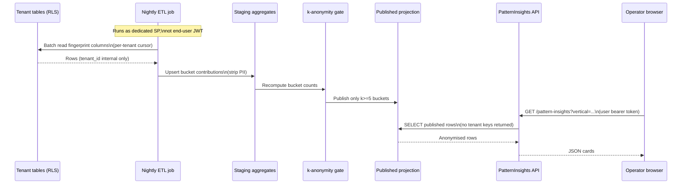

> **Scope:** ADR 0031 — Cross-tenant pattern library (anonymised industry guidance) - full detail, tables, and links in the sections below.

> **Spine doc:** [Five-document onboarding spine](../FIRST_5_DOCS.md). Read this file only if you have a specific reason beyond those five entry documents.


# ADR 0031: Cross-tenant pattern library (anonymised vertical guidance)

- **Status:** Accepted (owner sign-off **2026-05-03** — implementation PRs may merge when they conform to this ADR)
- **Date:** 2026-04-22
- **Supersedes:** *(none)*
- **Superseded by:** *(none)*
- **Amends:** *(none)*
- **Amended by:** *(none yet)*

## Context

ArchLucid operators already receive **tenant-private** architecture intelligence from their own committed manifests, runs, and governance outputs under **strict row-level security (RLS)** and RBAC. Product strategy (see [`docs/PENDING_QUESTIONS.md`](../PENDING_QUESTIONS.md) **Resolved 2026-04-21** table — row *Cross-tenant pattern library*, and **item 14** follow-ups) calls for an **optional** capability: show **patterns other tenants in the same industry / vertical preset have adopted**, derived from **aggregated** manifest-derived signals, **without** exposing which tenant contributed which artefact.

**Who asked / who approved.** The **owner** approved the feature at the principle level (**opt-in**, **k-anonymity**, **DPA carve-out**) in the **2026-04-21** interactive Q&A snapshot recorded in `docs/PENDING_QUESTIONS.md`. **Implementing ADR ownership (item 14, Resolved 2026-04-22)** is **assistant drafts in full**. **ADR acceptance (Status → Accepted):** owner **2026-05-03** — merges that ship SQL, Worker ETL, services, or UI for this capability must implement **this** ADR verbatim on security posture (dedicated principal, nightly ETL, k ≥ 5, opt-in default OFF, projection read model); **`PENDING_QUESTIONS.md` item 14** updated accordingly.

**Why an ADR.** Cross-tenant reads are a **controlled exception** to the default “every query is tenant-scoped” mental model. Without a written security and data-flow contract, engineering teams will (a) accidentally query tenant tables under a broad identity, (b) ship a feature that leaks **re-identifying** combinations, or (c) create an **Elastic Query** bill that surprises FinOps. This ADR pins the **dedicated service principal**, **materialised aggregate surface**, **k = 5** floor, and **purge SLA** so reviewers can say “no” to shortcuts.

## Objective

Give opted-in operators **actionable, anonymised pattern guidance** (“peers in your vertical often adopt *X*”) that:

1. **Never** surfaces tenant-identifying labels (customer names, subscription IDs, hostnames, user emails, project titles, or free-text blobs from manifests).
2. **Never** relaxes **RLS** on primary tenant tables; the application’s default SQL session context remains **tenant-bound** for all existing features.
3. **Only** exposes a pattern row when **at least five distinct tenants** (k-anonymity **k ≥ 5**) have contributed to that aggregate bucket in the rolling window used for publication.
4. **Honours** opt-out: when a tenant withdraws consent, their historical contributions **disappear from publishable aggregates within 24 hours** (see **Operational considerations** below).

## Assumptions

- **Opt-in default is OFF.** No tenant participates until an **explicit** controller action (UI toggle + durable audit) and, for enterprise customers, language aligned to [`DPA_TEMPLATE.md`](../go-to-market/DPA_TEMPLATE.md) **Section 10 — Cross-tenant patterns opt-in** (legal completes the bracketed stubs).
- **Vertical / industry preset** is already a stable product dimension (wizard presets, policy-pack families). Pattern buckets are keyed by **preset code + coarse pattern hash**, not by tenant id in the consumer-facing projection.
- **Source signal** is **deterministic structural fingerprints** already present in committed manifests (e.g. normalised service graph motifs, policy-pack presence flags, **non-semantic** hashes of topology shape) — **not** raw LLM narrative, **not** user-typed titles, **not** URLs that often embed customer tokens.
- **k = 5 is non-negotiable for v1.** Product may later propose **k > 5** for stricter tenants via a **new ADR** or per-tenant policy flag; **k < 5** is rejected for the public operator surface because re-identification risk rises quickly at small N.
- **DPA carve-out** lives in the DPA template (**Section 10 — Cross-tenant patterns opt-in**); this ADR does not restate legal language — it binds engineering behaviour to that stub.

## Constraints

- **RLS is not weakened** on `dbo.*` tenant tables. No `SECURITY DEFINER`-style broadening of tenant session policies to “read everyone.”
- **Cross-tenant reads** execute only under a **dedicated Microsoft Entra ID service principal** (or managed identity) whose SQL permission is **SELECT on a published materialised view (or dedicated staging schema)** — **not** `db_datareader` on the whole database.
- **No elastic live query against all tenants in the UI request path.** v1 rejects **Azure SQL elastic query** fan-out from the interactive API for this feature: latency, cost unpredictability, and blast-radius if misconfigured exceed benefit. **Nightly snapshot / ETL** into the aggregate store is mandatory for v1 (see **Architecture Overview** below).
- **Historical migrations 001–028** remain immutable; any new tables/views ship as **new** migrations + master DDL update per repo rule.
- **Implementation aligns** with **Accepted ADR:** owner sign-off **2026-05-03**. Legacy note: drafts under **Proposed** did not authorize merge; implementation PRs dated **≥ 2026-05-03** proceed under **Accepted**.

## Architecture Overview

**Opinionated v1 shape:** **nightly ETL** (ArchLucid Worker or Container Apps Job per [ADR 0018](0018-background-workloads-container-apps-jobs.md)) reads **per-tenant manifest fingerprints** from the **existing tenant-isolated stores** using **elevated but narrow** batch credentials, writes **normalised rows** into a **staging** table in a **non-tenant schema**, runs a **k-anonymity gate** (`HAVING COUNT(DISTINCT tenant_id) >= 5`), and refreshes a **materialised view** (or indexed table) consumed **read-only** by a new **PatternInsights** API surface. The **operator UI** calls that API with the **normal user JWT**; the API **never** receives cross-tenant SQL powers—it only reads the **pre-filtered** aggregate projection.

**Trade-off — nightly vs near-real-time.** **Nightly** cadence trades freshness (up to ~24h lag) for **predictable cost**, **simpler cache coherence**, and **time to run re-identification regression tests** offline. Near-real-time streaming (e.g. Event Hub + stream aggregation) is explicitly **deferred** until a future ADR proves need and funds **24/7** operational coverage.

**Trade-off — materialised view vs elastic query.** **Materialised view / table** in the primary SQL database keeps **one** operational surface, backup model, and RLS story for tenant primaries intact. **Elastic query** from a dedicated reporting database was considered: lower blast radius on the OLTP primary, but adds **second** SQL surface, **data lag**, and **cross-database auth** complexity — **out of scope for v1** unless FinOps later mandates it (document revisit under **Lifecycle** below).

```mermaid
flowchart TB
  subgraph tenants["Tenant-primary DB (RLS unchanged)"]
    M[Committed manifests / fingerprints]
  end
  ETL[Nightly ETL job\n(dedicated SP)]
  STG[Staging aggregates\n(no PII blobs)]
  K[k-anonymity gate\nk >= 5]
  PUB[Published projection\n(read-only)]
  API[PatternInsights API\n(user JWT)]
  UI[Operator UI\nvertical guidance strip]

  M --> ETL
  ETL --> STG
  STG --> K
  K --> PUB
  PUB --> API
  API --> UI
```

## Component Breakdown

| Component | Responsibility | Owner | Primary tests (when implemented) |
|-----------|----------------|-------|-----------------------------------|
| **Consent store** | Persist per-tenant opt-in / opt-out with audit event + timestamp | Product + data | API contract tests; audit trail assertions |
| **ETL extractor** | Pull allowed fingerprint columns per tenant batch; **no** free-text | Backend | Unit tests on redaction + schema mapping |
| **Staging schema** | `stg_pattern_contributions` (name illustrative) — **no** PII columns | Data | SQL unit tests — column allow-list |
| **k-anonymity SQL** | `GROUP BY` pattern bucket `HAVING COUNT(DISTINCT tenant_id) >= 5` | Data | Golden tests on boundary (4 vs 5 tenants) |
| **Published projection** | `mv_pattern_insights_public` (illustrative) refreshed nightly | Data | Refresh job idempotency; empty-set behaviour |
| **Dedicated SQL login / MI** | `SELECT` only on published projection + staging write during ETL | Security | IaC review; secret rotation runbook |
| **PatternInsights API** | Read projection; enforce vertical preset match; rate-limit | Backend | AuthZ tests; penetration-test item |
| **Operator UI strip** | “Peers in *{vertical}*” cards; no drill-down to foreign tenants | Frontend | Accessibility + copy review |

## Data Flow



## Security Model

| Topic | Rule |
|-------|------|
| **RLS on tenant primaries** | Unchanged. Interactive requests continue `SESSION_CONTEXT` tenant scope. |
| **Dedicated principal** | May **read** approved fingerprint extracts and **write** staging; may **not** `ALTER`, `DROP`, or `SELECT` wide slices of PII tables. Credentials live in Key Vault / MI — **never** in repo. |
| **PII removal** | **Allow-list columns only.** Any new column requires ADR amendment + security review. Free-text, URLs, system names, and user-display titles are **excluded** at extract. |
| **Re-identification** | Block **small-N** buckets; block **sparse** combinations (e.g. rare region + rare vertical + rare pattern triple) via minimum cell size rules in the ETL (v1: same **k ≥ 5** on primary bucket; optional chi-squared / cell-suppression in a later ADR). |
| **Opt-out** | Tenant flag flips **off** → ETL marks contributions inactive → next refresh removes them from **publishable** projection **≤ 24h** (operational clock; see **Operational considerations**). |
| **Audit** | Every opt-in change emits `AuditEvents` row (existing append-only model). |

## Operational Considerations

- **k threshold tuning.** Start at **5**. If enterprise customers demand **10**, ship a config flag **only** after security review (does not change this ADR’s default; amend or supersede).
- **ETL cadence.** **Nightly** at off-peak UTC (configurable). Manual “rebuild aggregates” admin action is allowed but **logged**.
- **Cost.** Nightly batch keeps SQL cost **bounded** vs elastic fan-out. Expect extra **storage + I/O** for staging; size projection to **O(unique buckets)** not `O(runs)`.
- **Opt-out purge ≤ 24h.** Staging rows for that `tenant_id` are tombstoned immediately; **published** rows disappear on the **next successful refresh** after tombstone — SLO: **worst-case one ETL period + one publish step**, target **≤ 24h** wall clock; if job fails, **block UI** for affected vertical until refresh succeeds (fail closed for that slice).
- **When tenant opts out mid-month.** Their contributions **must not** reappear after purge even if other tenants still qualify for a bucket — bucket may **disappear** if count drops below **k**.
- **Disaster recovery.** Rebuild projection from staging + raw extracts; **no** reliance on tenant tables for published cards at runtime.

## Lifecycle

| Phase | Exit criteria |
|-------|----------------|
| **P0 — Proposed** | Completed **2026-04-22** (draft circulated). Legal completes DPA Section 10 stubs; security signs off threat model before GA. |
| **P1 — Accepted** | **Met 2026-05-03 (owner)**; implementation PRs **may merge** subject to **[§ Constraints](#constraints)** / **[§ Architecture Overview](#architecture-overview)**. |
| **P2 — Private preview** | k-anonymity metrics dashboard; red-team small-N attempts. |
| **P3 — GA** | UI on for opted-in tenants; runbook + on-call playbooks. |

**Supersession triggers.** This ADR is **superseded** when (a) product replaces aggregates with a **different** privacy model (new ADR), (b) **elastic query** or third-party warehouse becomes canonical (new ADR), or (c) the feature is **retired** (ADR “Superseded by ADR NNN — pattern library retired”).

## Related

- [`docs/PENDING_QUESTIONS.md`](../PENDING_QUESTIONS.md) — Resolved tables (**Cross-tenant pattern library**), item **14**
- [`docs/go-to-market/DPA_TEMPLATE.md`](../go-to-market/DPA_TEMPLATE.md) — **Section 10 — Cross-tenant patterns opt-in**
- [ADR 0003 — SQL RLS and SESSION_CONTEXT](0003-sql-rls-session-context.md)
- [ADR 0018 — Background workloads (Container Apps Jobs)](0018-background-workloads-container-apps-jobs.md)
- [`docs/security/MULTI_TENANT_RLS.md`](../security/MULTI_TENANT_RLS.md)
- [`docs/go-to-market/TRUST_CENTER.md`](../go-to-market/TRUST_CENTER.md) (buyer-facing honesty on aggregates — update when GA)
