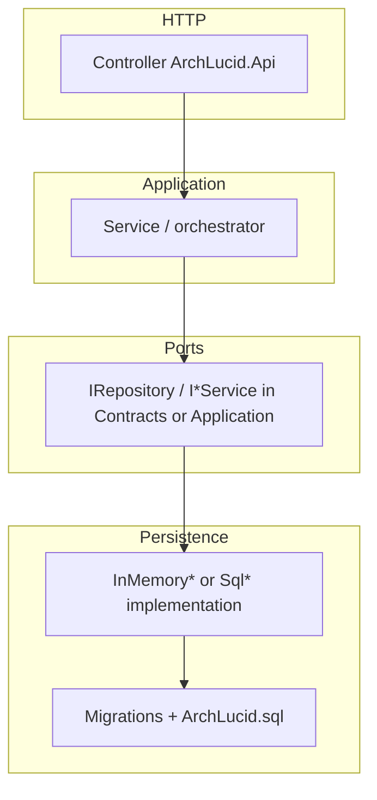

# Golden change path — extend ArchLucid safely

**Audience:** Engineers adding HTTP features, persistence, or audit signals without re-reading the entire repo.

**Last reviewed:** 2026-04-17

---

## 1. Objective

Provide a **minimum file touch list** per change type so work stays inside the right **interfaces → services → data models → orchestration** boundaries (see [ARCHITECTURE_ON_A_PAGE.md](ARCHITECTURE_ON_A_PAGE.md)).

---

## 2. Assumptions

- You are on **`main`** with a green **fast core** (`Suite=Core&Category!=Slow&Category!=Integration`) before pushing.
- **Storage** is either `Sql` (production-like) or `InMemory` (local/tests); parity matters for both when the feature touches workflow data ([ADR 0011](adr/0011-inmemory-vs-sql-storage-provider.md)).
- **OpenAPI** drift fails CI until the snapshot is regenerated ([OPENAPI_CONTRACT_DRIFT.md](OPENAPI_CONTRACT_DRIFT.md)).

---

## 3. Constraints

- Prefer **one class per file**; match existing controller and repository patterns.
- **Do not edit historical migrations** (001–028); add new migrations and update **`ArchLucid.Persistence/Scripts/ArchLucid.sql`** for the consolidated DDL story ([SQL_SCRIPTS.md](SQL_SCRIPTS.md)).
- **Durable audit:** use `IAuditService` + `AuditEventTypes.*`; update [AUDIT_COVERAGE_MATRIX.md](AUDIT_COVERAGE_MATRIX.md) and the **`audit-core-const-count`** HTML comment when adding Core constants.

---

## 4. Architecture overview (change routing)

---

## 5. Component breakdown — minimum touches by change type

### A. New versioned HTTP endpoint (read or write)

| Step | Location | Notes |
|------|----------|--------|
| 1 | `ArchLucid.Api/Controllers/{Area}/*Controller.cs` | Use `v{version:apiVersion}`, `[ApiVersion("1.0")]`, policies from `ArchLucidPolicies`, rate limiting per area ([CONTROLLER_AREA_MAP.md](CONTROLLER_AREA_MAP.md)). |
| 2 | `ArchLucid.Application/` | Application service if logic is non-trivial; keep controllers thin. |
| 3 | `ArchLucid.Contracts/` | DTOs / request-response types shared with clients. |
| 4 | `ArchLucid.Host.Composition/` | DI registration only if new interfaces or decorators ([DI_REGISTRATION_MAP.md](DI_REGISTRATION_MAP.md)). |
| 5 | `ArchLucid.Api.Tests/` | Integration or unit tests; `[Trait("Suite","Core")]` when appropriate. |
| 6 | Regenerate OpenAPI snapshot | `ARCHLUCID_UPDATE_OPENAPI_SNAPSHOT=1` per [TEST_EXECUTION_MODEL.md](TEST_EXECUTION_MODEL.md). |

**Scaffold:** `dotnet new archlucid-api-endpoint -n YourFeature` then copy the generated controller into the correct `Controllers/{Area}/` folder and adjust namespace, route, and policies ([templates/archlucid-api-endpoint/README.md](../templates/archlucid-api-endpoint/README.md)).

### B. New SQL-backed repository or column

| Step | Location | Notes |
|------|----------|--------|
| 1 | `ArchLucid.Persistence/` or `ArchLucid.Persistence.Data/` | Interface if cross-cutting; Dapper repository implementation. |
| 2 | New migration `ArchLucid.Persistence/Migrations/NNN_*.sql` + rollback | Forward-only numbering. |
| 3 | `ArchLucid.Persistence/Scripts/ArchLucid.sql` | Master DDL alignment. |
| 4 | `ArchLucid.Persistence/**/InMemory*.cs` | When `StorageProvider=InMemory` must behave for dev/tests. |
| 5 | `ArchLucid.Persistence.Tests` or `ArchLucid.Api.Tests` | SQL integration or repository tests. |
| 6 | `docs/TENANT_SCOPED_TABLES_INVENTORY.md` | If table carries tenant scope — document triple vs run-only FK ([MULTI_TENANT_RLS.md](security/MULTI_TENANT_RLS.md)). |

### C. New durable audit event

| Step | Location | Notes |
|------|----------|--------|
| 1 | `ArchLucid.Core/Audit/AuditEventTypes.cs` | New `public const string`. |
| 2 | Call site | `IAuditService.LogAsync` (fire-and-forget acceptable only where already documented). |
| 3 | `docs/AUDIT_COVERAGE_MATRIX.md` | New row + bump **`<!-- audit-core-const-count:N -->`**. |

### D. Agent / LLM path change

| Step | Location | Notes |
|------|----------|--------|
| 1 | `ArchLucid.AgentRuntime/` | Handlers, completion client usage. |
| 2 | `ArchLucid.Core/Diagnostics/ArchLucidInstrumentation.cs` | New metrics / activity sources if needed ([OBSERVABILITY.md](OBSERVABILITY.md)). |
| 3 | `docs/AGENT_TRACE_FORENSICS.md` / eval baselines | When prompts or trace shape change. |

---

## 6. Data flow (happy path)

1. **Request** hits controller → authZ policy → application service.
2. **Service** uses repository port; SQL path sets **RLS session context** when enabled.
3. **Response** maps to contract DTO; errors use [API_ERROR_CONTRACT.md](API_ERROR_CONTRACT.md) (`ProblemDetails`).

---

## 7. Security model

- **Default deny** on controllers; `AllowAnonymous` only for health/version/OpenAPI where already established.
- **Production:** CORS must not be `*`; RLS session context required for `Sql` (see `ProductionSafetyRules` in the API host validation layer).
- Optional **Entra-only** posture: `ArchLucidAuth:RequireJwtBearerInProduction=true` ([SECURITY.md](SECURITY.md)).

---

## 8. Operational considerations

- Run **full regression** with SQL before merge when touching persistence ([TEST_EXECUTION_MODEL.md](TEST_EXECUTION_MODEL.md)).
- **Storage provider parity:** DI registration parity is tested in `StorageProviderRegistrationParityTests`; HTTP surface parity in `StorageProviderPublicSurfaceParityIntegrationTests`.

---

## 9. Related docs

- [CODE_MAP.md](CODE_MAP.md) — file entry points.
- [DUAL_PIPELINE_NAVIGATOR.md](DUAL_PIPELINE_NAVIGATOR.md) — coordinator vs authority.
- [FIRST_RUN_WIZARD.md](FIRST_RUN_WIZARD.md) — operator-first run (UI).
