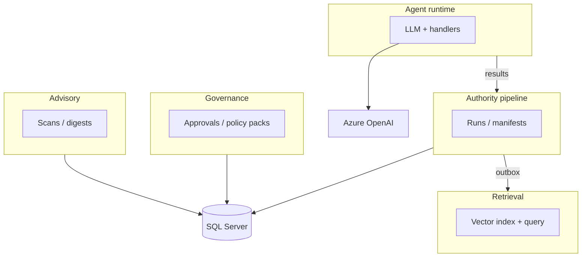

# Bounded context map (ArchLucid)

## Objective

Name the main **domain boundaries**, what each owns, and how they integrate — complementing **`docs/c4/workspace.dsl`** and **`docs/ARCHITECTURE_COMPONENTS.md`**.

## Contexts

| Context | Owns | Integrates via |
|---------|------|----------------|
| **Authority pipeline** | Run lifecycle, context ingestion, graph, findings snapshot, manifest commit, artifacts | SQL (`dbo.Runs` and children), outbox for retrieval indexing |
| **Governance** | Approvals, promotions, environment activation, policy packs | SQL, `IAuditService`, integration events |
| **Advisory** | Schedules, scans, digests, recommendations | SQL (advisory schema), worker hosted services |
| **Agent runtime** | LLM calls, agent handlers, traces, quality gate | Azure OpenAI, blob/SQL trace storage |
| **Retrieval** | Embeddings, vector index, query API | Azure AI Search (or in-memory), indexing outbox |

## Integration patterns

- **Shared kernel:** `ArchLucid.Contracts`, `ArchLucid.Core` (identity, audit types, instrumentation names).
- **Published language:** Integration events (`com.archlucid.*`), OpenAPI v1 JSON contracts.
- **Conformist:** External Entra ID and Azure OpenAI schemas — adapters live in host and `ArchLucid.AgentRuntime`.
- **Anti-corruption:** Dapper repositories map SQL rows to contract DTOs; decisioning stays free of `ArchLucid.Persistence` references (NetArchTest enforced).

## Diagram (Mermaid)

## Related

- **`docs/DUAL_PIPELINE_NAVIGATOR.md`** — coordinator vs authority convergence.
- **`docs/ARCHITECTURE_INDEX.md`** — reading order.
