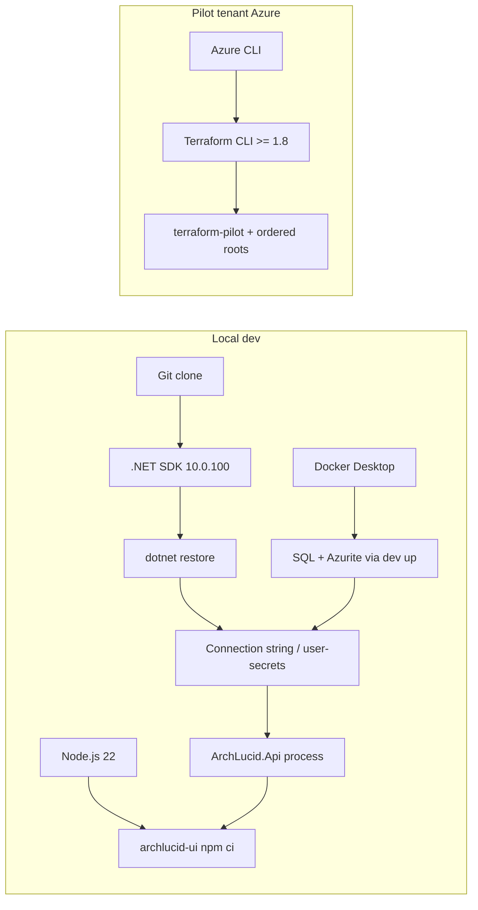

> **Scope:** Canonical install order for **ArchLucid contributors and internal operators**. Supersedes persona-specific install steps.

> **Spine doc:** [Five-document onboarding spine](../FIRST_5_DOCS.md). Read this file only if you have a specific reason beyond those five entry documents.

> **Audience banner — read first.** ArchLucid is a **SaaS** product. **Customers, evaluators, and sponsors never install Docker, SQL, .NET, Node, or Terraform** — they sign up at **`archlucid.com`** and use the in-product operator UI. This document is the **contributor / internal-operator** install path. It exists for people building, testing, or operating ArchLucid itself, not for customers using it. See **[`START_HERE.md`](../START_HERE.md)** "Audience split" and **[`QUALITY_ASSESSMENT_2026_04_21_INDEPENDENT_68_60.md`](../QUALITY_ASSESSMENT_2026_04_21_INDEPENDENT_68_60.md)** §0.1.

# Install order (canonical — ArchLucid contributors and internal operators)

Single answer to: **What do I install, in what order, to get a working ArchLucid contributor environment?**

## Prerequisites (read first)

| Dimension | Requirement |
|-----------|-------------|
| **OS** | **Windows 11**, **macOS 13+**, or **Linux x64** supported by the [.NET 10 SDK](https://dotnet.microsoft.com/download). |
| **CPU / RAM** | **≥4 vCPU / ≥8 GB RAM** recommended (Docker + API + UI + tests concurrently). |
| **Disk** | **≥15 GB** free for container images, NuGet/npm caches, and build artifacts. |
| **Network egress** | **Git** (clone), **NuGet**, **npm registry**, **Docker** pulls, and (pilot path) **Azure Resource Manager** (`management.azure.com`) and service endpoints for subscriptions you target. |
| **Azure (pilot column only)** | Identity able to run **`az login`**; subscription permissions sufficient for Terraform in [`REFERENCE_SAAS_STACK_ORDER.md`](../library/REFERENCE_SAAS_STACK_ORDER.md) (typically **Contributor** on the landing-zone RG—your org may require a custom role). **Never** expose SMB (**TCP 445**) publicly; private endpoints only per [`deployment/PILOT_PROFILE.md`](../deployment/PILOT_PROFILE.md). |

> **What this page is not:** A tutorial, troubleshooting guide, or role-specific week-one backlog. For those, use the **After install** table at the bottom.

## Dependency graph

Installable items and **must precede** edges (two tracks: **local dev** vs **pilot Azure**).

<!-- conflict: docs/onboarding/day-one-sre.md item 2 vs REFERENCE_SAAS_STACK_ORDER.md — resolved to REFERENCE + terraform-pilot (CI validates those roots). -->

## Ordered steps (two columns)

| # | Local dev (laptop, ephemeral) | Pilot tenant (Azure, durable) |
|---|------------------------------|--------------------------------|
| **1** | **What:** **Git** (latest stable). **Why:** Clone source. **How:** [Git install](https://git-scm.com/downloads). **Verify:** `git --version` | **What:** **Azure subscription** + **Azure CLI**. **Why:** Terraform and `az` target ARM. **How:** [Install Azure CLI](https://learn.microsoft.com/cli/azure/install-azure-cli). **Verify:** `az version` |
| **2** | **What:** **.NET SDK `10.0.100`** (pin from repo [`global.json`](../../global.json); `rollForward: latestMinor`). **Why:** `dotnet` build/test matches CI (`.github/workflows/ci.yml` uses `global-json-file: global.json`). **How:** [Download .NET 10](https://dotnet.microsoft.com/download/dotnet/10.0). **Verify:** `dotnet --version` | **What:** **Terraform CLI `>= 1.8.0`**. **Why:** Matches [`infra/terraform-pilot/versions.tf`](../../infra/terraform-pilot/versions.tf) `required_version`. **How:** [Install Terraform](https://developer.hashicorp.com/terraform/install). **Verify:** `terraform version` |
| **3** | **What:** **Restore + compile** solution. **Why:** Restores packages before tests or run. **How:** `dotnet restore ArchLucid.sln` then `dotnet build ArchLucid.sln -c Release` from repo root. **Verify:** build exit code **0** | **What:** **Remote state + tfvars** (not in git). **Why:** Applies require backend and secrets. **How:** [`FIRST_AZURE_DEPLOYMENT.md`](../library/FIRST_AZURE_DEPLOYMENT.md) (backend example). **Verify:** `terraform init` succeeds in target root |
| **4** | **What:** **Docker Desktop** (or Docker Engine on Linux). **Why:** `ArchLucid.Cli dev up` starts **SQL Server**, **Azurite**, **Redis** per [`CLI_USAGE.md`](../library/CLI_USAGE.md#commands). **How:** [Docker Desktop](https://www.docker.com/products/docker-desktop/). **Verify:** `docker info` | **What:** **Profile root** [`infra/terraform-pilot/README.md`](../../infra/terraform-pilot/README.md). **Why:** Canonical ordering + FinOps defaults before optional multi-root applies. **How:** `cd infra/terraform-pilot && terraform init -backend=false && terraform validate` (local validation; real apply uses your backend). **Verify:** exit code **0** |
| **5** | **What:** **Data plane up** for local SQL + storage emulation. **Why:** API readiness checks SQL and blob when `StorageProvider=Sql`. **How:** `dotnet run --project ArchLucid.Cli -- dev up` (repo root). **Verify:** containers healthy (`docker ps`) | **What:** **Ordered `infra/terraform-*` applies** (private → keyvault → sql → storage → … → container-apps per [`REFERENCE_SAAS_STACK_ORDER.md`](../library/REFERENCE_SAAS_STACK_ORDER.md)). **Why:** Private DNS/endpoints before workloads; storage IDs before container-apps when enabled. **How:** [`infra/apply-saas.ps1`](../../infra/apply-saas.ps1) **`-MultiRoot`** or manual per-root; secrets via Key Vault per [`CONFIGURATION_KEY_VAULT.md`](../library/CONFIGURATION_KEY_VAULT.md). **Verify:** `terraform plan` clean in each applied root |
| **6** | **What:** **SQL connection string** for the API. **Why:** DbUp migrations and runtime ([`README.md`](../../README.md) dev string). **How:** `dotnet user-secrets set "ConnectionStrings:ArchLucid" "..." --project ArchLucid.Api` (see [`OPERATOR_QUICKSTART.md`](../library/OPERATOR_QUICKSTART.md)). **Verify:** secret set (no echo) | **What:** **Entra + app settings** for deployed hosts. **Why:** **`JwtBearer`** / **`ApiKey`** in Azure per [`deployment/PILOT_PROFILE.md`](../deployment/PILOT_PROFILE.md). **How:** [`terraform-entra`](../../infra/terraform-entra/README.md) + Key Vault references. **Verify:** API `/health/ready` **200** on deployed URL |
| **7** | **What:** **Run API** locally. **Why:** Validates migrations (**DbUp**) against your DB. **How:** `dotnet run --project ArchLucid.Api`. **Verify:** `curl -s -o /dev/null -w "%{http_code}" http://localhost:5128/health/ready` → **200** (Windows: use `Invoke-WebRequest`). Schema source of truth: [`ArchLucid.Persistence/Scripts/ArchLucid.sql`](../../ArchLucid.Persistence/Scripts/ArchLucid.sql); runner: DbUp in host (see [`SQL_SCRIPTS.md`](../library/SQL_SCRIPTS.md)) | **What:** **Container image + revision** wired in Terraform vars. **Why:** Compute pulls digest from ACR/registry. **How:** [`terraform-container-apps/README.md`](../../infra/terraform-container-apps/README.md). **Verify:** revision **Healthy** in Azure Portal / [`cd-post-deploy-verify.sh`](../../scripts/ci/cd-post-deploy-verify.sh) |
| **8** | **What:** **Node.js 22.x** (CI uses `node-version: "22"` in `.github/workflows/ci.yml`). **Why:** Operator UI `archlucid-ui` **npm ci** / **Vitest**. **How:** [Node.js LTS matching CI](https://nodejs.org/) (use **22**). **Verify:** `node --version` → **v22.x** | **What:** *(optional)* **JWT / E2E lab** parity. **Why:** Live Playwright + **`JwtBearer`** local PEM path. **How:** [`LIVE_E2E_JWT_SETUP.md`](../library/LIVE_E2E_JWT_SETUP.md). **Verify:** job **`ui-e2e-live-jwt`** pattern in **`.github/workflows/ci.yml`** |
| **9** | **What:** **npm install** in UI. **Why:** Next.js dev server and tests. **How:** `cd archlucid-ui && npm ci`. **Verify:** `npm test` (or `npm run lint`) exit **0** | **What:** *(optional)* **Monitoring / edge** stacks. **Why:** Observability and ingress after workloads exist. **How:** `terraform-monitoring`, `terraform-edge` roots when enabled. **Verify:** dashboards / Front Door health per root README |

**Docker-only evaluator (no .NET first):** If you only need a canned stack, follow **[`FIRST_30_MINUTES.md`](FIRST_30_MINUTES.md)** first; return here before **`dotnet test`** or contributor workflows.

## After install (persona week-one — not install order)

| Persona | Week-one ticket (post-install) |
|---------|--------------------------------|
| Developer | [`onboarding/day-one-developer.md`](../onboarding/day-one-developer.md) |
| SRE / Platform | [`onboarding/day-one-sre.md`](../onboarding/day-one-sre.md) |
| Security / GRC | [`onboarding/day-one-security.md`](../onboarding/day-one-security.md) |
| Operator commands | [`OPERATOR_QUICKSTART.md`](../library/OPERATOR_QUICKSTART.md) |

---

**Last reviewed:** 2026-04-21

**Change control:** Update this file in the **same PR** that changes pinned SDK versions in [`global.json`](../../global.json), Terraform `required_version`, DbUp/migration strategy, or CI toolchain (`setup-node` / `setup-dotnet`).
