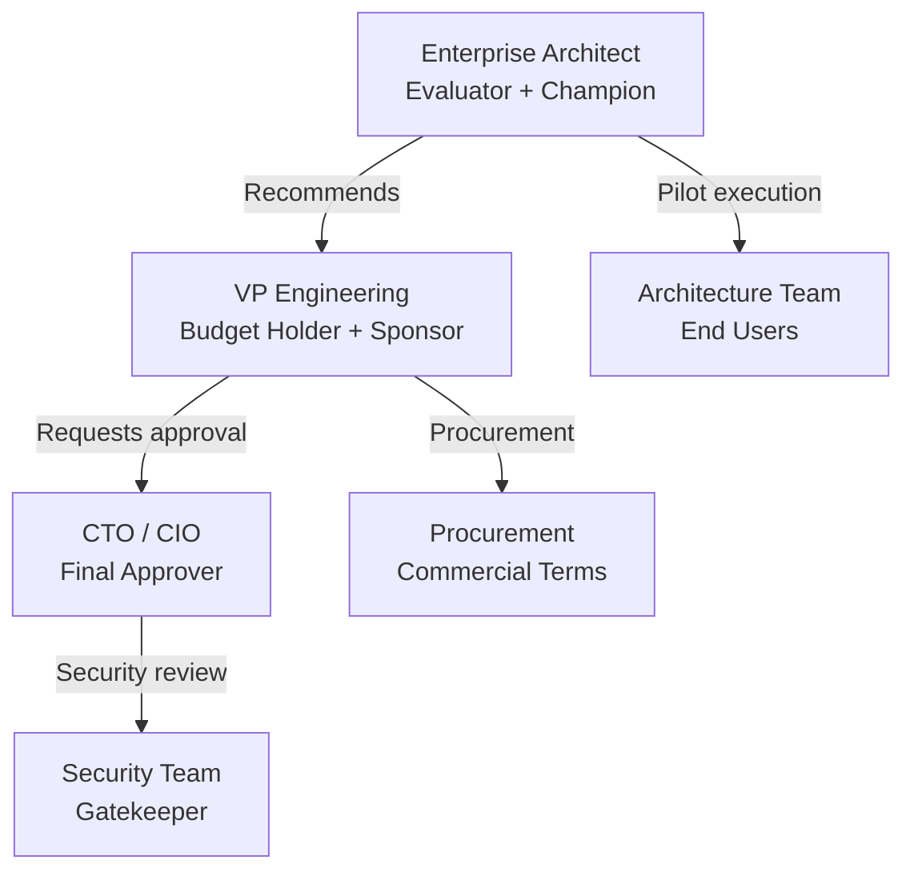

# ArchLucid buyer personas

**Audience:** Product, sales, and marketing teams who need a shared understanding of who buys ArchLucid, why, and how they evaluate it.

**Last reviewed:** 2026-04-15

**Grounding rule:** Capabilities and limitations referenced here reflect the V1 codebase per [V1_SCOPE.md](../V1_SCOPE.md) and [CUSTOMER_TRUST_AND_ACCESS.md](../CUSTOMER_TRUST_AND_ACCESS.md).

---

## How to use this document

1. **Sales:** Use personas to qualify leads quickly. If the prospect does not match at least one persona, the deal is likely a poor fit for V1.
2. **Marketing:** Use pain points and language to craft messaging that resonates.
3. **Product:** Use evaluation criteria and objections to prioritize roadmap items.
4. **Demo prep:** Tailor the demo to the persona in the room — each values different features.

---

## Persona 1: The Enterprise Architect / Chief Architect

### Profile

| Attribute | Detail |
|-----------|--------|
| **Title** | Enterprise Architect, Chief Architect, Principal Architect, Head of Architecture |
| **Reports to** | CTO or VP Engineering |
| **Team size** | 3–15 architects in a central practice or federated across business units |
| **Organization** | 500–10,000+ employee enterprise with established architecture practice |
| **Technical depth** | Deep — reads and writes architecture documentation, reviews designs, defines standards |
| **Budget authority** | Can recommend and influence ($50K–$250K range); needs CTO/VP approval for larger commitments |

### Responsibilities and goals

- Define and enforce architecture standards across the organization
- Review proposed system designs for compliance with principles and policies
- Maintain a current view of the technology landscape (what we run, where, why)
- Advise project teams on technology selection and design trade-offs
- Ensure architecture decisions are documented and traceable for auditors

### Pain points ArchLucid addresses

| Pain point | How ArchLucid helps | Evidence in product |
|-----------|---------------------|---------------------|
| **Architecture reviews are inconsistent** — different architects apply different standards, and reviews are oral conversations with no artifact trail | Multi-agent pipeline applies the same finding engines across every review. Every finding has an `ExplainabilityTrace`. Golden manifests are versioned and comparable. | 10 finding engines, `ExplainabilityTrace` (5 fields per finding), `dbo.GoldenManifests` with `ROWVERSION` |
| **No audit trail for architecture decisions** — auditors ask "who approved this design?" and the answer is "someone in a meeting" | 78 typed audit events with append-only SQL enforcement. Governance approval workflow with segregation of duties. Provenance graph linking evidence to decisions. | `dbo.AuditEvents`, `GovernanceApprovalRequests`, `ProvenanceBuilder` |
| **Compliance checking is manual** — architects manually verify designs against policy, and gaps are found late (or in production) | Pre-commit governance gate blocks manifest commit when findings at or above a configurable severity exist. Policy packs with versioned compliance rules. | `PreCommitGovernanceGate`, `PolicyPackContentDocument`, `BlockCommitMinimumSeverity` |
| **Architecture drift goes undetected** — the system evolves but no one tracks how the design changes between iterations | Two-run comparison with structured deltas. Comparison replay with drift verification mode. Compliance drift trend chart. | `ComparisonRecords`, replay verify mode (422 on drift), `ComplianceDriftTrendService` |

### How they evaluate tools

- **Criteria priority:** (1) Quality and depth of analysis output, (2) Governance and compliance workflow, (3) Integration with existing architecture practice (ArchiMate, TOGAF), (4) Audit trail completeness, (5) Price relative to team size
- **Evaluation process:** 4–8 week pilot with 2–3 real architecture reviews. Success = "findings I would have identified myself, plus some I would have missed, with full traceability."
- **Decision timeline:** 3–6 months from first contact to purchase

### What would make them champion ArchLucid

- The finding engines identify a real compliance gap that the manual review process missed
- The provenance graph shows the complete decision chain from context to finding to manifest entry
- The DOCX export produces a stakeholder-ready report that replaces their manual template
- The comparison feature shows meaningful architectural drift between two iterations

### What would make them reject ArchLucid

- Cannot import existing ArchiMate/TOGAF models (currently no import connectors)
- Findings are generic or low-quality compared to their expert judgment
- Cannot integrate with their existing CMDB or ServiceNow instance
- Azure-only when their organization is AWS-primary or multi-cloud
- The UI is too rough for them to present to non-technical stakeholders

### Key objections and responses

| Objection | Response |
|-----------|----------|
| "We already have LeanIX/Ardoq for architecture management" | ArchLucid does not replace your architecture repository — it adds **AI-driven analysis and governance** on top of your architecture decisions. LeanIX catalogs what you have; ArchLucid evaluates whether what you plan is sound. |
| "Can AI really do architecture review?" | ArchLucid's agents are not replacing architects — they are automating the repetitive parts (checking coverage, identifying policy gaps, flagging cost constraints) and providing a structured starting point. Every finding is explainable and traceable, not a black-box suggestion. |
| "We need ArchiMate import" | V1 accepts structured architecture requests with infrastructure declarations, documents, and policy references. ArchiMate and Terraform import connectors are on the roadmap. The API and CLI support integration from existing toolchains. |

### Demo priorities (what to show first)

1. Pre-loaded run with findings — focus on `ExplainabilityTrace` depth
2. Pre-commit governance gate blocking a non-compliant commit
3. Two-run comparison showing architectural drift
4. DOCX export with embedded diagram
5. Provenance graph visualization

---

## Persona 2: The VP Engineering / Head of Platform Engineering

### Profile

| Attribute | Detail |
|-----------|--------|
| **Title** | VP Engineering, Director of Engineering, Head of Platform Engineering, Principal Engineer |
| **Reports to** | CTO or SVP Engineering |
| **Team size** | 50–500 engineers across multiple squads |
| **Organization** | Technology company or technology-heavy enterprise with platform engineering practice |
| **Technical depth** | Moderate-to-deep — sets technical direction but delegates implementation |
| **Budget authority** | Direct authority for tooling budget ($100K–$500K range); does not need C-suite approval for developer tools |

### Responsibilities and goals

- Increase engineering velocity without sacrificing quality
- Reduce toil and manual gates in the software delivery pipeline
- Standardize practices across squads and reduce "reinventing the wheel"
- Ensure compliance and security are shifted left (caught before production, not after)
- Justify tooling investments with measurable ROI (time saved, incidents prevented)

### Pain points ArchLucid addresses

| Pain point | How ArchLucid helps | Evidence in product |
|-----------|---------------------|---------------------|
| **Architecture review is a bottleneck** — every design must go through a small team of architects, creating a queue | AI agents perform the initial analysis automatically. Architects review findings rather than conducting the entire review from scratch. | `IAuthorityRunOrchestrator` pipeline: context → graph → findings → decisioning → artifacts |
| **No architecture-as-code** — infrastructure has Terraform, code has CI/CD, but architecture decisions are in wikis and slides | Architecture requests are structured JSON. Manifests are versioned artifacts. The CLI supports automation. | `ArchitectureRequest` API, `archlucid run`, `archlucid commit`, `archlucid artifacts --save` |
| **Compliance is reactive** — security and compliance findings surface in post-deployment audits, not during design | Pre-commit governance gate. Policy packs with compliance rules evaluated during the run pipeline. Findings by severity with configurable blocking thresholds. | `PreCommitGovernanceGate`, `FindingSeverity`, `PolicyPackAssignment.BlockCommitMinimumSeverity` |
| **Cannot measure architecture quality** — no metrics on review throughput, finding patterns, or decision consistency | 30+ OTel metrics including runs created, findings by severity, LLM usage per run, agent output quality scores, and explanation cache effectiveness. | `ArchLucidInstrumentation`, Grafana dashboards committed in repo |

### How they evaluate tools

- **Criteria priority:** (1) Automation and CI/CD integration, (2) Time-to-value for engineering teams, (3) API-first design, (4) Measurable impact on velocity, (5) Reasonable per-run economics
- **Evaluation process:** 2–4 week proof of concept. Success = "my team ran 10 architecture reviews in the time it used to take to do 2, and the quality was comparable."
- **Decision timeline:** 1–3 months (faster than enterprise architects — they are used to buying developer tools)

### What would make them champion ArchLucid

- Architecture review as a pipeline step: a PR triggers an ArchLucid run, findings appear as PR comments, governance blocks merge if critical
- The CLI and API enable full automation without touching the UI
- Metrics show measurable reduction in review cycle time
- The simulator mode lets teams experiment without LLM costs

### What would make them reject ArchLucid

- No CI/CD pipeline examples (currently no GitHub Actions or Azure DevOps templates)
- Cannot run without Azure infrastructure (SQL Server dependency, Azure OpenAI)
- No Python or JavaScript SDK (their team is not .NET)
- Setup takes more than an hour (current Docker setup requires multiple configuration steps)
- Per-run LLM costs are not trackable or predictable

### Key objections and responses

| Objection | Response |
|-----------|----------|
| "We can just use ChatGPT/Copilot for architecture advice" | ChatGPT gives you an answer. ArchLucid gives you a **governed, auditable, repeatable process** with structured findings, version-controlled manifests, and drift detection. When your auditor asks "who reviewed this design and what did they find?", ArchLucid has the answer. |
| "Our engineers are not .NET developers" | ArchLucid's API is REST/JSON. The CLI is a single binary. The OpenAPI spec can generate clients in any language. V1 ships a .NET client; Python and JavaScript SDKs are on the roadmap. |
| "How do I justify the cost?" | Each architecture review that currently takes 40 hours of senior architect time can be reduced to a 2-hour review of AI-generated findings. At $150/hour fully loaded, that is $5,700 saved per review. Run 10 reviews per quarter and the tool pays for itself. |

### Demo priorities (what to show first)

1. CLI `run --quick` → `artifacts` pipeline (30 seconds to a manifest)
2. API flow: Swagger → create run → execute → commit → get manifest
3. OTel metrics in Grafana (runs, findings, agent quality)
4. Health checks and `doctor` command (operational readiness)
5. Compare two runs to show drift detection

---

## Persona 3: The CTO / CIO at a Regulated Enterprise

### Profile

| Attribute | Detail |
|-----------|--------|
| **Title** | Chief Technology Officer, Chief Information Officer, VP Technology |
| **Reports to** | CEO or COO |
| **Team size** | Oversees 100–5,000+ technical staff |
| **Organization** | Regulated enterprise (financial services, healthcare, government, energy) |
| **Technical depth** | Strategic — sets direction but does not review code or operate systems directly |
| **Budget authority** | Full authority ($500K+); final approver for enterprise platform decisions |

### Responsibilities and goals

- Ensure technology decisions are defensible to regulators and auditors
- Reduce operational risk from undocumented or ungoverned architecture changes
- Demonstrate to the board that technology investments are managed with discipline
- Enable digital transformation while maintaining compliance posture
- Reduce the cost and cycle time of internal and external audits

### Pain points ArchLucid addresses

| Pain point | How ArchLucid helps | Evidence in product |
|-----------|---------------------|---------------------|
| **Audit exposure** — auditors ask for evidence of architecture review and the answer is scattered emails and slides | 78 typed audit events in an append-only SQL store. Every finding traced to evidence. Governance approvals with segregation of duties. Export to JSON/CSV for auditor consumption. | `dbo.AuditEvents`, `DENY UPDATE/DELETE`, `GovernanceApprovalRequests`, audit export endpoints |
| **Ungoverned architecture decisions** — project teams make technology choices without formal review, creating compliance risk | Policy packs with configurable enforcement. Pre-commit gate blocks manifests with critical findings. Approval workflow with SLA tracking and escalation. | `PreCommitGovernanceGate`, `ApprovalSlaMonitor`, `GovernanceApprovalSlaBreached` audit event |
| **No visibility into architecture quality across the portfolio** — each team reviews differently (or not at all) | Standardized findings from consistent engines. Comparison and trend analysis across runs. Advisory scans with trace completeness metrics. | Finding engines, `ComplianceDriftTrendService`, `ExplainabilityTraceCompletenessAnalyzer` |
| **Regulatory questionnaires take weeks** — compliance teams manually gather evidence for SOC 2, ISO 27001, and industry audits | Durable audit trail, governance workflow evidence, and findings mapped to compliance concerns. Export capabilities for evidence packages. | Audit export (JSON/CSV), DOCX consulting export, artifact bundles |

### How they evaluate tools

- **Criteria priority:** (1) Security and compliance posture of the tool itself, (2) Audit trail and governance depth, (3) Vendor viability and support, (4) Integration with existing security and identity infrastructure, (5) Total cost of ownership
- **Evaluation process:** Security review → proof of concept (led by their architecture team) → business case → procurement. 6–12 months.
- **Decision timeline:** 6–12 months (enterprise procurement cycle)

### What would make them champion ArchLucid

- The STRIDE threat model and security architecture documentation demonstrate that the vendor takes security seriously
- Entra ID integration means their users sign in with existing credentials
- The audit trail satisfies their compliance team's evidence requirements
- Private endpoints and WAF show enterprise-grade deployment options
- The governance workflow mirrors their existing approval process

### What would make them reject ArchLucid

- No SOC 2 Type II report or equivalent third-party attestation
- No GDPR/CCPA data processing agreement
- Single-vendor SSO (Entra-only) when their organization uses Okta or Ping
- No SLA commitment (only aspirational targets)
- Vendor is too small / too early to bet on for a regulated environment
- No on-premises deployment option (some regulated industries cannot use cloud)

### Key objections and responses

| Objection | Response |
|-----------|----------|
| "Do you have SOC 2?" | ArchLucid is self-hosted in your Azure subscription — your existing SOC 2 controls apply to the deployment. The product includes RBAC, SQL RLS for tenant isolation, audit trail with append-only enforcement, and private endpoint support. We can provide a security architecture document and STRIDE threat model for your review team. |
| "We use Okta, not Entra" | V1 supports Entra ID JWT and API key authentication. Generic OIDC support (for Okta, Auth0, Ping) is on the near-term roadmap. In the interim, API key authentication provides a functional integration path. |
| "How do we know you will be around in 2 years?" | ArchLucid is self-hosted — your data stays in your Azure subscription. The codebase is structured for long-term maintainability (14 ADRs, 193+ docs, 815 test files, CI/CD pipeline). If you need additional assurance, we can discuss source escrow arrangements. |
| "Can this satisfy our compliance framework?" | ArchLucid's findings can be mapped to compliance controls. Policy packs are configurable to match your specific regulatory requirements. The governance workflow provides the approval chain evidence that auditors expect. We are working on pre-built control mappings for SOC 2 and ISO 27001. |

### Demo priorities (what to show first)

1. Governance approval workflow with segregation of duties
2. Audit event log with search and export
3. Pre-commit governance gate blocking a non-compliant commit
4. CUSTOMER_TRUST_AND_ACCESS architecture diagram (security posture)
5. DOCX export with structured evidence

---

## Cross-persona buying dynamics

In most deals, multiple personas are involved:

| Phase | Primary persona | Key action |
|-------|----------------|------------|
| Discovery | Enterprise Architect | Finds ArchLucid, evaluates it against manual process and competitors |
| Pilot | Enterprise Architect + Architecture Team | Runs 3–5 real reviews, compares output quality to manual reviews |
| Business case | VP Engineering | Quantifies time saved, builds ROI model, requests budget |
| Security review | Security Team + CTO | Reviews STRIDE model, auth architecture, data handling |
| Procurement | Procurement + CTO | Negotiates terms, requires SLA and DPA |
| Deployment | Platform Engineering / SRE | Deploys to Azure with Terraform, configures auth and monitoring |

---

## Related documents

| Doc | Use |
|-----|-----|
| [COMPETITIVE_LANDSCAPE.md](COMPETITIVE_LANDSCAPE.md) | Competitor-by-competitor analysis |
| [POSITIONING.md](POSITIONING.md) | Positioning statement and elevator pitches |
| [../PILOT_GUIDE.md](../PILOT_GUIDE.md) | Technical pilot onboarding |
| [../CUSTOMER_TRUST_AND_ACCESS.md](../CUSTOMER_TRUST_AND_ACCESS.md) | Security posture for enterprise buyers |
| [../MARKETABILITY_ASSESSMENT_2026_04_15.md](../MARKETABILITY_ASSESSMENT_2026_04_15.md) | Full marketability quality assessment |
