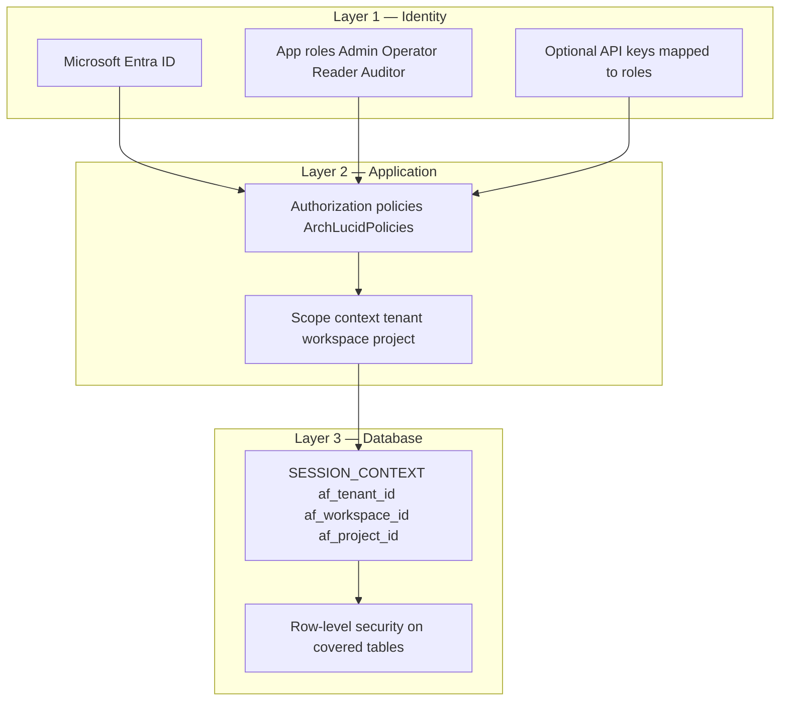

# ArchLucid — Tenant isolation (buyer overview)

**Audience:** Security reviewers who need a **short** explanation before diving into engineering docs.

**Last reviewed:** 2026-04-15

**Headline:** Your data is **logically isolated** at **identity**, **application**, and **database** layers when ArchLucid is deployed with the recommended Azure posture. This page summarizes; deep references are linked below.

---

## 1. Three layers

- **Layer 1 — Identity:** Prefer **Entra-issued JWTs** with **app roles**; API keys are server-side secrets mapped to **limited** roles ([../SECURITY.md](../SECURITY.md)).
- **Layer 2 — Application:** Controllers enforce **policies**; orchestration sets **tenant / workspace / project** scope before data access ([../security/MULTI_TENANT_RLS.md](../security/MULTI_TENANT_RLS.md) §5).
- **Layer 3 — Database:** **RLS** policies filter rows using **`SESSION_CONTEXT`**; missing context yields **no rows** when policies are ON (deny-by-default for scoped data). Covered tables and enablement are documented in [../security/MULTI_TENANT_RLS.md](../security/MULTI_TENANT_RLS.md).

**Caveat:** RLS is **defense in depth**; it does not replace correct application authorization. Mis-set scope or bypass connections can still cause wrong access — see [../security/MULTI_TENANT_RLS.md](../security/MULTI_TENANT_RLS.md) §7.

---

## 2. Encryption

- **In transit:** TLS to the API; TLS to Azure services per Microsoft’s stack.
- **At rest:** Azure SQL (TDE) and blob encryption are standard Azure controls; see [../CUSTOMER_TRUST_AND_ACCESS.md](../CUSTOMER_TRUST_AND_ACCESS.md).
- **Secrets:** Prefer **Key Vault** references in hosted configs ([../CONFIGURATION_KEY_VAULT.md](../CONFIGURATION_KEY_VAULT.md)).

---

## 3. Network

Optional **Front Door + WAF**, optional **APIM**, and **private endpoints** for SQL and blob reduce exposure ([../CUSTOMER_TRUST_AND_ACCESS.md](../CUSTOMER_TRUST_AND_ACCESS.md)). **SMB (445)** is not used for tenant data at the API boundary (workspace security rule).

---

## 4. Audit and accountability

Durable **append-only** audit events and correlation IDs support forensic review ([../AUDIT_COVERAGE_MATRIX.md](../AUDIT_COVERAGE_MATRIX.md), [../SECURITY.md](../SECURITY.md)).

---

## 5. What we do not claim here

Unless separately contracted and documented:

- **Dedicated database per tenant** — not implied; isolation is **logical** with RLS and app scope.
- **Customer-managed keys (BYOK)** — not stated; confirm in roadmap or security pack if offered.
- **Separate compute per tenant** — not implied for standard SaaS.

Be explicit in sales and security packs to avoid over-claiming.

---

## 6. Deep dives

| Doc | Content |
|-----|---------|
| [../security/MULTI_TENANT_RLS.md](../security/MULTI_TENANT_RLS.md) | RLS design, `SESSION_CONTEXT`, covered tables |
| [../security/SYSTEM_THREAT_MODEL.md](../security/SYSTEM_THREAT_MODEL.md) | STRIDE, trust boundaries |
| [../CUSTOMER_TRUST_AND_ACCESS.md](../CUSTOMER_TRUST_AND_ACCESS.md) | Edge, identity, private connectivity |
| [../SECURITY.md](../SECURITY.md) | RBAC, rate limiting, CI security tests, PII |

---

## Related documents

| Doc | Use |
|-----|-----|
| [TRUST_CENTER.md](TRUST_CENTER.md) | Trust index |
| [SUBPROCESSORS.md](SUBPROCESSORS.md) | Where data is processed (Azure) |
