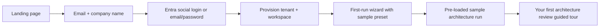

> **Scope:** ArchLucid — Trial and signup experience design - full detail, tables, and links in the sections below.

# ArchLucid — Trial and signup experience design

**Audience:** Product and engineering teams planning the self-serve trial path.

**Last reviewed:** 2026-04-17

**Pricing:** Trial parameters (seats, runs, duration) are governed by the free trial row in [PRICING_PHILOSOPHY.md](PRICING_PHILOSOPHY.md) §4. Prices for conversion are in [PRICING_PHILOSOPHY.md §5](PRICING_PHILOSOPHY.md) — do not restate numbers here.

---

## 1. Goal

Prospect → active trial in **< 5 minutes** with no sales contact required. The trial should deliver the same "first impression" as the seller-led Docker demo ([DEMO_QUICKSTART.md](DEMO_QUICKSTART.md)) but in a **buyer-led, hosted** experience.

---

## 2. Signup flow

| Step | Owner | Notes |
|------|-------|-------|
| Landing page | Marketing | CTA: "Start free trial" — no credit card required |
| Email + company | Product | Minimal form; company name for ICP qualification |
| Authentication | Engineering | Entra social login (Microsoft account), or email/password for non-Microsoft users |
| Tenant provisioning | Engineering | Automated: create tenant, workspace, assign Admin role, seed sample data |
| First-run wizard | Product (existing) | Pre-select a sample preset (e.g., "Greenfield web app") so the trial user sees results immediately |
| Sample run | Engineering | Auto-execute a sample run using the agent simulator so results appear without LLM cost |
| Guided tour | Product | In-app tooltips or checklist highlighting: findings, manifest, governance, comparison |

---

## 3. Trial parameters

| Parameter | Value | Rationale |
|-----------|-------|-----------|
| **Duration** | **14 days** | Enough time for evaluation without urgency loss; aligns with typical enterprise eval cycles |
| **Tier** | **Team** features (per [PRICING_PHILOSOPHY.md](PRICING_PHILOSOPHY.md)) | Provides architecture runs, manifests, comparisons — enough to demonstrate core value |
| **Seats** | Up to 3 | Allows team evaluation without over-provisioning |
| **Runs** | 10 included | Sufficient for meaningful evaluation; prevents abuse |
| **Workspaces** | 1 | Simplicity for trial; upgrade to add more |
| **Data** | Pre-seeded sample project (using Docker demo seed pattern) | Ensures immediate value — user sees a completed run on first login |
| **Trial end** | **Read-only access** for 7 days after expiration, then data export available for 30 days, then deletion per [DPA](DPA_TEMPLATE.md) | Avoids abrupt loss; incentivizes conversion |

---

## 4. Technical requirements (high level)

| Requirement | Description | Priority |
|-------------|-------------|----------|
| **Multi-tenant provisioning** | API or background service that creates tenant, workspace, seeds sample data, and assigns roles | Must-have |
| **Trial feature flags** | Configuration-driven tier enforcement (run limits, feature gates per [PRICING_PHILOSOPHY.md](PRICING_PHILOSOPHY.md)) | Must-have |
| **Usage metering** | Track runs consumed, seats active, features used — feeds health scoring ([CUSTOMER_HEALTH_SCORING.md](CUSTOMER_HEALTH_SCORING.md)) and conversion analytics | Must-have |
| **Billing integration** | Stripe, Azure Marketplace, or equivalent — triggered on conversion from trial to paid | Phase 2 |
| **Trial expiration workflow** | Automated emails (approaching limit, expiration), read-only enforcement, deletion scheduler | Must-have |

---

## 5. Conversion triggers

| Trigger | Channel | Timing |
|---------|---------|--------|
| **Welcome + getting started** | Email | Day 0 |
| **"Your first run is complete"** | In-app notification + email | Day 1 (after seed run) |
| **Mid-trial check-in** | Email | Day 7 |
| **Approaching run limit** | In-app banner | When 8 of 10 runs consumed |
| **Trial expiring soon** | Email + in-app | Day 12 |
| **Trial expired** | Email with upgrade CTA pointing at **Stripe Checkout** for Team tier (`teamStripeCheckoutUrl` in `archlucid-ui/public/pricing.json`, populated per [STRIPE_CHECKOUT.md](STRIPE_CHECKOUT.md)) + data export reminder | Day 14 |
| **Champion enablement** | Auto-generated pilot scorecard stub (linked to [PILOT_SUCCESS_SCORECARD.md](PILOT_SUCCESS_SCORECARD.md)) | Day 7 (if > 3 runs completed) |

---

## 6. Relationship to Docker demo

| | Docker demo | Self-serve trial |
|--|-------------|-----------------|
| **Audience** | Seller-led prospects, conference attendees | Buyer-led self-evaluation |
| **Infrastructure** | Prospect's machine (Docker) | ArchLucid-hosted SaaS |
| **Data** | Pre-seeded, disposable | Pre-seeded, persisted for trial duration |
| **Auth** | DevelopmentBypass | Entra / email-password (production auth) |
| **Outcome** | "Wow" moment → schedule deeper evaluation | "Wow" moment → convert to paid or escalate to sales |

Both paths should deliver the **same first impression**: a completed architecture run with findings, manifest, and governance gate visible within minutes.

---

## Related documents

| Doc | Use |
|-----|-----|
| [PRICING_PHILOSOPHY.md](PRICING_PHILOSOPHY.md) | Tier features and limits |
| [DEMO_QUICKSTART.md](DEMO_QUICKSTART.md) | Seller-led Docker demo |
| [BUYER_PERSONAS.md](BUYER_PERSONAS.md) | Who signs up |
| [CUSTOMER_ONBOARDING_PLAYBOOK.md](CUSTOMER_ONBOARDING_PLAYBOOK.md) | Post-conversion onboarding |
