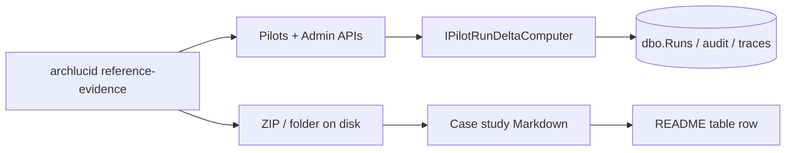

> **Scope:** Operational runbook for moving a real customer reference from internal drafting to a **Published** row in [`README.md`](README.md), including computed-ROI evidence extraction and the CI discount re-rate gate.

> **Spine doc:** [Five-document onboarding spine](../../FIRST_5_DOCS.md). Read this file only if you have a specific reason beyond those five entry documents.


# Reference customer — publication runbook

**Audience:** Product marketing, customer success, sales engineering, and the owner who signs legal agreements.

**Related:** [`PRICING_PHILOSOPHY.md` § 5.4](../PRICING_PHILOSOPHY.md#54-discount-stack-work-down) · [`scripts/ci/check_reference_customer_status.py`](../../../scripts/ci/check_reference_customer_status.py) · [`REFERENCE_EVIDENCE_PACK_TEMPLATE.md`](REFERENCE_EVIDENCE_PACK_TEMPLATE.md) · [`../REFERENCE_NARRATIVE_TEMPLATE.md`](../REFERENCE_NARRATIVE_TEMPLATE.md)

---

## 1. Objective

Ship **one** publishable reference backed by **measured** pilot deltas (time-to-commit, findings, audit rows, LLM calls) so finance can re-rate the **−15% reference discount** when the table first reaches `Status: Published` (CI auto-flip — see README § *How to add a real reference*).

---

## 2. Assumptions

- The customer has at least one **committed** golden manifest in production or pilot SQL.
- You have an **API key** with `ReadAuthority` for tenant-scoped CLI export, or **AdminAuthority** for `--tenant` ZIP export.
- **Owner-blocked:** a countersigned **reference / logo / quote** agreement exists before anything is published externally.

---

## 3. Constraints

- **Never** publish Contoso demo numbers as a customer outcome. The CLI refuses demo runs unless `--include-demo` is explicit; JSON includes `isDemoTenant` for double-checks.
- Do **not** restate list prices outside [`PRICING_PHILOSOPHY.md`](../PRICING_PHILOSOPHY.md) — link instead.
- Historical SQL migrations **001–028** are immutable; evidence export is API/CLI-only.

---

## 4. Architecture overview (evidence flow)



---

## 5. Step-by-step — Drafting → Customer review → Published

### Step 1 — Confirm legal sign-off (owner-blocked)

- [ ] Executed reference / logo / quote agreement (template: *owner legal template path TBD*).
- [ ] Customer named contact for approvals recorded.

### Step 2 — Extract computed evidence

**Tenant-scoped run (operator / sales engineer key):**

```bash
archlucid reference-evidence --run <runId> [--out ./reference-evidence/<runId>] [--include-demo]
```

**Admin ZIP (global admin key, entire tenant anchor run auto-picked):**

```bash
archlucid reference-evidence --tenant <tenantId> [--out ./reference-evidence/tenant-<tenantId>] [--include-demo]
```

Artifacts:

| Artifact | Source |
|----------|--------|
| `pilot-run-deltas.json` | `GET /v1/pilots/runs/{runId}/pilot-run-deltas` |
| `first-value-report.md` | `GET /v1/pilots/runs/{runId}/first-value-report` |
| `first-value-report.pdf` | `POST /v1/pilots/runs/{runId}/first-value-report.pdf` |
| `sponsor-one-pager.pdf` | `POST /v1/pilots/runs/{runId}/sponsor-one-pager` (Standard tier; may be absent) |
| ZIP (tenant path) | `GET /v1/admin/tenants/{tenantId}/reference-evidence` |

### Step 3 — Fill the narrative

1. Open [`REFERENCE_EVIDENCE_PACK_TEMPLATE.md`](REFERENCE_EVIDENCE_PACK_TEMPLATE.md).
2. Copy measured fields from `pilot-run-deltas.json` into the template (each field cites the JSON property — see template).
3. For long-form prose, start from [`../REFERENCE_NARRATIVE_TEMPLATE.md`](../REFERENCE_NARRATIVE_TEMPLATE.md) archetypes and replace fictional names with the customer’s.

### Step 4 — Customer review checklist

- [ ] **Quote accuracy** — every quote matches an email or signed doc; attach redacted source link internally.
- [ ] **Screenshots** — no third-party logos or unreleased product UI without permission; blur tenant-specific hostnames if required.
- [ ] **Numbers** — every numeric claim maps to `pilot-run-deltas.json` or [`PILOT_ROI_MODEL.md`](../../library/PILOT_ROI_MODEL.md) formula inputs the customer approved.
- [ ] **Demo banner** — if any screenshot accidentally includes demo data, ensure the “demo tenant — replace before publishing” banner is visible or delete the screenshot.

### Step 5 — README row + CI flip

1. Add or update the customer row in [`README.md`](README.md) with `Status: Drafting` → `Customer review` → `Published` per the lifecycle table.
2. The CI guard [`check_reference_customer_status.py`](../../../scripts/ci/check_reference_customer_status.py) parses **only** that table. When **any** row’s normalized `Status` token is `published`, the **warn** step exits `0` and the follow-on strict step in `.github/workflows/ci.yml` becomes merge-blocking (auto-flip — no YAML hand-edit).
3. Add a one-line entry to [`../../CHANGELOG.md`](../../CHANGELOG.md) on each transition so finance can trace discount re-rate timing ([`PRICING_PHILOSOPHY.md` § 5.3](../PRICING_PHILOSOPHY.md#53-re-rate-plan)).

---

## 6. Security model

- API keys with **only** `ReadAuthority` cannot call `--tenant` admin export (403).
- Evidence ZIPs may contain **run metadata** — treat as **confidential** until the customer publishes.
- Do not attach ZIPs to public tickets; use NDA-gated storage.

---

## 7. Operational considerations

- **404 on tenant export:** no committed run for that tenant after demo filtering — seed a real pilot run or pass `--include-demo` for internal-only rehearsal.
- **402 on sponsor PDF:** tenant below Standard — omit from pack; Markdown + first-value PDF still tell the story.
- **Re-run evidence** after each material pilot week so the case study stays fresh.

---

## 8. Owner decisions (defer to [`../../PENDING_QUESTIONS.md`](../../PENDING_QUESTIONS.md))

- Discount-for-reference percent (default narrative: **15%** per § 5.4).
- Whether the first **Published** row is **PLG first paying tenant** vs **named design partner** (drives which case-study file graduates first).
