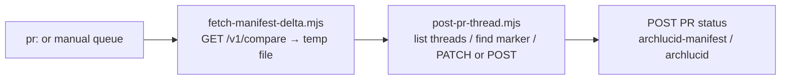

> **Scope:** Azure Pipelines — sticky PR comment + PR status for manifest delta (ArchLucid) — buyer-facing runbook.

> **Picking a vendor:** [GitHub job summary](GITHUB_ACTION_MANIFEST_DELTA.md) · [GitHub PR comment](GITHUB_ACTION_MANIFEST_DELTA_PR_COMMENT.md) · [Azure DevOps job summary](AZURE_DEVOPS_PIPELINE_TASK_MANIFEST_DELTA.md) · [Azure DevOps PR comment](AZURE_DEVOPS_PIPELINE_TASK_MANIFEST_DELTA_PR_COMMENT.md) · [Azure DevOps server-side](AZURE_DEVOPS_PR_DECORATION_SERVER_SIDE.md)

# Azure Pipelines — manifest delta (sticky PR comment + PR status)

**Audience:** Platform engineers wiring ArchLucid into **Azure DevOps Repos** pull-request review who want the same outcome as the GitHub **sticky PR comment** action: **one** comment that is rewritten on every run, plus an **informational** PR status check — both ultimately driven by the same **`GET /v1/compare`** Markdown.

**Template path:** [`integrations/azure-devops-task-manifest-delta-pr-comment/`](../../integrations/azure-devops-task-manifest-delta-pr-comment/) (`task.yml`, [`post-pr-thread.mjs`](../../integrations/azure-devops-task-manifest-delta-pr-comment/post-pr-thread.mjs), [`post-pr-thread-wire.mjs`](../../integrations/azure-devops-task-manifest-delta-pr-comment/post-pr-thread-wire.mjs)).

---

## 1. How it works

| Step | Artifact | Surface |
| --- | --- | --- |
| 1 | [`fetch-manifest-delta.mjs`](../../integrations/github-action-manifest-delta/fetch-manifest-delta.mjs) | Writes Markdown to `$(Agent.Temp)/archlucid-manifest-delta.md`. |
| 2 | [`post-pr-thread.mjs`](../../integrations/azure-devops-task-manifest-delta-pr-comment/post-pr-thread.mjs) | Lists PR threads (paginated), finds `<!-- archlucid:manifest-delta -->`, **PATCH**es the comment or **POST**s a new thread; then **POST**s PR status. |

---

## 2. Sticky marker contract

Identical to GitHub: **HTML comment** marker, `body.includes(marker)` matching, multi-match picks **most recent** `lastUpdatedDate` with a warning. See [`GITHUB_ACTION_MANIFEST_DELTA_PR_COMMENT.md`](GITHUB_ACTION_MANIFEST_DELTA_PR_COMMENT.md) §2.

---

## 3. Auth modes (Azure DevOps)

| Mode | Header | When |
| --- | --- | --- |
| **A — System token** | `Authorization: Bearer $(System.AccessToken)` | `azure-devops-pat` parameter is empty **and** the pipeline exposes `System.AccessToken` (use `checkout: self` with **`persistCredentials: true`**). |
| **B — PAT** | `Authorization: Basic` base64(`:{pat}`) | `azure-devops-pat` is set (secret variable). |

The script logs only **`archlucid:ado-auth mode=Bearer`** or **`mode=Basic`** — never token material.

**Build service permissions (Mode A):** **Contribute to pull requests** on the repository; **Read** on the repo. Branch policy gating on the informational status is a **separate** ADO project setting (out of scope for this template).

---

## 4. PR status semantics

The status uses **`state: succeeded`** (informational). Wiring it as a **required** check for merge is a tenant-side branch policy decision — document it locally; this repo does not automate that policy.

---

## 5. Example (copy-paste)

See **[`integrations/azure-devops-task-manifest-delta-pr-comment/example.azure-pipelines.yml`](../../integrations/azure-devops-task-manifest-delta-pr-comment/example.azure-pipelines.yml)**.

---

## 6. Parity with server-side Worker decoration

The **Worker** optional handler ([`AZURE_DEVOPS_PR_DECORATION_SERVER_SIDE.md`](AZURE_DEVOPS_PR_DECORATION_SERVER_SIDE.md)) posts to a **single configured PR** from `appsettings.json`. The **pipeline** path is per-PR and buyer-controlled. JSON wire bodies are shared with **`AzureDevOpsPullRequestWireFormat`** (ADR 0024).

---

## Related

- [ADR 0024 — Azure DevOps pipeline task parity](../adr/0024-azure-devops-pipeline-task-parity-with-github-action.md)
- [`docs/API_CONTRACTS.md`](../API_CONTRACTS.md)
