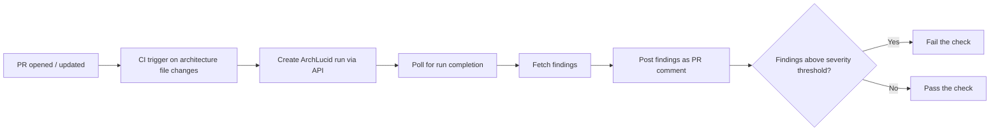

> **Scope:** ArchLucid — CI/CD integration guide - full detail, tables, and links in the sections below.

> **Spine doc:** [Five-document onboarding spine](../FIRST_5_DOCS.md). Read this file only if you have a specific reason beyond those five entry documents.

# ArchLucid — CI/CD integration guide

**Audience:** DevOps engineers and platform teams who want to integrate architecture review into their PR or build pipelines.

**Last reviewed:** 2026-04-15

---

## 1. Why

Architecture review traditionally happens in meetings — after the code is written and the PR is merged. ArchLucid can shift architecture review **left** into the PR workflow, giving developers feedback on architecture decisions **before** they merge.

---

## 2. Pattern

1. **PR change detection:** Trigger the pipeline when architecture-relevant files change (e.g., `docs/architecture/**`, `*.dsl`, `*.archimate`, `infra/**/*.tf`). Customize the path filters to match your repository structure.
2. **Create run:** `POST /v1/architecture/request` with a description referencing the PR. Include `X-Correlation-ID` for traceability.
3. **Poll for completion:** `GET /v1/runs/{runId}` until status is `Completed` or `Failed` (or timeout).
4. **Fetch findings:** `GET /v1/runs/{runId}/findings` returns the structured findings array.
5. **Report:** Post a summary table as a PR comment (GitHub) or publish as a build artifact (Azure DevOps).
6. **Gate:** Fail the check if findings at or above a configurable severity exist.

---

## 3. Setup

### GitHub Actions

1. Add the following **repository secrets:**
   - `ARCHLUCID_API_URL` — Your ArchLucid API base URL (e.g., `https://api.archlucid.dev`)
   - `ARCHLUCID_API_KEY` — API key with **Operator** role (create run) or **Reader** role (read-only checks)

2. Copy `examples/github-actions/archlucid-architecture-review.yml` to `.github/workflows/` in your repository.

3. Customize the `paths` trigger to match your architecture file locations.

4. Adjust `SEVERITY_THRESHOLD` environment variable (`Low`, `Medium`, `High`, `Critical`).

### Azure DevOps

1. Add **pipeline variables** (mark as secret):
   - `ArchLucidApiUrl` — Your ArchLucid API base URL
   - `ArchLucidApiKey` — API key with appropriate role

2. Copy `examples/azure-devops/archlucid-architecture-review.yml` to your repository and create a pipeline from it.

3. Customize path triggers and severity threshold variable.

---

## 4. Configuration options

| Option | Default | Description |
|--------|---------|-------------|
| **Path triggers** | `docs/architecture/**`, `*.dsl`, `infra/**/*.tf` | Which file changes trigger the review |
| **Severity threshold** | `High` | Findings at this severity or above fail the check |
| **Timeout** | 300 seconds (5 minutes) | Maximum wait for run completion |
| **Preset** | `Greenfield web app` | Architecture request preset — customize to your domain |
| **Max findings in comment** | 20 | Truncate the PR comment table for readability |

---

## 5. Security

- **API keys:** Store as **secrets** in your CI/CD platform. Never commit keys to source control.
- **Least privilege:** Use an **Operator**-role key if the pipeline creates runs. Use **Reader** if it only reads existing runs.
- **Network:** Ensure CI runners can reach the ArchLucid API URL. For private deployments, use self-hosted runners with network access.
- **Correlation:** Include `X-Correlation-ID` header (e.g., `gh-pr-123`) for support and audit alignment.

---

## 6. Limitations (V1)

- ArchLucid does **not** auto-detect architecture drift from code changes. Runs require **explicit context input** (description + optional preset). The CI pipeline provides the trigger; the user-submitted description or a configured preset defines what is analyzed.
- Architecture runs use LLM inference (or the simulator in demo mode). Run duration depends on model latency, not just API processing.
- PR comments are informational summaries. Full findings detail is available in the ArchLucid UI or via the API.

---

## Related documents

| Doc | Use |
|-----|-----|
| [../go-to-market/INTEGRATION_CATALOG.md](../go-to-market/INTEGRATION_CATALOG.md) | Full integration catalog |
| [../API_CONTRACTS.md](../library/API_CONTRACTS.md) | API endpoints |
| [../SECURITY.md](../library/SECURITY.md) | Auth modes and RBAC |
