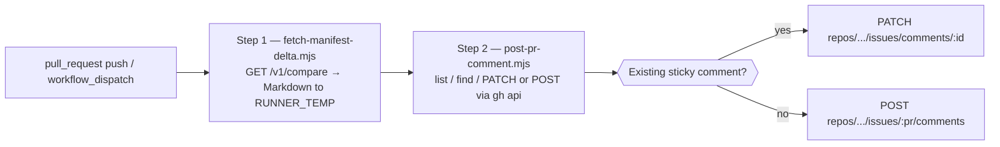

> **Scope:** GitHub Action — sticky PR comment for the ArchLucid manifest delta - full detail, contract, and links in the sections below.

> **Picking a vendor:** [GitHub job summary](GITHUB_ACTION_MANIFEST_DELTA.md) · [GitHub PR comment](GITHUB_ACTION_MANIFEST_DELTA_PR_COMMENT.md) · [Azure DevOps job summary](AZURE_DEVOPS_PIPELINE_TASK_MANIFEST_DELTA.md) · [Azure DevOps PR comment](AZURE_DEVOPS_PIPELINE_TASK_MANIFEST_DELTA_PR_COMMENT.md) · [Azure DevOps server-side](AZURE_DEVOPS_PR_DECORATION_SERVER_SIDE.md)

# GitHub Action — manifest delta PR comment (sticky)

**Audience:** Platform engineers wiring ArchLucid into GitHub pull-request review who want the delta inline on the PR (not just on the Actions job-summary page).

**Purpose:** Surface **`GET /v1/compare`** (structured golden-manifest delta between two **committed** runs) as a **single sticky pull-request comment** that is rewritten on every workflow run instead of stacking duplicates.

**Action path:** [`integrations/github-action-manifest-delta-pr-comment/`](../../integrations/github-action-manifest-delta-pr-comment/) (composite action).

> ℹ️ The sibling action [`github-action-manifest-delta`](../../integrations/github-action-manifest-delta/) is the right choice when the **job summary** is the surface you want. This action is for **inline PR comments**.

---

## 1. How it works



| Step | Script | Surface |
| --- | --- | --- |
| 1 | [`fetch-manifest-delta.mjs`](../../integrations/github-action-manifest-delta/fetch-manifest-delta.mjs) (sibling action — single source of truth for the Markdown shape) | Writes Markdown to `${RUNNER_TEMP}/archlucid-manifest-delta.md`. |
| 2 | [`post-pr-comment.mjs`](../../integrations/github-action-manifest-delta-pr-comment/post-pr-comment.mjs) | Lists the PR's comments, finds one whose body contains the marker, **PATCHes** it in place or **POSTs** a new one. |

---

## 2. Sticky marker contract

The sticky behaviour is identity-by-marker: a hidden HTML comment line.

| Field | Default | Notes |
| --- | --- | --- |
| Marker | `<!-- archlucid:manifest-delta -->` | Rendered as nothing in the PR view; survives round-trips through the GitHub REST API unmodified. |
| Match | `body.includes(marker)` | Lets authors prepend/append context (review notes, etc.) without breaking sticky detection. |
| Multi-tenant override | pass `marker:` input | Use a unique marker per tenant when one PR receives multiple delta comments — e.g. `<!-- archlucid:manifest-delta:tenant-acme -->`. Different markers are independent. |
| Body shape | `${marker}\n${markdown}` | Marker on its own line; Markdown payload verbatim. |

> ⚠️ **Don't change the marker on a live PR** without first deleting the old comment. The action would create a new sticky and treat the old one as foreign noise (it would no longer overwrite it).

---

## 3. Prerequisites

- Both runs must exist in the **same tenant scope** as the API key and must already have **golden manifests** (committed). Otherwise the API returns **404** — see [`docs/API_CONTRACTS.md`](../API_CONTRACTS.md) and [`docs/COMPARISON_REPLAY.md`](../COMPARISON_REPLAY.md).
- API key must satisfy **ReadAuthority** (header: `X-Api-Key`). Reuse the `ARCHLUCID_READONLY_API_KEY` secret.
- The job must declare **`permissions: pull-requests: write`** so the default `secrets.GITHUB_TOKEN` can create / patch comments. Use a PAT with `repo` scope when the workflow runs from a fork (the default token is read-only on PRs from forks).
- Respect **rate limiting** on `/v1/*` (`429` with backoff). The script performs a **single** GET per run; `pull_request: synchronize` will refire on every PR push, which is the design — that's what makes the sticky comment "live".

---

## 4. Secrets

| Secret | Purpose | Notes |
| --- | --- | --- |
| `ARCHLUCID_READONLY_API_KEY` | `X-Api-Key` for `GET /v1/compare`. | Same secret as the sibling job-summary action; **never** commit keys to YAML. Rotate if a workflow log ever captured one. |
| `GITHUB_TOKEN` (built-in) | Auth for `gh api` to read comments and POST/PATCH the sticky one. | Works for same-repo PRs with `permissions: pull-requests: write`. Use a PAT for fork PRs. |

---

## 5. Inputs

| Name | Required | Default | Description |
| --- | --- | --- | --- |
| `api-base-url` | yes | — | API origin without trailing slash. |
| `api-token` | yes | — | `X-Api-Key` value (`secrets.ARCHLUCID_READONLY_API_KEY`). |
| `base-run-id` | yes | — | Baseline committed run id. |
| `target-run-id` | yes | — | Candidate committed run id. |
| `pr-number` | yes | — | PR number; for `pull_request` triggers pass `${{ github.event.pull_request.number }}`. |
| `repository` | no | `${{ github.repository }}` | `owner/repo` slug. |
| `github-token` | yes | — | Token for `gh api` (typically `secrets.GITHUB_TOKEN`). |
| `marker` | no | `<!-- archlucid:manifest-delta -->` | Sticky-marker override (see §2). |
| `operator-compare-url-template` | no | `''` | Optional deep link template using `{baseRunId}` and `{targetRunId}` placeholders. |

---

## 6. Example workflow

See **[`.github/workflows/example-manifest-delta-pr-comment.yml`](../../.github/workflows/example-manifest-delta-pr-comment.yml)** — supports both `pull_request` (auto on every push) and `workflow_dispatch` (manual back-fill with explicit ids).

---

## 7. Tests

The pure upsert function (`upsertStickyComment`) is exported from `post-pr-comment.mjs` so the create-vs-update branching is unit-testable with a fake `gh` client. Run locally:

```bash
node --test integrations/github-action-manifest-delta-pr-comment/post-pr-comment.test.mjs
```

The test mocks `listIssueComments`, `createIssueComment`, and `updateIssueComment` — it never invokes `gh` and never hits the GitHub API. Coverage:

- Empty / non-string-body comment lists → no false-positive sticky match.
- New PR (no sticky present) → POST exactly once, no PATCH.
- Existing sticky → PATCH exactly once, no POST.
- Custom marker isolated from the default-marker sticky on the same PR.
- Argument validation for every required field.

---

## 8. Related

- [`docs/integrations/GITHUB_ACTION_MANIFEST_DELTA.md`](GITHUB_ACTION_MANIFEST_DELTA.md) — sibling action that writes to the **Actions job summary** instead of a PR comment.
- [`docs/integrations/CICD_INTEGRATION.md`](CICD_INTEGRATION.md) — broader PR-review integration patterns.
- [`docs/API_CONTRACTS.md`](../API_CONTRACTS.md) — versioning and correlation.
- [`docs/COMPARISON_REPLAY.md`](../COMPARISON_REPLAY.md) — `/v1/compare` semantics.
- [`docs/operator-shell.md`](../operator-shell.md) — operator compare workflow.
