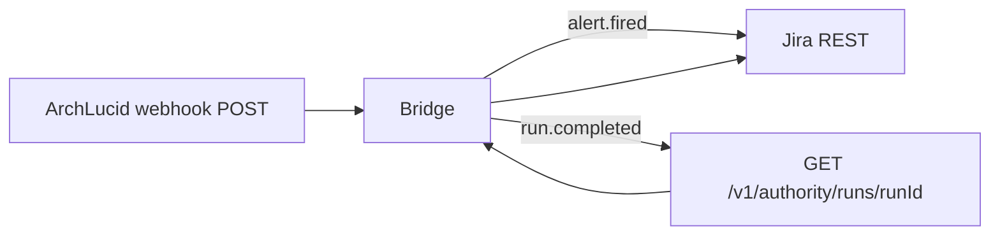

> **Scope:** Jira Cloud webhook bridge pattern for V1 — runnable reference scripts plus operational recipe; **not** a substitute for an Atlassian-supported first-party connector (V1.1) or customer security review.

> **Spine doc:** [Five-document onboarding spine](../FIRST_5_DOCS.md).


# Jira webhook bridge (reference implementation)

**Audience:** Platform engineers integrating ArchLucid **`com.archlucid.authority.run.completed`** and **`com.archlucid.alert.fired`** [CloudEvents 1.0](https://github.com/cloudevents/spec/blob/v1.0.2/cloudevents/formats/json-format.md) deliveries into Atlassian **Jira Cloud** before the **[V1.1 first-party Jira connector](../library/V1_DEFERRED.md)** ships.

Canonical contracts remain **[INTEGRATION_EVENTS_AND_WEBHOOKS.md](../library/INTEGRATION_EVENTS_AND_WEBHOOKS.md)** (HMAC **`X-ArchLucid-Webhook-Signature`** signs the UTF-8 envelope), **[catalog.json](../../schemas/integration-events/catalog.json)**, and the deep-cut template **`templates/integrations/jira/jira-webhook-bridge-recipe.md`**.

---

## 1. Objective

Produce **issues in Jira** from the same payloads ArchLucid emits to subscribed HTTPS webhooks, with an optional **`GET /v1/authority/runs/{runId}`** hop when the event is **`…authority.run.completed`** (finding rows are embedded in run detail JSON, not duplicated on the CloudEvent envelope).

---

## 2. Assumptions

- **Jira Cloud** with REST API v3, project key / issue-type names aligned with **`JIRA_PROJECT_KEY`** / **`JIRA_ISSUE_TYPE`** (bridge defaults: **Task**, **Bug** for alerts).

- Caller can store **ArchLucid API key** (**`X-Api-Key`**) and **Jira API token + email** in a vault or CI secret bundle.

---

## 3. Constraints

- **One-way** create-only in this bridge (issues are not synced back into ArchLucid findings).

- **Rate limits**: cap findings per run via **`MAX_FINDINGS_PER_RUN`** (default **25**) to protect Jira and operator budgets.

- **No plaintext secrets** in repo — scripts read **environment variables only**.

---

## 4. Architecture overview

| Node | Role |
| --- | --- |
| **ArchLucid SaaS / tenant deployment** | Emits webhook POST (**CloudEvents** + HMAC header). |

| **`jira-webhook-bridge.mjs` or `.ps1`** | Validates HMAC (HTTP path); maps **`alert.fired`** → one issue; **`run.completed`** → **GET run** then one issue per finding (capped). |

| **Jira Cloud** | Issues created via **`POST /rest/api/3/issue`** (Atlassian Document Format description body). |



---

## 5. Component breakdown

| Artifact | Purpose |
| --- | --- |
| [`scripts/integrations/jira/jira-webhook-bridge.mjs`](../../scripts/integrations/jira/jira-webhook-bridge.mjs) | Node 18+ — **`process <file.json>`** offline replay; optional **`ARCHLUCID_JIRA_BRIDGE_SERVE=1`** HTTP listener on **`127.0.0.1:${ARCHLUCID_JIRA_BRIDGE_PORT:-8787}/webhook`**. |
| [`scripts/integrations/jira/jira-webhook-bridge.ps1`](../../scripts/integrations/jira/jira-webhook-bridge.ps1) | PowerShell 7 — **`-ProcessPath`** file replay (no embedded HTTP server; use Node **serve** or wrap in Azure Functions / API Management). |
| [`sample-alert-fired.json`](../../scripts/integrations/jira/sample-alert-fired.json) | Example **`com.archlucid.alert.fired`** envelope. |
| [`sample-authority-run-completed.json`](../../scripts/integrations/jira/sample-authority-run-completed.json) | Example **`com.archlucid.authority.run.completed`** envelope (requires live API for findings). |

No-code alternative: **[recipes/JIRA_ISSUE_VIA_POWER_AUTOMATE.md](recipes/JIRA_ISSUE_VIA_POWER_AUTOMATE.md)**.

---

## 6. Data flow

1. **Inbound HTTP** (Node serve): read raw body bytes; compare **`X-ArchLucid-Webhook-Signature`** to **`sha256=` + HMAC-SHA256(shared secret, raw UTF-8 body)**.

2. **Parse** JSON → read **`type`**.

3. **`com.archlucid.alert.fired`:** map **`data.title`**, **`severity`**, ids → Jira **summary** / **priority** / **description** (ADF).

4. **`com.archlucid.authority.run.completed`:** **`GET …/v1/authority/runs/{runId}`** with **`X-Api-Key`**; iterate **`findingsSnapshot.findings`** (camelCase JSON per API defaults).

5. **Outbound** → Jira **`POST /rest/api/3/issue`** with **Basic** auth (`email:api_token` → Base64).

---

## 7. Security model

| Topic | Practice |
| --- | --- |
| **Webhook authenticity** | Require HMAC in any internet-exposed listener; **never** `SKIP_HMAC` in production. |
| **File replay** | Set **`SKIP_HMAC=1`** only on developer workstations when testing saved JSON; **unset** **`ARCHLUCID_WEBHOOK_HMAC_SECRET`** or use **Node serve** with real signatures. |
| **ArchLucid API** | Least-privilege **Reader**-class key if only **GET run** is needed. |
| **Jira** | Scoped API token; rotate per Atlassian policy; store in Key Vault / GitHub encrypted secrets. |

---

## 8. Operational considerations

| Topic | Notes |
| --- | --- |
| **Scalability** | Horizontally scale **stateless** bridge instances; deduplicate on **`ce.id`** or **`deduplicationKey`** (alerts) at your store. |
| **Reliability** | Return **401** on bad HMAC, **200** after successful Jira create; let ArchLucid retries remain idempotent via your dedupe table. |
| **Cost** | Bridge compute + Jira API usage + ArchLucid read calls — dominated by human triage, not API cents. |

---

## 9. Environment variables

| Variable | Required for | Description |
| --- | --- | --- |
| **`JIRA_BASE_URL`** | All | e.g. `https://your-site.atlassian.net` |
| **`JIRA_EMAIL`**, **`JIRA_API_TOKEN`** | All | Basic auth to Jira Cloud REST. |
| **`JIRA_PROJECT_KEY`** | All | Project key (e.g. `ARCH`). |
| **`JIRA_ISSUE_TYPE`** | Findings path | Default **Task**. |
| **`JIRA_ISSUE_ALERT_TYPE`** / **`ALERT_ISSUE_TYPE`** | Alert path | Default **Bug**. |
| **`ARCHLUCID_BASE_URL`**, **`ARCHLUCID_API_KEY`** | `run.completed` | **GET** run detail. |
| **`ARCHLUCID_WEBHOOK_HMAC_SECRET`** | HTTP serve | Must match **`WebhookDelivery:HmacSha256SharedSecret`**. |
| **`SKIP_HMAC`** | Local file replay | Set to **`1`** only when **`ARCHLUCID_WEBHOOK_HMAC_SECRET` is absent** or intentionally bypassing verification. |
| **`MAX_FINDINGS_PER_RUN`** | `run.completed` | Default **25**. |
| **`ARCHLUCID_JIRA_BRIDGE_SERVE`**, **`ARCHLUCID_JIRA_BRIDGE_PORT`** | Node listener | **`SERVE=1`**, port default **8787**. |

---

## 10. Quick start (alert sample, file replay)

```powershell
cd scripts/integrations/jira
$env:SKIP_HMAC = "1"
$env:JIRA_BASE_URL = "https://your.atlassian.net"
$env:JIRA_EMAIL = "automation@example.com"
$env:JIRA_API_TOKEN = "<api-token>"
$env:JIRA_PROJECT_KEY = "ARCH"
node ./jira-webhook-bridge.mjs process ./sample-alert-fired.json
```

```powershell
./jira-webhook-bridge.ps1 -ProcessPath .\sample-alert-fired.json
```

---

## 11. Related documents

| Doc | When to read |
| --- | --- |
| [INTEGRATION_EVENTS_AND_WEBHOOKS.md](../library/INTEGRATION_EVENTS_AND_WEBHOOKS.md) | Webhook + HMAC configuration |
| [recipes/JIRA_ISSUE_VIA_POWER_AUTOMATE.md](recipes/JIRA_ISSUE_VIA_POWER_AUTOMATE.md) | No-code Power Automate |
| [templates/integrations/jira/jira-webhook-bridge-recipe.md](../../templates/integrations/jira/jira-webhook-bridge-recipe.md) | Long-form developer recipe + payload JSON |
| [INTEGRATION_CATALOG.md](../go-to-market/INTEGRATION_CATALOG.md) | Roadmap / V1.1 connector status |

---

*Last reviewed: 2026-04-28 — event type strings from [`IntegrationEventTypes.cs`](../../ArchLucid.Core/Integration/IntegrationEventTypes.cs).*
