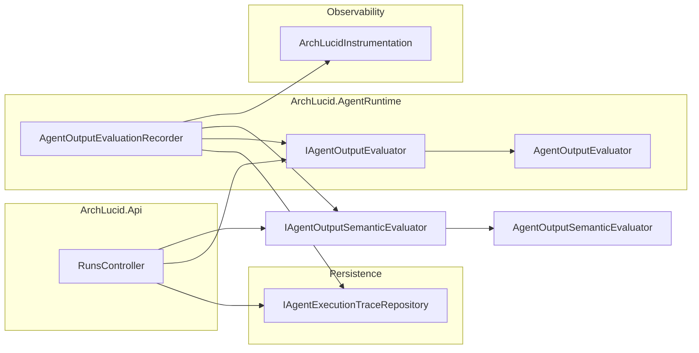

> **Scope:** Agent output structural evaluation - full detail, tables, and links in the sections below.

> **Spine doc:** [Five-document onboarding spine](../FIRST_5_DOCS.md). Read this file only if you have a specific reason beyond those five entry documents.


# Agent output structural evaluation

## 1. Objective

Provide a **cheap, deterministic** check that persisted agent **`AgentExecutionTrace.ParsedResultJson`** still looks like a serialized **`AgentResult`**: correct JSON root shape and expected **top-level property names** (camelCase, matching **`JsonSerializerDefaults.Web`**). Support **on-demand HTTP inspection** per run and **optional OTEL metrics** for batch or post-run jobs—without calling an LLM.

## 2. Assumptions

- **Traces** store **`ParsedResultJson`** only when **`ParseSucceeded`** is true (handlers serialize the validated **`AgentResult`**).
- **Schema validation** already ran at execution time; this layer catches **drift**, **manual SQL edits**, or **future serializer changes** that leave traces readable but structurally incomplete.
- **Automatic metrics path:** **`AgentOutputEvaluationRecorder.EvaluateAndRecordMetricsAsync`** runs after a successful architecture execute (**`ArchitectureRunExecuteOrchestrator`** → **`IAgentOutputTraceEvaluationHook.AfterSuccessfulExecuteAsync`**) once evidence, **`AgentResult`** rows, and evaluations are committed; failures in the hook are logged and swallowed so the run stays successful. **`GET …/agent-evaluation`** still performs the same scoring on demand without recording OTel metrics.

## 3. Constraints

- **`schemas/agentresult.schema.json`**: top-level **`AgentResult`** contract plus optional **`proposedChanges`** (when present, **`ManifestDeltaProposal`** shape with **`addedServices`** / **`addedDatastores`** / **`addedRelationships`** item schemas). Enforced before domain checks in **`AgentResultParser`** when **`AgentExecution:SchemaValidation:EnforceOnParse`** is **`true`**.
- **CI fixture guard:** `scripts/ci/assert_agent_reference_baselines.py` (wired in `.github/workflows/ci.yml`) validates committed golden JSON under `ArchLucid.AgentRuntime.Tests/Fixtures/GoldenAgentResults/` listed in `scripts/ci/agent-reference-baselines.json`. Extend that array when adding new golden files.
- **No new external services**; only **`System.Text.Json`** and existing repositories.
- **Privacy**: evaluation reads **already-persisted** trace JSON; the **GET** endpoint requires the same **read authority** policy as other run reads.
- **Cardinality**: metric labels use **`agent_type`** only (four values).

## 4. Architecture Overview



## 5. Component Breakdown

| Component | Responsibility |
|-----------|------------------|
| **`IAgentOutputEvaluator`** | Pure **`Evaluate(traceId, json, agentType)`** → **`AgentOutputEvaluationScore`**. |
| **`AgentOutputEvaluator`** | Expected key list for **`AgentResult`** JSON; parse; ratio = present / expected. |
| **`AgentOutputEvaluationRecorder`** | Load traces by **`runId`**; score; emit **`archlucid_agent_output_*`**; log low scores. |
| **`AgentOutputSemanticScore`** | Contract DTO for semantic ratios (also returned nested on each API score row). |
| **`AgentOutputEvaluationScore` / `AgentOutputEvaluationSummary`** | Contracts for API and tests. |
| **`GET …/run/{runId}/agent-evaluation`** | Structural + semantic scores per trace, **`blobUploadFailed`** from the trace row, and **`averageSemanticScore`** — does **not** record OTel metrics. |
| **`IAgentOutputEvaluationHarness` / `AgentOutputEvaluationHarness`** | Test-time and offline composition of structural + semantic evaluators with **`AgentOutputExpectation`** (min scores, required JSON keys, finding categories). |
| **`ISemanticScorer`** | Placeholder seam for **embedding-based** similarity vs reference text (not wired in DI today); current semantic path remains **`IAgentOutputSemanticEvaluator`**. |

## 6. Data Flow

1. **API**: **`GetByRunIdAsync`** → for each eligible trace, structural **`Evaluate`**, then **`IAgentOutputSemanticEvaluator.Evaluate`** (when structural parse is OK); set **`BlobUploadFailed`** from the trace; aggregate **`AverageStructuralCompletenessRatio`** and **`AverageSemanticScore`**; skipped count for traces without parsed JSON.
2. **Post-execute hook** (automatic on successful **`POST …/execute`**): **`ArchitectureRunExecuteOrchestrator`** calls **`IAgentOutputTraceEvaluationHook.AfterSuccessfulExecuteAsync`**, which delegates to **`AgentOutputEvaluationRecorder.EvaluateAndRecordMetricsAsync(runId)`** → load traces → same scoring loop → **`Histogram.Record`** / **`Counter.Add`** with **`agent_type`** tag.
3. **Parse failure** (invalid JSON or non-object root): **`IsJsonParseFailure`** true; metrics path increments **`archlucid_agent_output_parse_failures_total`** (no histogram point).

## 7. Security Model

- **Authorization**: **`ReadAuthority`** on **`RunsController`** (same as **`GET …/traces`**).
- **Data exposure**: Response includes **missing key names** and **scores** only—no raw prompts. Traces already scoped by **run repository** / **RLS** as elsewhere.
- **Abuse**: Rate limiting inherits controller **`fixed`** window; evaluation is CPU-only over in-memory JSON strings.

## Semantic evaluation

Beyond structural completeness, **`AgentOutputSemanticEvaluator`** performs a deeper deterministic inspection of the agent JSON output without calling an LLM.

### What it checks

| Dimension | Scoring rule |
|-----------|-------------|
| **Claims quality** | Fraction of items in `claims[]` that have non-empty `evidenceRefs[]` or a non-empty `evidence` string. |
| **Findings quality** | Fraction of items in `findings[]` with non-empty `severity`, `description` (>10 chars), and `recommendation` (>5 chars). |
| **Overall score** | Weighted average: Claims × **0.4** + Findings × **0.6**. When only one dimension is present, that dimension's ratio is the overall score. Zero when both arrays are absent or empty. |

### OTel metric

**`archlucid_agent_output_semantic_score`** (histogram, 0.0–1.0; label `agent_type`) — recorded alongside the structural histogram by **`AgentOutputEvaluationRecorder`**.

### Warning threshold

**`AgentOutputEvaluationRecorder`** logs a warning when **`OverallSemanticScore < 0.3`** (critical semantic emptiness). Structural low-score warnings still use **0.5**. The optional quality gate uses separate floors from **`AgentOutputQualityGateOptions`**.

### Interface

```csharp
IAgentOutputSemanticEvaluator.Evaluate(traceId, parsedResultJson, agentType) → AgentOutputSemanticScore (type lives in **`ArchLucid.Contracts.Agents`**).
```

Registered as **singleton** (`IAgentOutputSemanticEvaluator → AgentOutputSemanticEvaluator`).

## Quality gate (enabled by default)

**`IAgentOutputQualityGate`** classifies structural + semantic scores into **accepted / warned / rejected** using **`ArchLucid:AgentOutput:QualityGate`** (`AgentOutputQualityGateOptions`).

- **Shipped default (`ArchLucid.Api/appsettings.json`):** **`Enabled: true`** with **`StructuralWarnBelow`**, **`SemanticWarnBelow`**, **`StructuralRejectBelow`**, **`SemanticRejectBelow`** thresholds so production-like runs record gate outcomes on the evaluation path.
- **Local Development (`appsettings.Development.json`):** matches the same threshold block with **`Enabled: true`** so **`dotnet run`** and API tests observe the same OTel gate counters and warning logs as staging—set **`Enabled: false`** only when you are intentionally mutating agent JSON without gate noise.
- **`appsettings.Advanced.json`:** does not need to repeat the block unless you override thresholds per environment.

**Release credibility posture (owner, 2026-05-01):** Buyers who design on Azure and for AI systems should see a **high bar**. **Release candidates must not ship** when **reference** real-mode or (once required) golden-cohort real-LLM evidence shows **insufficient** structural/semantic scores or a **material rate** of **rejected** gate outcomes at the configured floors—**warn-only** is not enough for perceived credibility. Operational follow-up: name the **reference Azure OpenAI deployment**, then tune **`StructuralWarnBelow` / `SemanticWarnBelow` / `StructuralRejectBelow` / `SemanticRejectBelow`** **conservatively** (often **tighter** than initial defaults) and wire failing gates into **required** release or branch-protection automation. **Offline PR signal:** `scripts/ci/eval_agent_corpus.py` scores committed **simulator** **`AgentResult`** JSON under **`tests/eval-corpus/agent-results/`** with the same structural/semantic heuristics and default gate floors; use `--markdown-report` for an RC appendix and **`--enforce-quality-gate`** when a tagged build must fail on **rejected** simulator rows. **Manual QA** lay definitions, threshold discipline, and operator actions: [`docs/quality/MANUAL_QA_CHECKLIST.md`](../quality/MANUAL_QA_CHECKLIST.md) § **8.4**.

When enabled, **`AgentOutputEvaluationRecorder`** increments **`archlucid_agent_output_quality_gate_total`** (labels `agent_type`, `outcome`) and logs **warn** for **warned**/**rejected** outcomes. The gate does **not** change persisted traces or block merges by itself.

## Golden-set trace fixtures (regression)

**`ArchLucid.AgentRuntime.Tests`** includes **`GoldenAgentExecutionTraceTests`**, which load **`Fixtures/AgentExecutionTrace/*.json`** and assert:

- **`ModelDeploymentName`** / **`ModelVersion`** match expected values (including **`AgentExecutionTraceModelMetadata`** sentinels for simulator paths).
- **`ParseSucceeded`** and presence of **`ParsedResultJson`** where the fixture models a successful parse.

**Agent result JSON (parsed output shape):** **`GoldenAgentResultJsonEvaluationTests`** loads **`Fixtures/GoldenAgentResults/*.json`** through **`AgentOutputEvaluator`** and **`AgentOutputSemanticEvaluator`**. The pair **`golden-agent-result-valid.json`** vs **`golden-agent-result-claim-without-evidence.json`** guards regressions where **`claims[].evidenceRefs`** (or non-empty **`evidence`**) is removed but findings remain complete — semantic **`OverallSemanticScore`** must drop.

**Harness + round-trip JSON:** **`AgentOutputEvaluationHarnessGoldenFixtureTests`** deserializes **`harness-agent-result-topology.json`** and **`harness-agent-result-compliance.json`** to **`AgentResult`** (web JSON), then runs **`IAgentOutputEvaluationHarness.Evaluate`** with structural floors. A third test loads the topology fixture and clears **`Findings`** to assert the harness fails **`MinimumFindingCount`**.

Add a new JSON file per scenario (minimal fields only); keep fixtures **small** and **non-sensitive** (no customer text, no secrets).

## 8. Operational Considerations

- **Full prompts**: Blob upload (plus SQL **`Full*Inline`** fallback) runs after trace insert for **Real** execution; **Simulator** skips full-text blob/inline; see **`docs/AGENT_TRACE_FORENSICS.md`**. Optional JSON reference cases: **`AgentExecution:ReferenceEvaluation`** → **`archlucid_agent_output_reference_case_*`** metrics and **`dbo.AgentOutputEvaluationResults`**.
- **Dashboards**: **`archlucid_agent_output_structural_completeness_ratio`** (histogram), **`archlucid_agent_output_semantic_score`** (histogram), **`archlucid_agent_output_parse_failures_total`** (counter), and optional **`archlucid_agent_output_quality_gate_total`** (counter)—see **`docs/OBSERVABILITY.md`**.
- **Low score logs**: Recorder warns below **0.5** completeness for both structural and semantic scores (configurable in code if product asks).
- **Evolution**: Per-**`AgentType`** key lists live in **`GetExpectedKeys`** for future stricter Topology/Cost/Critic profiles.

### Release-readiness signal

For release candidates, treat agent output quality as a release signal, not only a dashboard metric:

```bash
python scripts/ci/eval_agent_corpus.py --markdown-report artifacts/agent-output-quality.md --enforce-quality-gate
```

Use the generated Markdown file as the deterministic appendix for the release. It is intentionally simulator / fixture backed by default so normal release checks do not require Azure OpenAI credentials. When the release posture includes real Azure OpenAI, attach the live run evidence from [`docs/quality/REAL_LLM_RUN_EVIDENCE_TEMPLATE.md`](../quality/REAL_LLM_RUN_EVIDENCE_TEMPLATE.md) alongside this deterministic corpus output.

**Block vs warn:** a rejected quality-gate row under the configured release floors should block a tagged release candidate unless the release notes explicitly narrow the supported surface to simulator-only evidence. Warning rows can ship only with an owner note that explains why the semantic or structural score is acceptable for the scenario.

## 9. Trending, reports, and email alerts

**What the product emits today**

- After each **successful** architecture **`execute`**, **`AgentOutputEvaluationRecorder`** records **OpenTelemetry** histograms and counters documented in **`OBSERVABILITY.md`**: **`archlucid_agent_output_structural_completeness_ratio`**, **`archlucid_agent_output_semantic_score`**, **`archlucid_agent_output_quality_gate_total`**, **`archlucid_agent_output_parse_failures_total`** (labels include **`agent_type`**; gate counter includes **`outcome`**).
- **Per run (no warehouse required):** **`GET /v1/architecture/run/{runId}/agent-evaluation`** returns the same scoring for that run’s traces (averages per row + summary).

**There is no first-party “weekly agent score email” in the API** — trending and notifications are expected to come from whatever receives **OTel** (Azure Monitor / Application Insights + **Metric alerts**, **Grafana** + **Alerting**, Prometheus + **Alertmanager**, etc.).

**See trends (charts)**

| Approach | What you do |
|----------|-------------|
| **Grafana** (or similar) | Panels on the histograms above: **p50/p90/p95** over time, split by **`agent_type`**; separate stat panel for **`rate(archlucid_agent_output_quality_gate_total{outcome="rejected"}[1d])`**. Pair with **`OBSERVABILITY.md`** naming. |
| **Azure Monitor / App Insights** | If the host exports OTLP or **custom metrics** land in App Insights, use **Metrics** explorer or a **Workbook** (pattern: golden cohort cost workbook in **`docs/runbooks/GOLDEN_COHORT_REAL_LLM_GATE.md`** §5). **KQL** (when custom metrics are in `customMetrics`) can time-series **`archlucid_agent_output_semantic_score`** and **`archlucid_agent_output_structural_completeness_ratio`** — exact field names depend on exporter mapping. |
| **Manual / pilot** | For a single tenant, call **`agent-evaluation`** after important runs and paste aggregates into your pilot log (see **`docs/quality/MANUAL_QA_CHECKLIST.md`** §8.3–8.4). |

**Get email when something is wrong (or on a schedule)**

1. **Threshold alert (recommended first):** In Azure Monitor or Grafana, define an alert when, for example, **semantic score p10** over **24h** drops below your release bar, or **`rejected`** gate **`rate()`** exceeds a small baseline. Attach an **Action group** → **Email** to yourself.
2. **Scheduled summary:** **Azure Monitor scheduled query alert** or **Grafana report** (if licensed) on a saved query that aggregates last **7 days** of the same metrics — less common for histograms; often easier to alert on **SLO-style** thresholds than “digest of percentiles.”
3. **DIY:** Small scheduled job (Logic App, GitHub Action, or **Azure Function**) that calls **`agent-evaluation`** for a **fixture run id** or queries your metrics API and emails JSON — use only if hosted metrics are not available yet.

**Prerequisite:** OTel from **`ArchLucid.Api`** must export to a backend; see **`OBSERVABILITY.md`** § **Export path configuration (OpenTelemetry)** (Application Insights connection string, OTLP endpoint, or Prometheus scrape). Local **`dotnet run`** with no exporter may only show the **console** in Development. Without any export path, use the **HTTP API** per run until observability is wired.
