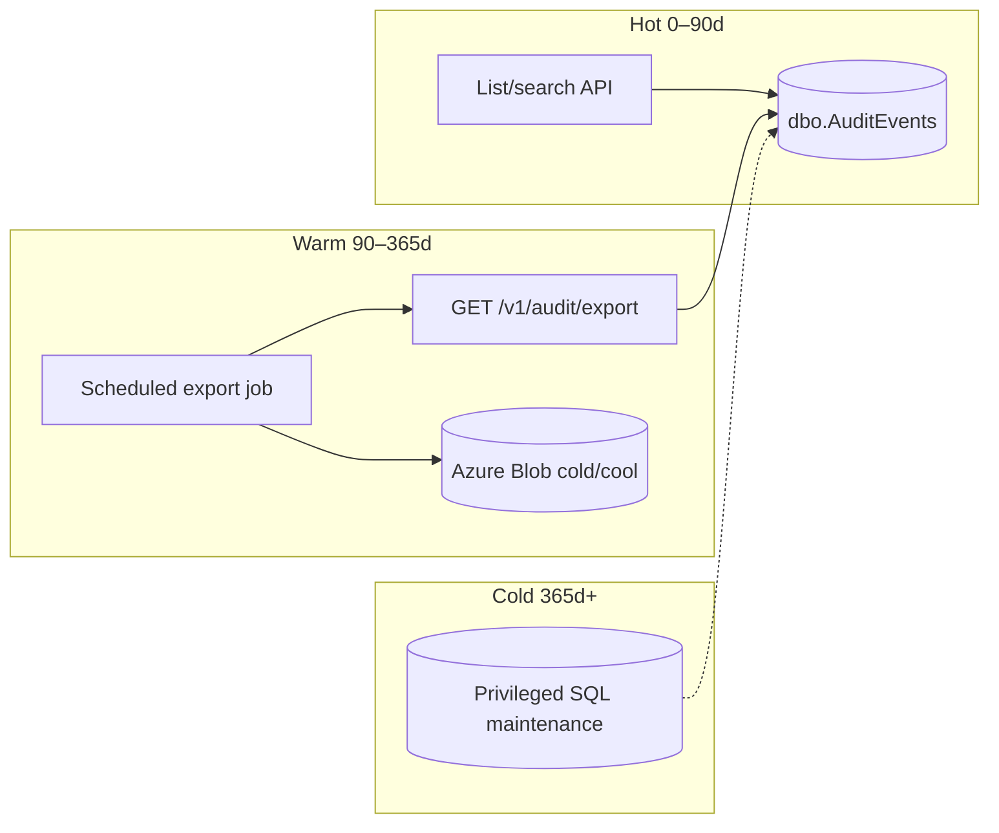

> **Scope:** Audit retention policy - full detail, tables, and links in the sections below.

> **Spine doc:** [Five-document onboarding spine](../FIRST_5_DOCS.md). Read this file only if you have a specific reason beyond those five entry documents.


# Audit retention policy

## Purpose

This document exists to make the **audit data lifecycle** explicit for three audiences:

1. **Regulatory / assurance** — Auditors and security reviewers need a written statement of how long audit evidence remains queryable in the primary database, how bulk extraction works, and where long-term copies should live.
2. **Operations** — Platform operators need a default tiering model (hot / warm / cold) so capacity planning, backup scope, and export automation are aligned.
3. **Cost** — `dbo.AuditEvents` is **append-only** (see **Database enforcement**). Without exports and eventual archival, the table grows without bound, increasing storage, backup size, and index maintenance cost.

Related material: durable audit producers are mapped in [`docs/AUDIT_COVERAGE_MATRIX.md`](./AUDIT_COVERAGE_MATRIX.md); HTTP behaviour for list/search/export is summarized in [`docs/API_CONTRACTS.md`](./API_CONTRACTS.md).

---

## Retention tiers

| Tier | Age (guidance) | Primary store | Access pattern |
|------|----------------|---------------|----------------|
| **Hot** | **0–90 days** | SQL Server `dbo.AuditEvents` | **Full interactive access** via API: `GET /v1/audit` (paginated, newest-first) and `GET /v1/audit/search` (filtered). Suitable for operator UI and incident response. |
| **Warm** | **90–365 days** | Still in `dbo.AuditEvents` until archived | **Bulk extraction** via `GET /v1/audit/export` (JSON or CSV via `Accept`). Each request is limited to a **90-day UTC window** and a **row cap** (default 10 000 per export); operators run **multiple exports** to cover longer periods. **Recommendation:** schedule **periodic CSV exports** to **Azure Blob Storage** (e.g. **Cool** or **Archive** tier) using an automation account, Kubernetes `CronJob`, Logic App, or equivalent—**not** the interactive app role for ad-hoc deletes. |
| **Cold** | **365+ days** | **Azure Blob Storage** (exported files) | Treat **object storage** as the long-term compliance copy. Prefer **immutable / WORM** (time-based retention or legal hold) on the container or blob prefix used for audit exports. **Database rows** in this tier are candidates for **removal from the hot query path** once blob retention is verified. |

**Product default (today):** There is **no automatic expiry** of audit rows in SQL. **Retention is operator-initiated**: export to blob, then (when ready) archive or purge database rows using a **privileged** process—see below.

**API note:** The ArchLucid API does **not** currently enforce “hot vs warm” by age—`GET /v1/audit`, `GET /v1/audit/search`, and `GET /v1/audit/export` can all query any `OccurredUtc` within each endpoint’s own limits (pagination caps; export **90-day** window per call). The table above is the **recommended operational split** so interactive traffic stays on recent data and **bulk export** is used for older ranges.

---

## Database enforcement

Append-only semantics for `dbo.AuditEvents` are enforced at the database for the least-privilege application principal:

- **Migration `051_AuditEvents_DenyUpdateDelete.sql`** (parity block in `ArchLucid.Persistence/Scripts/ArchLucid.sql`) issues **`DENY UPDATE`** and **`DENY DELETE`** on **`dbo.AuditEvents`** to the **`ArchLucidApp`** database role **when that role exists**.
- The interactive API uses insert-only code paths (`IAuditRepository.AppendAsync`); **051** closes the gap where ad-hoc SQL or defects could mutate historical audit rows under the app identity.
- **`dbo` / `db_owner`** are **not** covered by those `DENY`s—break-glass maintenance and **privileged archival jobs** remain possible when run under an elevated principal.
- Local or lab environments that connect as **`dbo`** and have **no** `ArchLucidApp` role: the migration **skips** the `DENY` until the role is created and the app login is added—see [`docs/security/MANAGED_IDENTITY_SQL_BLOB.md`](../security/MANAGED_IDENTITY_SQL_BLOB.md).

**Archival pattern (product today vs audit):** The hosted **`DataArchivalCoordinator`** (`ArchLucid.Persistence.Runtime/Archival/DataArchivalCoordinator.cs`) implements **soft archival** for **runs**, **architecture digests**, and **conversation threads** (sets **`ArchivedUtc`**, reads filter active rows). It does **not** yet include **`dbo.AuditEvents`**, and the shipped **`dbo.AuditEvents`** DDL in `ArchLucid.sql` does **not** define **`ArchivedUtc`**. A future audit archival feature would need **DDL**, **repository/query changes**, and an **elevated** or **dedicated** archival principal whose `UPDATE` rights are compatible with regulatory intent and Migration **051** (e.g. archival job runs as `db_owner` or a specific role granted `UPDATE` only via controlled stored procedures).

---

## Export workflow

**Endpoint:** `GET /v1/audit/export`

**Query parameters (UTC):**

- `fromUtc` — inclusive lower bound  
- `toUtc` — exclusive upper bound (`OccurredUtc >= fromUtc` and `OccurredUtc < toUtc`)  
- `maxRows` — optional; clamped **1–10 000** (default **10 000**)

**Validation:** `fromUtc < toUtc` and **`toUtc - fromUtc` ≤ 90 days**; otherwise **400** with problem details.

**Content negotiation:**

- `Accept: application/json` — JSON array of audit events (camelCase).  
- `Accept: text/csv` — CSV with header row; response includes **`Content-Disposition: attachment`** with a filename of the form `audit-export-<from>-<to>.csv`.

**Rate limiting:** Uses the **`expensive`** policy (see API host configuration).

**Scope:** Same tenant / workspace / project as other audit endpoints (authority headers / claims as configured).

### Example: periodic CSV export (`curl`)

Replace placeholders for base URL and scope header values. Add authentication the same way as for other ArchLucid API calls (**`X-Api-Key`** when using API-key mode, or **`Authorization`** with a bearer token when using JWT); see [`docs/API_CONTRACTS.md`](./API_CONTRACTS.md) and [`docs/BUILD.md`](./BUILD.md). Do not commit real secrets into scripts or repos.

**CSV** (supply your own auth headers before or after the `Accept` line, e.g. from a secrets manager or env var):

```bash
curl -sS -D - -o "audit-export.csv" \
  -H "Accept: text/csv" \
  -H "X-ArchLucid-Tenant-Id: {tenantGuid}" \
  -H "X-ArchLucid-Workspace-Id: {workspaceGuid}" \
  -H "X-ArchLucid-Project-Id: {projectGuid}" \
  "https://api.example.com/v1/audit/export?fromUtc=2026-01-01T00:00:00Z&toUtc=2026-04-01T00:00:00Z&maxRows=10000"
```

**JSON** (same pattern; set **`Accept: application/json`**):

```bash
curl -sS -D - -o "audit-export.json" \
  -H "Accept: application/json" \
  -H "X-ArchLucid-Tenant-Id: {tenantGuid}" \
  -H "X-ArchLucid-Workspace-Id: {workspaceGuid}" \
  -H "X-ArchLucid-Project-Id: {projectGuid}" \
  "https://api.example.com/v1/audit/export?fromUtc=2026-01-01T00:00:00Z&toUtc=2026-04-01T00:00:00Z"
```

**CLI:** The **`archlucid`** CLI does not yet wrap this endpoint; use **`curl`**, a small script, or your scheduler’s HTTP action. Upload the artifact to Blob Storage with a deterministic path (e.g. `audit/{tenantId}/{year}/{month}/export-{from}-{to}.csv`).

---

## Regulatory considerations

- **Retention length is not one-size-fits-all.** Tenants and industries differ: **SOC 2** evidence periods often align with **≥ 1 year** of relevant logs; **GDPR** requires **deletion** when data is **no longer necessary** for the purpose (and subject to legal hold exceptions). This document describes **mechanisms**; **your** legal/compliance team sets **durations** and **scope**.
- **Default product stance:** Audit events **remain in SQL until operators act**. There is **no** built-in “delete after N days” for `dbo.AuditEvents`. **Exports + blob lifecycle management** are the supported path for moving evidence to a controlled, cost-effective tier.
- **Immutability:** For regimes that require **tamper-evident** storage, prefer **versioning**, **WORM**, or **append-only** blob configurations on the **export** bucket—not reliance on operators keeping mutable file shares.
- **Access control:** Export uses **`ReadAuthority`** (same family as other audit reads). Restrict API keys and roles accordingly.

---

## Future enhancements

| Enhancement | Intent |
|-------------|--------|
| **Automated archival job** | Extend the **`DataArchivalHostIteration`** / coordinator pattern to **audit** rows (after DDL and privileged `UPDATE` design). |
| **Configurable per-tenant retention** | Policy-driven **export schedules** and **SQL retention** targets stored in governance tables, evaluated by a trusted worker. |
| **Azure Blob immutability via Terraform** | Declare **time-based retention** or **legal hold** on the audit-export container in IaC (e.g. `azurerm_storage_container` **immutability** / **versioning** options as supported by the provider and subscription policy). |
| **CLI `archlucid audit export`** | Thin wrapper over `GET /v1/audit/export` for operators who standardize on the CLI. |

---

## Summary diagram (nodes and flows)



**Edges:** Operators query **hot** data directly; **warm** data is bulk-pulled via **export** into **Blob**; **cold** treats **Blob** as the long-term record and uses **DBA/archival automation** (future) to align SQL footprint with policy.
