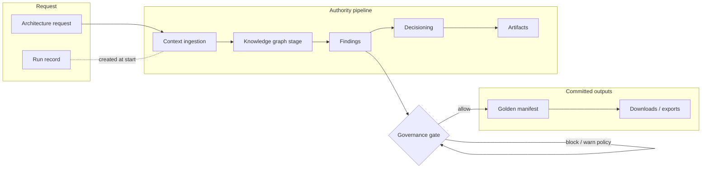

> **Scope:** One-page conceptual map for new evaluators/contributors — not a substitute for ARCHITECTURE_ON_ONE_PAGE.md or detailed runbooks.

# ArchLucid concepts in five minutes

**Audience:** first-time operators, pilot engineers, or sponsors skimming before a guided session.

---

## Diagram (mental model)

**After commit:** optional **Operate** flows (compare, replay, audit, alerts) consume the same run and manifest identifiers.

---

## Seven terms (plain language)

| Term | One-line meaning |
|------|------------------|
| **Run** | One end-to-end analysis session keyed by **`RunId`**, from **`ArchitectureRequest`** through execute to commit readiness. |
| **Agent pipeline** | Four bounded agents — Topology, Cost, Compliance, Critic — coordinated by **`IAuthorityRunOrchestrator`** (see [ARCHITECTURE_CONTEXT.md](ARCHITECTURE_CONTEXT.md)). |
| **Findings** | Structured issues with severity, evidence payloads, and **ExplainabilityTrace** metadata for auditors. |
| **Golden manifest** | Immutable merged architecture decision snapshot produced on **commit**. |
| **Policy pack** | Versioned governance content (rules, defaults, metadata) applied with tenant → workspace → project precedence. |
| **Governance gate** | Configurable blocker on commit when severity counts breach declared thresholds (**[PRE_COMMIT_GOVERNANCE_GATE.md](PRE_COMMIT_GOVERNANCE_GATE.md)**). |
| **Compare / replay** | Diff two manifests or replay authority chain validations for drift—**Operate** tier tools after Pilot success (**[OPERATOR_DECISION_GUIDE.md](OPERATOR_DECISION_GUIDE.md)**). |

---

## What happens when I create a run?

1. **Context ingestion** — Description, hints, docs, IaC snippets normalize into **`ContextSnapshot`**.
2. **Graph** — Knowledge-graph structures support downstream reasoning (**[CONTEXT_INGESTION.md](CONTEXT_INGESTION.md)**).
3. **Findings** — Decisioning engines persist findings with traces.
4. **Decisioning** — Merge and validate manifest proposals (**[ARCHITECTURE_COMPONENTS.md](ARCHITECTURE_COMPONENTS.md)** → Decisioning).
5. **Artifacts** — Exported bundles, markdown/DOCX, etc., appear after execution/commit per configuration.

---

## Where to go next

| Need | Doc |
|------|-----|
| First pilot checklist | **[CORE_PILOT.md](../CORE_PILOT.md)** |
| V1 in/out scope | **[V1_SCOPE.md](V1_SCOPE.md)** |
| Containers + pipelines | **[ARCHITECTURE_ON_ONE_PAGE.md](../ARCHITECTURE_ON_ONE_PAGE.md)** |
