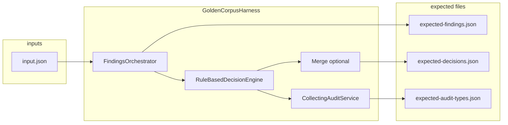

> **Scope:** Decisioning golden corpus — CI contract, layout, recording workflow, and maintenance rules for `tests/golden-corpus/decisioning/`.

# Decisioning golden corpus

**Audience:** Engineers changing authority decisioning, merge integration, or manifest emission who need a merge-blocking correctness signal without LLMs or SQL integration tests.

**Status:** Active hard gate in `.github/workflows/ci.yml` (`dotnet-fast-core` → **Test — fast core**). Tests live in `ArchLucid.Decisioning.Tests` and run under `Suite=Core` with `Category!=GoldenCorpusRecord`.

---

## Why this exists

The pipeline **agent output → typed findings → manifest decisions → audit** is the highest-risk place for silent regressions. The corpus freezes **deterministic** JSON for each curated input bundle so any drift fails CI before it reaches production.

**Non-goals:** No live LLM calls, no integration-tier SQL, and no edits to `ArchLucid.Decisioning` / `ArchLucid.Decisioning.Merge` production code or `AuditEvents` schema solely to satisfy a case (if behavior is intentional, update expected files and document in the case `README.md`).

---

## Corpus contract

Each case is a directory under `tests/golden-corpus/decisioning/` named `case-NN` (two-digit index, 30 cases total).

| File | Purpose |
|------|---------|
| `input.json` | Agent-result bundle: graph snapshot, run identifiers, optional merge payload (same shape as `GoldenCorpusInputDocument`). |
| `expected-findings.json` | Normalized typed finding rows (stable sort order). Each `findingId` is a **deterministic surrogate** (SHA256-derived Guid over canonical fields) because production engines emit fresh runtime IDs per run; golden files must not depend on those. |
| `expected-decisions.json` | Manifest decision payload after authority + optional merge (stable shape). |
| `expected-audit-types.json` | Sorted list of `AuditEventType` string names emitted during the harness run. |
| `README.md` | What the case exercises; note any intentional quirks of frozen behavior. |

On assertion failure, `GoldenCorpusRegressionTests` writes sibling files with an `.actual` suffix for trivial diffing.

---

## Coverage map (30 cases)

Cases are `case-01` … `case-30`, built by cycling **six archetypes** (`index % 6`) with a stable suffix per block of six (`index / 6`).

| Archetype | What it stresses |
|-----------|------------------|
| 0 | **Empty graph** — no nodes (boundary: minimal graph / empty finding sets where applicable). |
| 1 | Requirement-only graph. |
| 2 | **Topology** — `TopologyResource` nodes (topology coverage engines). |
| 3 | **Cost** — `CostConstraint` with budget / risk properties. |
| 4 | **Compliance / security baseline** — `SecurityBaseline` with missing control. |
| 5 | **Multi-signal** — requirement + topology + security + cost + edges (cross-category density). |

**Merge slice:** `case-01` … `case-03` include a minimal `DecisionEngineService.MergeResults` payload (success path with one proposed service). Remaining cases exercise authority + manifest only.

**Simulator / LLM:** The harness uses **in-process** finding engines and `RuleBasedDecisionEngine` only. It does **not** start the agent runtime or call a live LLM. `AgentExecution:Mode=Simulator` applies to hosted runs; it is not required for this test path because no coordinator agent execution is invoked.

**Severity / conflict edges:** Dedicated “threshold” and “conflicting decision node” fixtures are approximated by **multi-signal graphs** (several engines firing) and **merge + authority** on the first three cases. Tightening with extra named edge fixtures is a corpus expansion (add new case indices per the no-deletion rule), not a change to production decisioning.

---

## Where the harness lives

| Component | Location |
|-----------|----------|
| **Full pipeline** (orchestrator, engines, decision engine, optional merge, audit capture) | `ArchLucid.Decisioning.Tests/GoldenCorpus/GoldenCorpusHarness.cs` |
| **Shared primitives** (frozen clock provider, collecting audit service, JSON options) | `ArchLucid.TestSupport/GoldenCorpus/` |

`ArchLucid.TestSupport` intentionally does **not** reference `ArchLucid.Decisioning`, so the heavy wiring stays in the Decisioning test project and the solution graph stays clean.

---

## How to refresh or add cases

1. **Add or edit definitions** in `GoldenCorpusGraphFactory` (and related DTOs) so new scenarios are generated with stable semantics.
2. **Record** (local only): set `ARCHLUCID_RECORD_DECISIONING_GOLDEN=1` and run:
   - `dotnet test ArchLucid.Decisioning.Tests/ArchLucid.Decisioning.Tests.csproj --filter "FullyQualifiedName~GoldenCorpusMaterializerTests"`
3. **Commit** the updated `tests/golden-corpus/decisioning/**` tree and case `README.md` files.
4. **Verify** regression: `dotnet test ArchLucid.Decisioning.Tests/ArchLucid.Decisioning.Tests.csproj --filter "FullyQualifiedName~GoldenCorpusRegressionTests"` (or rely on CI `Suite=Core`).

`GoldenCorpusMaterializerTests` is tagged `Category=GoldenCorpusRecord` and is **excluded** from the fast-core CI filter so accidental env in CI does not rewrite the repo.

---

## Maintenance rule: no case deletion

**Do not delete** an existing `case-NN` directory. The corpus only **grows** (new indices or new files). If a scenario is obsolete, keep the folder and mark the `README.md` as superseded or redirect to the replacement case. Rationale: git history and reviewers can always see what was locked and when.

---

## Diagram (high level)

---

## Related

- Typed findings detail: [DECISIONING_TYPED_FINDINGS.md](./DECISIONING_TYPED_FINDINGS.md)
- CI tiering comment in `.github/workflows/ci.yml` (fast core job)
