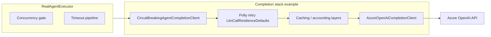
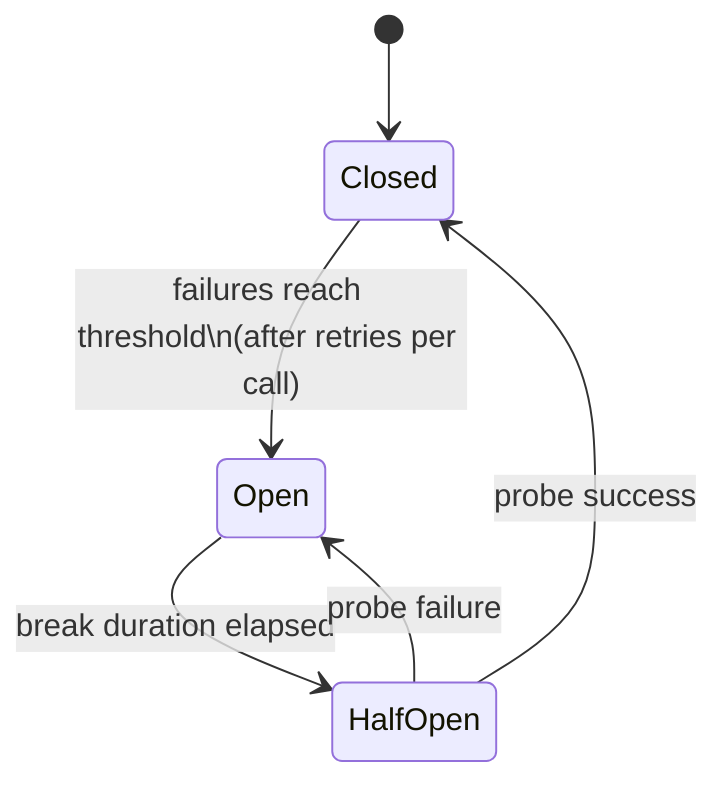

> **Scope:** LLM per-call retry and circuit breaker - full detail, tables, and links in the sections below.

> **Spine doc:** [Five-document onboarding spine](../FIRST_5_DOCS.md). Read this file only if you have a specific reason beyond those five entry documents.


# LLM per-call retry and circuit breaker

## Objective

Protect Azure OpenAI completion and embedding calls with a **Polly retry** layer **inside** the circuit breaker decorators (`CircuitBreakingAgentCompletionClient`, `CircuitBreakingOpenAiEmbeddingClient`). Transient faults (rate limits, 5xx, network, HTTP timeouts) are retried with exponential backoff and jitter **before** a single failure is recorded on the gate. This avoids tripping the breaker on short-lived outages while still opening the circuit on sustained failures.

## Assumptions

- Azure OpenAI is the primary LLM path in production; failures surface as `HttpRequestException`, `ClientResultException` (Azure SDK / `System.ClientModel`), or `TaskCanceledException` when the HTTP stack times out (token not cancelled).
- Operators tune behavior via `AgentExecution:Resilience` without code changes.
- Chaos validation runs in CI (including a weekly scheduled workflow); Simmy is not used in production.

## Constraints

- Retry must not wrap the circuit breaker **outside** (no retry-on-open-circuit loops).
- User-initiated cancellation (`OperationCanceledException` with requested cancellation) must not be retried and must not count as a breaker failure in the same way as dependency faults (see decorator implementation). The decorators call `ThrowIfCancellationRequested()` on the caller token **before** entering the Polly retry pipeline so a pre-cancelled call never hits the inner client even if Polly forwards a different token to the callback.
- `InvalidOperationException` (e.g. empty assistant payload) and `CircuitBreakerOpenException` are not retried.

## Architecture overview

`RealAgentExecutor` applies bulkhead concurrency and a per-handler timeout. The **LLM HTTP boundary** is the `IAgentCompletionClient` / `IOpenAiEmbeddingClient` pipeline registered in host composition. The circuit breaker decorator sits **outside** the inner Azure SDK client; the **retry pipeline** sits **inside** the try/catch that calls `RecordSuccess` / `RecordFailure` so the gate sees the outcome **after** retries.



Embeddings follow the same idea: `CircuitBreakingOpenAiEmbeddingClient` → retry → `AzureOpenAiEmbeddingClient`.

## Model-level fallback vs per-call retry

**Retry** ( **`LlmCallResilienceDefaults` / Polly** inside **`CircuitBreakingAgentCompletionClient`**) re-invokes the **same** inner **`AzureOpenAiCompletionClient`** (same endpoint and deployment) with backoff. That helps with short-lived **429** / **5xx** bursts on that single route but does not escape quota or outage on that deployment.

**Fallback** (**`FallbackAgentCompletionClient`**, optional) sits **outside** the circuit-breaking decorator: it wraps **two** full stacks (each: accounting/cache → **`CircuitBreakingAgentCompletionClient`** → Azure client) for **primary** and **secondary** configurations. When the **primary** stack throws an eligible **429** or **5xx** ( **`HttpRequestException`** or **`ClientResultException`** ), the fallback issues **one** attempt on the **secondary** endpoint/deployment. **OperationCanceledException** does not trigger fallback.

Configured via **`ArchLucid:FallbackLlm`** (see **`docs/RESILIENCE_CONFIGURATION.md`** § LLM model fallback). Distinct circuit gates (**`OpenAiCompletion`** vs **`OpenAiCompletionFallback`**) keep primary and fallback breaker state independent.

## Component breakdown

| Component | Role |
|-----------|------|
| `AgentExecutionResilienceOptions` | `LlmCallMaxRetryAttempts`, `LlmCallBaseDelayMilliseconds`, `LlmCallMaxDelaySeconds`; `Normalize()` clamps ranges. |
| `LlmCallResilienceDefaults.BuildLlmRetryPipeline` | Stateless `ResiliencePipeline` with exponential backoff + jitter; `ShouldRetryLlmException` classifies exceptions. |
| `CircuitBreakingAgentCompletionClient` | `ThrowIfBroken` → `ExecuteAsync` through retry → `RecordSuccess` / `RecordFailure` / `RecordCallCancelled`. |
| `FallbackAgentCompletionClient` | Outermost when **`ArchLucid:FallbackLlm:Enabled`**; delegates to primary stack, then secondary stack on eligible HTTP failures (see § Model-level fallback). |
| `CircuitBreakingOpenAiEmbeddingClient` | Same for `EmbedAsync` / `EmbedManyAsync`. |
| `ArchLucidInstrumentation.LlmCallRetries` | Counter `archlucid_llm_call_retries_total` (tags: `gate`, `attempt`, `exception_type`). |

## Data flow

1. Caller invokes `CompleteJsonAsync` / `EmbedAsync` with a `CancellationToken` (often linked to handler timeout).
2. Gate rejects immediately if open (`CircuitBreakerOpenException`).
3. Retry pipeline runs the inner delegate; on transient failure Polly waits (backoff + jitter) and retries until success or exhaustion.
4. Success → `RecordSuccess`. Uncaught exception after retries → `RecordFailure` (one tick). User cancellation path → `RecordCallCancelled` where applicable.

## Security model

- No secrets in logs; retry logging uses exception type and attempt metadata.
- Same auth and network boundaries as the inner Azure client (private endpoints, managed identity or API key per deployment).

## Operational considerations

- **Metrics:** Use `archlucid_llm_call_retries_total` to detect rising transient pressure (e.g. 429 storms).
- **Latency trade-off:** Worst case adds several backoff intervals before surfacing failure; per-handler timeout remains the outer bound (default 900s).
- **Configuration:** See table below; invalid values are clamped at runtime via `Normalize()`.

### Configuration (`AgentExecution:Resilience`)

| Property | Default | Valid range (after `Normalize`) | Meaning |
|----------|---------|-----------------------------------|---------|
| `MaxConcurrentHandlers` | (existing) | — | Bulkhead for parallel handlers. |
| `PerHandlerTimeoutSeconds` | (existing) | — | Outer timeout for each handler. |
| `LlmCallMaxRetryAttempts` | `3` | 0–10 | Retry attempts **after** the first call; `0` disables retry (`ResiliencePipeline.Empty`). |
| `LlmCallBaseDelayMilliseconds` | `500` | 50–30_000 | Base delay for exponential backoff. |
| `LlmCallMaxDelaySeconds` | `10` | 1–120 | Cap for a single backoff wait. |

### Exception classification (retry vs terminal)

| Exception / condition | Retry? | Notes |
|-------------------------|--------|-------|
| `HttpRequestException` with status 429, 500, 502, 503, 504 | Yes | Rate limit and server errors. |
| `HttpRequestException` without status | Yes | Treated as network-level. |
| `HttpRequestException` 4xx other than 429 | No | Client errors. |
| `ClientResultException` with status 429 / 5xx listed above | Yes | Azure SDK HTTP wrapper. |
| `TaskCanceledException`, token **not** cancelled | Yes | Typical HTTP timeout. |
| `OperationCanceledException` / cancel with user token | No | Intentional shutdown. |
| `InvalidOperationException` | No | e.g. empty assistant message — retry wastes tokens. |
| `CircuitBreakerOpenException` | No | Circuit already open. |

### Circuit breaker interaction

- **One logical call** that exhausts all retries produces **one** `RecordFailure` (one step toward open).
- A call that eventually succeeds after retries produces **one** `RecordSuccess` (helps half-open recovery).

State machine (simplified):



### Enriched `/health` (circuit breakers)

Authenticated **`GET /health`** (detailed JSON) includes **`entries[].data.gates`** for the **`circuit_breakers`** check. Each gate row carries operational metadata so operators can triage breaker state **without** opening Prometheus first:

| Field | Meaning |
|-------|---------|
| **`name`** | Gate key (e.g. completion vs embedding). |
| **`state`** | `Closed`, `Open`, or `HalfOpen`. |
| **`consecutiveFailures`** | Current failure counter toward open (or threshold after a failed half-open probe). |
| **`failureThreshold`** | Effective threshold from `CircuitBreakerOptions` (including hot-reloaded values when the gate uses `IOptionsMonitor`). |
| **`breakDurationSeconds`** | Effective open duration before a recovery probe is allowed. |
| **`lastStateChangeUtc`** | ISO-8601 round-trip timestamp of the last state transition, or **`never`** if the gate has not yet transitioned since process start. |

Example (abridged; real payloads include all health entries):

```json
{
  "entries": [
    {
      "name": "circuit_breakers",
      "status": "Degraded",
      "data": {
        "gates": [
          {
            "name": "OpenAiCompletion",
            "state": "Open",
            "consecutiveFailures": 5,
            "failureThreshold": 5,
            "breakDurationSeconds": 30,
            "lastStateChangeUtc": "2026-04-10T12:34:56.7890123+00:00"
          }
        ]
      }
    }
  ]
}
```

See also **`docs/OBSERVABILITY.md`** (Health JSON).

## Simmy chaos testing

- **Local:** `dotnet test ArchLucid.AgentRuntime.Tests --filter "FullyQualifiedName~Simmy|FullyQualifiedName~Chaos"`
- **Persistence (SQL/blob):** `dotnet test ArchLucid.Persistence.Tests --filter "FullyQualifiedName~Simmy|FullyQualifiedName~Chaos"`
- **Scheduled CI:** `.github/workflows/simmy-chaos-scheduled.yml` (Wed 05:00 UTC) runs the same filters and uploads TRX artifacts.

To add a scenario: follow `LlmCallRetrySimmyTests`, `LlmCallChaosEndToEndTests`, `SqlOpenResilienceSimmyTests`, or `BlobStoreSimmyChaosTests` — compose **retry outside chaos** (or match production order documented in those tests) and assert inner call counts and breaker state.

## References

- `docs/RESILIENCE_CONFIGURATION.md` — broader resilience and circuit breaker options.
- `ArchLucid.Persistence/Connections/SqlOpenResilienceDefaults.cs` — SQL open retry pattern.
- `ArchLucid.Cli/CliRetryDelegatingHandler.cs` — CLI HTTP retry pattern.
