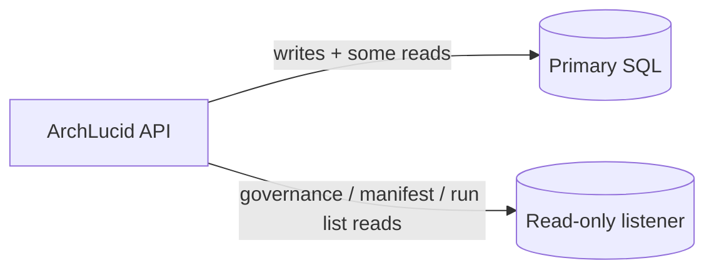

> **Scope:** Top five frequent SQL queries — execution plan reference - full detail, tables, and links in the sections below.

> **Spine doc:** [Five-document onboarding spine](../FIRST_5_DOCS.md). Read this file only if you have a specific reason beyond those five entry documents.


# Top five frequent SQL queries — execution plan reference

## Objective

Document the **five highest-churn read SQL shapes** used on hot API paths (authority lists, governance resolution, manifest materialization), with **how to capture real execution plans** in Azure SQL and **expected plan shapes** from the current schema in `ArchLucid.Persistence/Scripts/ArchLucid.sql`.

## Assumptions

- Frequency ordering is **engineering judgment** from coordinator/governance/compare flows and HTTP read surfaces, not a live `Query Store` export. Validate in your tenant with **Query Store** or **Extended Events** before capacity work.
- Plans below are **estimated / logical** for the shipped indexes; actual costs depend on row counts, statistics, and parameter values.
- Read traffic for these shapes can be aimed at the failover group **read-only listener** when `SqlServer:ReadReplica:FailoverGroupReadOnlyListenerConnectionString` is set (see `ReadReplicaRoutedConnectionFactory`).

## Constraints

- RLS `SESSION_CONTEXT` may change cardinality estimates; capture plans **under the same security context** as the API.
- Secondary replica plans can differ slightly from primary; compare when tuning.

## Architecture overview



## Component breakdown

| # | Query role | Repository / route | Primary indexes used |
|---|------------|--------------------|----------------------|
| 1 | Runs by project (paged) | `SqlRunRepository.ListByProjectAsync` | `IX_Runs_Scope_Project_CreatedUtc` |
| 2 | Policy assignments for scope | `DapperPolicyPackAssignmentRepository.ListByScopeAsync` | `IX_PolicyPackAssignments_ScopeLevel_AssignedUtc` / `IX_PolicyPackAssignments_Scope_Enabled` |
| 3 | Golden manifest by id | `SqlGoldenManifestRepository.GetByIdAsync` | `PK` on `ManifestId` (+ scope filters) |
| 4 | Published pack version body | `DapperPolicyPackVersionRepository.GetByPackAndVersionAsync` | `IX_PolicyPackVersions_PolicyPackId_Version` |
| 5 | Policy pack metadata | `DapperPolicyPackRepository.GetByIdAsync` | `PK_PolicyPacks` |

## Data flow

Governance resolution (`PolicyPackResolver`) issues **assignment list → pack by id → version by pack+version** per enabled assignment; run list and manifest load dominate read dashboards and compare.

## Security model

Plans must be captured with the same **tenant/workspace/project** session keys as production when RLS predicates apply.

## Operational considerations

### Capturing actual plans (Azure SQL / SSMS / Azure Data Studio)

1. Connect to the **target endpoint** (primary or read-only listener).
2. Run:

```sql
SET STATISTICS XML ON;
GO
-- Paste one parameterized batch below with representative parameters.
```

3. Save the XML showplan from the **Messages** pane, or use **Actual Execution Plan** in the UI.

Alternatively enable **Query Store** and use “Top Resource Consuming Queries” filtered by query text hash.

---

## 1. `dbo.Runs` — list by project (scoped)

**Source:** `ArchLucid.Persistence/Repositories/SqlRunRepository.cs` (`ListByProjectAsync`).

```sql
SELECT TOP (@Take)
    RunId, TenantId, WorkspaceId, ScopeProjectId, ProjectId, Description, CreatedUtc,
    ContextSnapshotId, GraphSnapshotId, FindingsSnapshotId,
    GoldenManifestId, DecisionTraceId, ArtifactBundleId, ArchivedUtc
FROM dbo.Runs
WHERE ProjectId = @ProjectSlug
  AND TenantId = @TenantId
  AND WorkspaceId = @WorkspaceId
  AND ScopeProjectId = @ScopeProjectId
  AND ArchivedUtc IS NULL
ORDER BY CreatedUtc DESC;
```

**Expected plan shape:** Index seek (or range scan) on `IX_Runs_Scope_Project_CreatedUtc` matching `(TenantId, WorkspaceId, ScopeProjectId, ProjectId)` with residual `ArchivedUtc IS NULL`, ordered backward on `CreatedUtc`, **TOP N** stop.

---

## 2. `dbo.PolicyPackAssignments` — hierarchical list for governance

**Source:** `ArchLucid.Persistence/Governance/DapperPolicyPackAssignmentRepository.cs` (`ListByScopeAsync`).

```sql
SELECT TOP 200
    AssignmentId, TenantId, WorkspaceId, ProjectId,
    PolicyPackId, PolicyPackVersion, IsEnabled, ScopeLevel, IsPinned, AssignedUtc, ArchivedUtc
FROM dbo.PolicyPackAssignments
WHERE TenantId = @TenantId
  AND ArchivedUtc IS NULL
  AND (
        (ScopeLevel = N'Tenant')
     OR (ScopeLevel = N'Workspace' AND WorkspaceId = @WorkspaceId)
     OR (ScopeLevel = N'Project' AND WorkspaceId = @WorkspaceId AND ProjectId = @ProjectId)
  )
ORDER BY AssignedUtc DESC;
```

**Expected plan shape:** Seek on `IX_PolicyPackAssignments_ScopeLevel_AssignedUtc` (or similar scope index) under `TenantId`, filter `ArchivedUtc` / `ScopeLevel` / workspace / project, **Sort** on `AssignedUtc DESC` capped by **TOP 200**.

---

## 3. `dbo.GoldenManifests` — scoped lookup by manifest id

**Source:** `ArchLucid.Persistence/Repositories/SqlGoldenManifestRepository.cs` (`GetByIdAsync`).

```sql
SELECT
    TenantId, WorkspaceId, ProjectId,
    ManifestId, RunId, ContextSnapshotId, GraphSnapshotId, FindingsSnapshotId, DecisionTraceId,
    CreatedUtc, ManifestHash, RuleSetId, RuleSetVersion, RuleSetHash,
    MetadataJson, RequirementsJson, TopologyJson, SecurityJson, ComplianceJson, CostJson,
    ConstraintsJson, UnresolvedIssuesJson, DecisionsJson, AssumptionsJson,
    WarningsJson, ProvenanceJson, ManifestPayloadBlobUri
FROM dbo.GoldenManifests
WHERE TenantId = @TenantId
  AND WorkspaceId = @WorkspaceId
  AND ProjectId = @ProjectId
  AND ManifestId = @ManifestId;
```

**Expected plan shape:** **Clustered index seek** on `PK` (`ManifestId`) returning one row, with **residual** scope predicates on `TenantId` / `WorkspaceId` / `ProjectId` (cheap if `ManifestId` is unique). Follow-on reads for relational slices use the same connection during hydration.

---

## 4. `dbo.PolicyPackVersions` — content for resolved version

**Source:** `ArchLucid.Persistence/Governance/DapperPolicyPackVersionRepository.cs` (`GetByPackAndVersionAsync`).

```sql
SELECT PolicyPackVersionId, PolicyPackId, [Version] AS Version, ContentJson, CreatedUtc, IsPublished
FROM dbo.PolicyPackVersions
WHERE PolicyPackId = @PolicyPackId AND [Version] = @Ver;
```

**Expected plan shape:** **Seek** on `IX_PolicyPackVersions_PolicyPackId_Version` (or seek on `PolicyPackId` + predicate on `[Version]`).

---

## 5. `dbo.PolicyPacks` — metadata for assigned pack

**Source:** `ArchLucid.Persistence/Governance/DapperPolicyPackRepository.cs` (`GetByIdAsync`).

```sql
SELECT
    PolicyPackId, TenantId, WorkspaceId, ProjectId,
    Name, Description, PackType, Status,
    CreatedUtc, ActivatedUtc, CurrentVersion
FROM dbo.PolicyPacks
WHERE PolicyPackId = @PolicyPackId;
```

**Expected plan shape:** **Clustered index seek** on `PK_PolicyPacks` (`PolicyPackId`).

---

## Cost, scalability, reliability

- **Cost:** Offloading these reads to the read-only listener reduces CPU on the primary and can lower DTU/vCore pressure; you pay for secondary compute and data sync lag trade-offs.
- **Scalability:** `TOP` caps and selective indexes keep plans narrow; revisit if `TOP 200` lists grow without pagination.
- **Reliability:** Replica lag means governance/manifest reads may be **milliseconds behind** commits; acceptable for advisory/read surfaces, not for read-your-writes immediately after a mutation.

## Alternatives considered

- **Single shared connection string only:** Rejected in favor of optional `AuthorityRunListReadsConnectionString` override so legacy deployments can split run-list traffic independently.
- **Query Store export in-repo:** Rejected because plans are environment-specific; this document captures **reproducible capture steps** instead.
