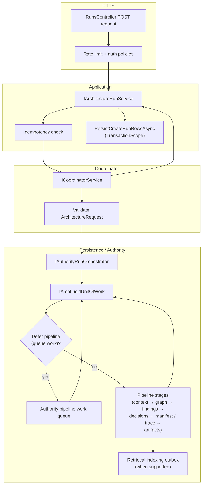

> **Scope:** Day one — Developer (week one) - full detail, tables, and links in the sections below.

> **Spine doc:** [Five-document onboarding spine](../FIRST_5_DOCS.md). Read this file only if you have a specific reason beyond those five entry documents.

# Day one — Developer (week one)

**Goal:** Ship a small, safe change or run the **ArchLucid** stack locally with confidence. **Not** full domain mastery. (Repo and projects: `ArchLucid.*`.)

**Canonical operator action map:** [OPERATOR_ATLAS.md](../library/OPERATOR_ATLAS.md) (UI route × API × CLI × authority — use this instead of memorizing scattered onboarding-only lists).

> **Install order moved.** See [INSTALL_ORDER.md](../INSTALL_ORDER.md). This page now only covers Developer week-one tasks **after** install.

**Ticket:** `ONBOARD-DEV-001` (copy into your work tracker)

---

## Scope (3–5 outcomes — check off by end of week one)

- [ ] **1. Toolchain done** — You finished the **Local dev** column in the canonical one-pager (see [../START_HERE.md](../START_HERE.md) first table row) — SDK, Docker/`dev up`, connection string, API **`/health/ready`**, optional UI `npm ci`.
- [ ] **2. Fast tests** — Run the Core corset (matches CI fast job):  
  `dotnet test --filter "Suite=Core&Category!=Slow&Category!=Integration"` ([TEST_EXECUTION_MODEL.md](../library/TEST_EXECUTION_MODEL.md)).
- [ ] **3. One contract** — Skim [API_CONTRACTS.md](../library/API_CONTRACTS.md) (versioning `/v1`, correlation ID, one status code you will handle).
- [ ] **4. Small change** — Open a PR with a **tiny** change (doc typo, test name, log message) so you practice the full loop (build + Core tests + green CI).

---

## Escalation

| Blocker | Where |
|---------|--------|
| Build / packages | [BUILD.md](../library/BUILD.md), [TROUBLESHOOTING.md](../TROUBLESHOOTING.md) |
| SQL / migrations | [SQL_SCRIPTS.md](../library/SQL_SCRIPTS.md) |
| Auth locally | [API_CONTRACTS.md](../library/API_CONTRACTS.md#security-schemes-swashbuckle) |

**Last reviewed:** 2026-04-17

---

## Mental model: `POST /v1/architecture/request`

**What this endpoint does:** Creates an architecture **run**, an **evidence bundle**, and **starter agent tasks** (when not deferred). It does **not** run the full agent simulation loop or manifest commit; those are separate execute/commit flows (`docs/API_CONTRACTS.md`).

**Flow (nodes and edges):**

1. **HTTP** — `POST /v1/architecture/request` on `RunsController` (`v1/architecture`). Policy **`ExecuteAuthority`**; **`EnableRateLimiting("fixed")`** on the controller. Optional **`Idempotency-Key`** for deduplication.
2. **Application** — `IArchitectureRunService.CreateRunAsync` checks idempotency, then calls **`ICoordinatorService.CreateRunAsync`**.
3. **Coordinator** — Validates `ArchitectureRequest`, builds an evidence bundle shell, calls **`IAuthorityRunOrchestrator.ExecuteAsync`** with a mapped context-ingestion request.
4. **Authority pipeline (Persistence)** — `AuthorityRunOrchestrator` opens **`IArchLucidUnitOfWork`**, persists the run, then either:
   - **Deferred path:** enqueues **authority pipeline work** (feature + resolver + non-empty deferred bundle id), **commits** the UoW, returns early with empty starter tasks; **or**
   - **Inline path:** **`IAuthorityPipelineStagesExecutor`** runs stages (context → graph → findings → decisions → manifest/trace → agents/artifacts as configured) inside the same orchestration, then finalizes commit, audit, and **retrieval indexing outbox** when supported.
5. **Application persistence (Data repos)** — On coordination success, `ArchitectureRunService` persists request/run/tasks (and related rows) inside a **`System.Transactions.TransactionScope`** — a **separate** transactional boundary from the authority UoW (two layers on purpose today; see `ArchitectureRunService` and ADR 0004 for manifest/trace split).

**Simulator vs Real:** `AgentExecution:Mode=Simulator` affects **`IAgentExecutor`** used on **execute**, not the create-request path directly. Create-request still runs the **authority** pipeline (or defers it) depending on storage and feature flags.

**Where to read code:** `ArchLucid.Api/Controllers/Authority/RunsController.cs`, `ArchLucid.Application/ArchitectureRunService.cs`, `ArchLucid.Coordinator/Services/CoordinatorService.cs`, `ArchLucid.Persistence/Orchestration/AuthorityRunOrchestrator.cs`.
