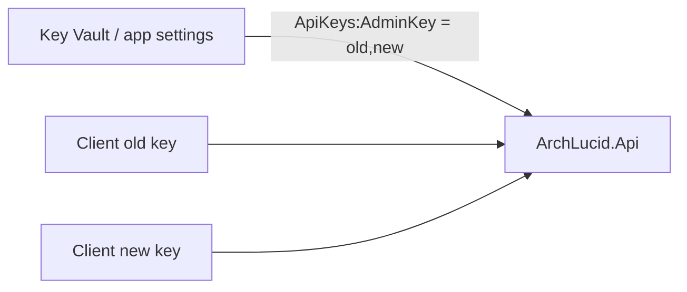

# Runbook: API key rotation (ArchLucid)

**Last reviewed:** 2026-04-16

## 1. Objective

Rotate **development / automation API keys** accepted by `ArchLucid.Api` (`ApiKeys:AdminKey`, `ApiKeys:ReadOnlyKey`) without downtime for well-behaved clients, using **comma-separated dual values** during cutover.

## 2. Assumptions

- Keys are stored in **Key Vault references** or **App Service / Container Apps** settings (not committed to git).
- Callers can be updated in a **controlled window** (hours to days), not instantaneously.
- **SMB (port 445)** is not used for exposing tenant data at the API edge (see workspace security rules).

## 3. Constraints

- A single flat key value cannot overlap old+new without parser support — ArchLucid binds **comma-separated** keys so both values authenticate during migration.
- **JWT / Entra** flows are unaffected; this runbook covers **API key** auth only.
- Rotating **SQL** or **storage** credentials is out of scope here; see [SECRET_AND_CERT_ROTATION.md](SECRET_AND_CERT_ROTATION.md).

## 4. Architecture overview

**Nodes:** operators, secret store, API host, API clients (CI, scripts, operator UI BFF).

**Edges:** operators update configuration → API reload → clients send `X-Api-Key` (or configured header) → handler matches any configured segment.

**Flows:**

## 5. Component breakdown

| Piece | Role |
|--------|------|
| **`ApiKeyAuthenticationHandler`** | Splits comma-separated keys; ignores empty segments after trim. |
| **`ApiKeys:AdminKey` / `ApiKeys:ReadOnlyKey`** | Configuration values (may each list **multiple** comma-separated secrets). |
| **Clients** | Must send one valid key per request; no need to send both simultaneously. |

## 6. Data flow (rotation)

1. Generate **new** key material in the secret store.
2. Append to config: `oldkey,newkey` (comma only — no spaces required; spaces around commas are trimmed from segments).
3. **Reload configuration** so the API picks up the new material. **`ApiKeyAuthenticationHandler`** reads keys from **`IOptionsMonitor<ApiKeyAuthenticationOptions>`**, so **Azure App Service / Container Apps** (and similar hosts that refresh config from Key Vault references **without** a full process restart) typically apply the change on the platform’s next settings refresh — **no dedicated restart is required** for well-behaved deployments. If your host only loads `appsettings` at startup, restart or recycle the process once after the secret/store update.
4. Re-point clients to **new** key at their own pace.
5. Remove **old** segment when logs show no `old` usage (monitor 401 rates and audit if enabled).
6. Repeat for **ReadOnly** scope if used.

## 7. Security model

- **Strengths:** short overlap window; no “big bang” client flip required.
- **Weaknesses:** longer dual-key period increases exposure if a backup of config leaks (both values valid).
- **Mitigation:** keep overlap **time-bounded**; use separate keys per environment; never log key values.

## 8. Operational considerations

- **Scalability:** handler work is O(n) in **number of configured segments** (typically 1–2 during rotation).
- **Reliability:** failed rotation surfaces as 401 for clients still on removed keys — predictable.
- **Cost:** negligible CPU; operational cost is coordination.
- **Terraform / IaC:** model keys as secret outputs → app setting references; avoid plaintext in state where possible.

## 9. References

- General secret rotation: [SECRET_AND_CERT_ROTATION.md](SECRET_AND_CERT_ROTATION.md)
- Security index: [SECURITY.md](../SECURITY.md)
