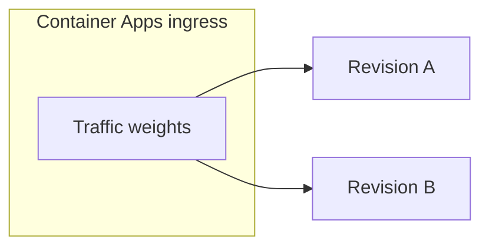

# Canary and blue-green — Azure Container Apps

## Objective

Describe how operators run **revision-based** rollouts for ArchLucid API / worker / UI on **Azure Container Apps**, using Terraform variables and Azure CLI traffic splits.

## Assumptions

- Container Apps are deployed from `infra/terraform-container-apps/` with `enable_container_apps = true`.
- CI/CD uses `.github/workflows/cd.yml` for image updates; a **placeholder** step documents where a manual canary split would go.

## Constraints

- **State safety:** Terraform resource addresses may still contain historical `archiforge` tokens; coordinate `terraform state mv` per Phase 7.5 before renaming resources.
- **Revision mode:** `revision_mode = Multiple` is required before `az containerapp ingress traffic set` can assign weights to more than one active revision.

## Architecture overview

## Operational flow

1. Set `api_revision_mode = "Multiple"` (and optionally worker/ui) in tfvars; `terraform apply` during a window.
2. Deploy a new image (creates a new revision). Record revision names:  
   `az containerapp revision list -g RG -n APP --all`
3. Split traffic (example: 90% stable, 10% canary):  
   `az containerapp ingress traffic set -g RG -n APP --revision-weight REV-STABLE=90 --revision-weight REV-CANARY=10`
4. Observe metrics and Application Insights / OTLP signals; promote by shifting weights to 100% on the new revision, then deactivate the old revision.

## Security

- Prefer **private** ingress and authenticated synthetic checks; do not expose admin-only diagnostics publicly.

## Reliability

- Keep at least one healthy revision; test rollback by reversing weights before deactivating the new revision.

## Cost

- Multiple active revisions consume **additional** CPU/memory allocation within min/max replica bounds; size `max_replicas` accordingly.

## References

- `infra/terraform-container-apps/variables.tf` — `api_revision_mode`, `worker_revision_mode`, `ui_revision_mode`.
- `.github/workflows/cd.yml` — deploy job placeholder step.
