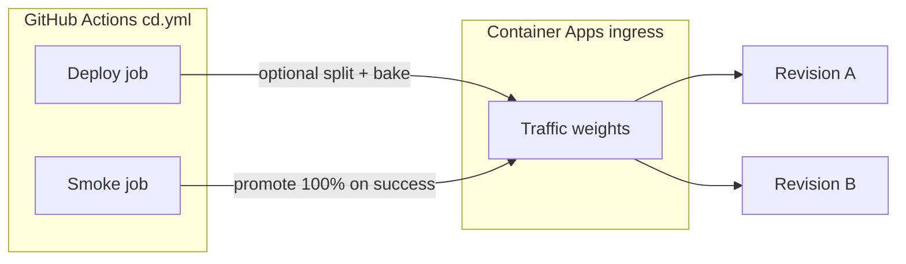

# Canary and blue-green — Azure Container Apps

**Last reviewed:** 2026-04-16

## Objective

Describe how operators run **revision-based** rollouts for ArchLucid API / worker / UI on **Azure Container Apps**, using Terraform variables, GitHub Actions CD automation, and Azure CLI traffic splits.

## Assumptions

- Container Apps are deployed from `infra/terraform-container-apps/` with `enable_container_apps = true`.
- CI/CD uses `.github/workflows/cd.yml` for image updates; optional **canary** steps split API traffic between revisions before post-deploy smoke and **promote** to 100% when smoke succeeds.

## Constraints

- **State safety:** Terraform resource addresses may still contain historical `archiforge` tokens; coordinate `terraform state mv` per Phase 7.5 before renaming resources.
- **Revision mode:** `api_revision_mode = Multiple` (Terraform variable) is required before `az containerapp ingress traffic set` can assign weights to more than one active revision.
- **Smoke dependency:** Canary promotion runs in the `smoke-test` job and uses `az` after **Azure login**; keep `SMOKE_TEST_BASE_URL` configured whenever `CD_CANARY_ENABLED` is true so validation and promotion stay aligned.

## Architecture overview

## Operational flow

### Terraform (one-time or change window)

1. Set `api_revision_mode = "Multiple"` (and optionally `worker_revision_mode` / `ui_revision_mode`) in tfvars; `terraform apply` during a window.
2. Confirm revision mode on the API app: `az containerapp show -g RG -n API --query "properties.configuration.ingress.traffic"`.

### CD automation (ongoing)

Repository **variables** (GitHub Actions `vars`):

| Variable | Purpose |
|----------|---------|
| `CD_CANARY_ENABLED` | Set to `true` to run canary split + bake + promote (default unset / false skips). |
| `CD_CANARY_INITIAL_PERCENT` | Optional; integer **1–99**; weight for the **new** revision after deploy (default **10**). |
| `CD_CANARY_BAKE_MINUTES` | Optional; minutes to sleep after the split and **before** the smoke job (default **0**). |

**Flow in `cd.yml`:**

1. **Deploy job** records API revision **before** and **after** `az containerapp update`.
2. If `CD_CANARY_ENABLED=true` and both revisions exist and differ, the job runs `az containerapp ingress traffic set` with weights `(100 - PCT)%` on the old revision and `PCT%` on the new revision, then optionally sleeps for the bake window.
3. **Smoke job** runs `scripts/ci/cd-post-deploy-verify.sh` against `SMOKE_TEST_BASE_URL`.
4. If canary is enabled and smoke **succeeds**, the smoke job sets **100%** traffic to the new revision (`revision_after` from the deploy job output).

### Manual operations (break-glass)

1. Deploy a new image (creates a new revision). List revisions:  
   `az containerapp revision list -g RG -n APP --all`
2. Split traffic (example: 90% stable, 10% canary):  
   `az containerapp ingress traffic set -g RG -n APP --revision-weight REV-STABLE=90 --revision-weight REV-CANARY=10`
3. Observe metrics and Application Insights / OTLP signals; promote by shifting weights to 100% on the new revision, then deactivate the old revision.

## Security

- Prefer **private** ingress and authenticated synthetic checks; do not expose admin-only diagnostics publicly.
- Canary promotion uses OIDC **Azure login** in the smoke job; least-privilege service principals should only manage the target Container Apps resource group.

## Reliability

- Keep at least one healthy revision; test rollback by reversing weights before deactivating the new revision.
- If smoke **fails**, optional rollback (`CD_ROLLBACK_ON_SMOKE_FAILURE`) deactivates the new revision; traffic may remain split until an operator promotes or resets weights manually.

## Cost

- Multiple active revisions consume **additional** CPU/memory allocation within min/max replica bounds; size `max_replicas` accordingly.

## References

- `infra/terraform-container-apps/variables.tf` — `api_revision_mode`, `worker_revision_mode`, `ui_revision_mode`.
- `.github/workflows/cd.yml` — `CD_CANARY_*` vars, canary split in deploy job, promote step in smoke job.
